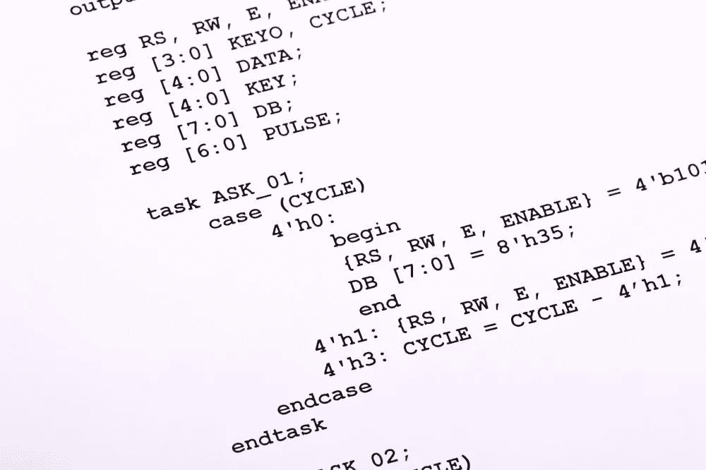

# 是的，面试中的编程挑战很难…

> 原文：<https://medium.com/codex/yes-programming-challenges-in-interviews-are-hard-d6c2b08aad1f?source=collection_archive---------7----------------------->

## …是的，随着时间的推移，它们会变得更好。

*免责声明:所有观点都是我自己的。*

当我还是个孩子的时候，我就在长除法中挣扎。我不是在开玩笑，这是一个相关的地方开始这篇文章。

我对乘法表很在行！)，但不知什么原因`98 / 32`对我来说真的很难。我的大脑不想看到数字。这已经够有挑战性了，我开始怀疑我的大脑是不是有问题，我是不是太笨或者是个白痴，或者是不是注定要上完小学。

通过足够的练习，我掌握了通过二年级考试的窍门(加油！).

快进到大学，我挣扎于不同的 C.S .类和更高层次的数学课。我也想知道同样的事情——我是哑巴吗？我不适合完成一个理学硕士学位吗？为什么我不能找到一个动态编程问题的答案？或者把一个离散数学证明通读三遍就明白了？

在这种情况下，这是一个类似的解决方案-重复练习，在导师实验室的时间，和时间投资。

再次快进，我正在为软件工程面试做准备。每当我点击 Leetcode 媒体时，我只是在挣扎，答案对我来说并不明显，我花时间构建一个错误的解决方案，甚至不是正确的方法。

我开始怀疑同样的事情——我是不是太笨了，连软件工程面试都过不了？我不适合做这个吗？(请记住，我已经做了 10 年的软件工程师了)。

但是通过反复练习和时间投入，我越来越快，直到平均 25 分钟就能解决中等问题。

我的观点是什么？嗯，几个

*   冒名顶替综合症是真实存在的——即使你已经扮演一个角色很多年了
*   熟能生巧——坚持练习，不要放弃

当你踏上成为软件工程师的旅程并通过面试时，继续练习吧！