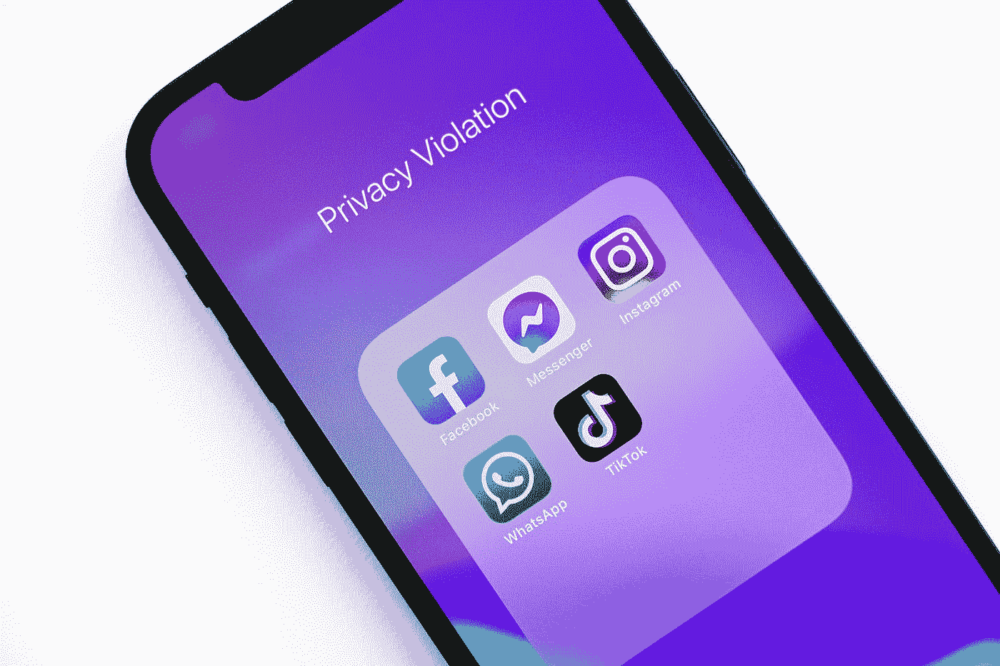

# 是，你可以分享比基尼照片，同时仍然关心你的隐私

> 原文：<https://medium.com/codex/yes-you-can-share-that-bikini-pic-and-still-care-about-your-privacy-77847864b1f5?source=collection_archive---------32----------------------->

杰里米·贝赞格在 [Unsplash](https://unsplash.com?utm_source=medium&utm_medium=referral) 上的照片

> “隐私已死，一切都太迟了。”

这句话是在我做了一场关于 UX 设计中的黑色图案的演讲后，一位同行对我说的。从演讲后的讨论中，我清楚地看到，问题不是人们不关心网上的阴暗模式，而是他们实际上认为他们再也不能做任何事情了。假设我们已经放弃了抱怨的权利，因为我们已经分享了那一张照片。

# 人们感到愤怒，但没有采取行动，因为他们觉得自己是伪君子

但是，关注数字隐私并不意味着你必须生活在岩石下。你可以利用社交媒体或网络上的其他新发展。事实上，技术是伟大的——我们只需要确保它为我们服务，而不是为了利润奴役我们。

我不相信你会因为自愿发布自己的帖子而放弃关注跟踪的权利。我周围的大多数人会告诉你，我根本不是一个孤僻的人——说实话，我不擅长把任何私人的事情藏在心里。我的意思是，我们都有父母不认可的社交媒体账户，以及脸书个人资料中有问题的照片。但是我坚信一个叫做目的的小概念会让事情有所不同。

# 为什么目的比同意更重要

如果我在网上分享一些东西，我是有目的的——比如和朋友联系。我期待平台尊重这一宗旨。这就是数据滥用的来源。大多数立法在其框架中体现了这一点。例如，GDPR 是故意造大的:

> “除了最初收集个人数据的目的之外，只有在处理符合最初收集个人数据的目的的情况下，才应允许为其他目的处理个人数据”

事实上，与我的网络分享我的性别是我的权利，但我不想因为我是女性而被展示某些产品。我可以通过关注正确的帐户来表明我对冲浪的兴趣，但这并不等于同意在昂贵的冲浪板上做定向广告。更进一步，我甚至可能同意在一个特定平台上接收定向广告，但我不希望我的利益被出售给其他平台。就这么简单。如果你*真的*希望你的体验以这种方式“*优化”*(平台经常使用的有趣术语)，那也完全没问题。底线是你有一个选择。

我认为，这种选择被一片沼泽和多种目的的混合夺走了。我们面对的是一个横幅，一次点击，一个选择，这应该是所有人都同意的信号。

> “是的，我想用这个平台”变成了等同于“是的，我的数据你随便用，只要我能用这个平台。”

不要误解我。同意是很棒的，平台在处理数据前一定要问我们。但是，如果我们不能区分我们同意的目的，这就变得毫无意义。我认为人们已经放弃了数字隐私，因为它是作为他们想使用的服务的一揽子交易而出现的。平台提供了两种选择，一种是'*住在你的岩石下，与世隔绝，保存你的数据'* **或者'** *加入这个有趣的社交网络，把你所有的数据都给我们'*。为什么是这种二分法？为什么我们不回收我们的社交空间**和**我们的数据？毕竟，我们是保持网络活力的用户。

# 如何回收网络？

权力下放可能是实现这一目标的一种方式。像乳齿象这样的服务的兴起(互联网对 Twitter 将所有者从一个盈利组织换成另一个盈利组织，即埃隆·马斯克感到愤怒)表明了对服务和尊重我们的平台的需求。不同意一个系统的工作方式并不意味着我们失去了使用它的权利。这意味着平台应该找到新的方法来满足用户的需求——否则竞争对手就会这么做。我们终于开始要求尊重数字权利和有意义的同意。

**Extra:** 促使人们说出*“隐私已死，为时已晚”*这句话的演讲，是基于我最近一篇关于 cookie 弹出窗口中的黑暗模式的文章:

 [## 为人权买单

### 我写了一篇关于饼干弹出窗口的论文——但是把手放在饼干罐里比我想象的还要糟糕。

medium.com](/@evavogel/paying-for-a-human-right-a6530241b1dd) 

关于 UX 设计中欺骗性做法的更多资源，我推荐 [Luiza Jarovsky](https://medium.com/u/5923939aa3e2?source=post_page-----77847864b1f5--------------------------------) 的文章:

 [## 数据保护中的欺骗性模式(以及 UX 设计者能做些什么)

### 深入臭名昭著的欺骗性设计世界

uxdesign.cc](https://uxdesign.cc/dark-patterns-in-data-protection-13fdb0c5231d)