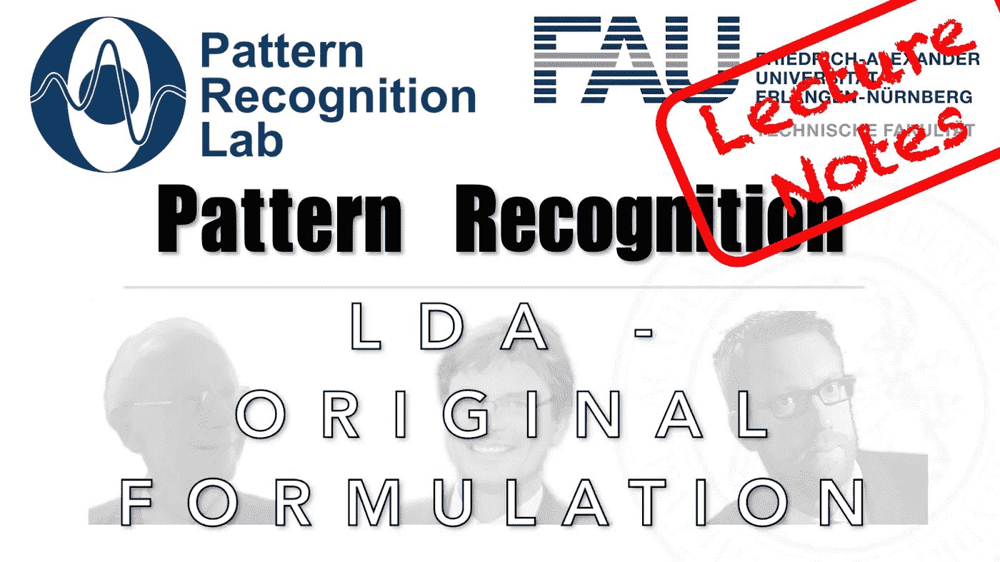

# 又一个 LDA:费希尔变换

> 原文：<https://medium.com/codex/yet-another-lda-the-fisher-transform-730645fd3098?source=collection_archive---------14----------------------->

## 模式识别中的 FAU 讲义，[抄本](http://medium.com/codex)

## LDA —原始配方

下图 [CC BY 4.0](https://creativecommons.org/licenses/by/4.0/) 来自[模式识别讲座](https://www.youtube.com/playlist?list=PLpOGQvPCDQzsWvT_bqmexrJ359RTQQuMO)

**这些是 FAU 的 YouTube 讲座** [**模式识别**](https://www.youtube.com/playlist?list=PLpOGQvPCDQzsWvT_bqmexrJ359RTQQuMO) **的讲义。这是讲座视频&** [**配套幻灯片**](https://doi.org/10.5281/zenodo.4429576) **的完整抄本。幻灯片的来源可以在** [**这里**](https://github.com/akmaier/pr-slides) **找到。我们希望，你喜欢这个视频一样多。这份抄本** …