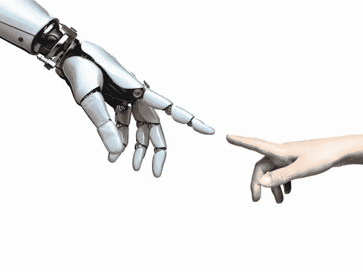

# 机器人瑜伽

> 原文：<https://medium.com/codex/yoga-for-robots-c5f5386a1d2d?source=collection_archive---------13----------------------->

一只钢铁手臂上紧握着一杯热气腾腾的柴，另一只手里拿着一个钱包，一个乐于助人的机器人跟着希拉走向角落里的电话亭，我当时正坐在孟买咖啡馆里。她是一个年近五十的漂亮女人。当她坐在桌子的另一边时，她的机器人在把它携带的所有东西放在桌子上后，在离她一英尺远的地方停了下来。

“很抱歉让你久等了。”她的声音高得出奇。我试着回忆我最后一次见到她时是否有那么讨厌。

“不，没关系。我来的时间不长。”她点点头，然后翻遍她的钱包，找到一张 500 卢比的钞票。她伸出手，手指夹着钞票。

"买一杯咖啡和两片香蕉蛋糕."她用同样吱吱的声音说，没有向我们的金属同伴转过一厘米。

我敬畏地看着它小心翼翼地抓住钞票，然后开始走向柜台。

“你喜欢咖啡，对吗？”希拉的话让我的注意力回到了她那假晒黑的脸上。“因为我没有。反正不是他们在这里做的。我带来了我的茶。”她说着，呷了一口。

“咖啡很好。”我笑着说。

“那么你想知道什么？”她问。我很高兴她自己减少了闲聊。

“我正在写一篇关于家用机器人瑜伽的文章。山姆大叔告诉我，你每周都把你的钱送去上瑜伽课。”我看着她的脸从轻微的希望变成彻底失望。

“真的吗？我以为你在宝莱坞 101 工作。”她的声音完成了不可能的任务，变得更高了。

“我做到了。但是我离开了，大概一年前。”

“哦。”她低下头，显然已经失去了兴趣。

她真的认为我大老远跑来是为了从她那里得到一些宝莱坞的琐事吗？我的意思是她出现在一部电影里。正好一个。

“所以你只是想和奥利谈谈？”她的声音似乎深受伤害。我改变了我的计划，决定也包括一个对老板的简短采访。

“不，我也想听听你的意见。”我努力让自己的声音听起来很激动。

“好吧。”她笑了。这可能是她在电影制作行业学到的许多假笑之一。但我不在乎。

“那么，”我拿出我的录音机，按下‘开’，“你从什么时候开始送他去练瑜伽了？”

她清了清嗓子，我不得不努力不笑出来。“嗯，两个月前，奥利把一个花瓶掉在了我们客厅的中间。他两年前才被制造出来。这不可能是故障。”她脸上掠过一丝怀疑的表情。她绝对给了我一场轰动的表演。

“那时，我亲爱的丈夫萨姆建议说，也许我们应该送他去上瑜伽课。对于我们可怜邻居的机器人来说，这无疑创造了奇迹。”

“你邻居的机器人怎么了？”

“哦一切。他什么也做不了。萨姆和我经常听到他们房子里东西破碎的声音。有一次，他甚至让割草机开着。这是一场灾难。”她闭上眼睛，可能想起了这件事。

我们被奥利打断了，他回来了，一手拿着咖啡，一手拿着一个盘子，里面有两片蛋糕。他把咖啡放在我面前，把盘子放在我和希拉之间。这让我印象深刻。

“你傻吗？再去拿一盘！”希拉厉声说道。我不禁为他感到难过。但他似乎并不担心。他的轮子开始滚回柜台，他的身体转向一边。

“毕竟是机器人。”她又呷了一口茶。“那么我在哪里？”

“割草机事件。”我漫不经心地说，并从我的咖啡抿了一小口，小心翼翼，以免烫伤我的舌头。我不明白她为什么不喜欢这咖啡，它味道好极了。

“哦，是的。所以基本上这个机器人一无是处。我们的邻居太穷了，他买不起新的。或者让他检查有没有窃听器。

“但后来他开始和他一起做瑜伽。显然在美国很大。那里正在进行机器人权利运动。”她翻了翻白眼。

奥利拿着多余的盘子回来了，把它放在桌子上。然后他回到自己的位置，离希拉只有一英尺远。

"他身上发生了显著的变化。"她继续说道，同时拿起一片香蕉蛋糕放在另一个盘子里。"所以我们决定也送奥利来这里上瑜伽课."她咬了一口蛋糕，把盘子靠近下巴，以免面包屑掉在衣服上。

“你在他身上看到了什么变化？”她狼吞虎咽地吃蛋糕时，我仔细观察了她。

她把一张餐巾纸贴在嘴唇上。“从那以后，他再也没有丢过任何东西。”

“嗯。”

#

后来，我们去附近的公园坐了坐。希拉接到一个女仆的电话。据我所知，女佣正在准备晚餐，找不到特别的马萨拉。希拉从长凳上站起来，沮丧地走开了，她的声音像先前对奥利一样愤怒，我得到了我要的东西。和金属人独处几分钟。

“你好。”我说，看着他的脸，或者我以为是他的脸。

两个小相机，他的眼睛大概，转向固定在我的脸上。一分钟一定在沉默中过去了。当一个机器人的声音回答时，我开始想他可能没有和陌生人说话的程序。“你好。”

“我是迈拉。”我的声音变得更自信了。

“我知道你是谁。”我对他的反应有点惊讶。

“真的吗？怎么会？”

"你以前在卡普尔家族中被谈论过."他的声音以同样单调的方式出现。

"山姆大叔和希拉谈论我. "我真的很惊讶。他们和我并不亲近。

“是的。时不时的。”

“呃——好吧。”我清了清嗓子，回到正题。"我之前和希拉谈过你的瑜伽课."

“是的，你是。”他的回答给我留下了深刻印象。他们每个人看起来都很聪明。

“你认为他们有帮助吗？”

“帮什么忙？”

我想了一会儿我应该说什么。很难说清楚。“你曾经摔过一个花瓶。你知道你生来就不会犯错，永远不会。”我深吸了一口气。

“是的，我做到了。那是 53 天前。”他的声音有些变了，他转过头看着希拉，希拉在很远的地方，还在电话里争论着。然后他回头，走近了一点。

“那天卡普尔先生在楼上打电话，卡普尔太太正在去找他的路上。”他向下看了一秒钟。这是我第一次和机器人说话。我一直对它们着迷。但我从未想过他们会有复杂的情感，或者任何一种情感。这在科学上是不可能的。但是奥利身上的某些东西让我质疑我的信仰。

“这是一个分心，”奥利继续说，他的声音几乎听不见。"我不能让卡普尔太太偷听电话。"

“为什么？他在和谁通话？”我的脑子里充满了各种理论。也许，山姆大叔和他的海外秘书有一腿。我一直知道他有比工作更好的理由，每隔一个月去一次瑞士。

“他在和他的医生说话。卡普尔先生得了白血病。”

我觉得我的呼吸卡在我的喉咙后面。我僵在原地，奥利得到了保持沉默的暗示。我处理信息时，他在一旁等着。

“他告诉你了吗？”我努力找到了自己的声音。

“不，他曾经要我替他确定一个约会。“而且，”他又看了看我，“我发现是和一位来自日内瓦的癌症专家。”

我大声呼出。这完全不是我想象中的采访。我看着手中的录音机，在上交之前，心里记下要把里面的东西都擦掉。

“那么他不知道你知道了？”

“没有。”

“希拉什么都不知道吗？”

"不，我想这是卡普尔先生想要的."这是一个鲜明的对比，他说话如此单调，而且抓住了大多数人不知道的东西。

“你为什么告诉我这一切？”过了一会儿我问他。“我是说，你没有让希拉知道！”

“有几次他谈到你，我注意到他对你评价很高。我想他信任你。我只是担心他。他谁都没有。”

我感到一滴眼泪从我的眼角流了出来。我点点头，然后凝视着远方。所有的信息让我感到沉重。我不得不把它靠在长凳后面。

我看着奥利。我知道这是不可能的，但他看起来也很累。就像那些老旧的收音机，带着噼噼啪啪的声音。

我们俩都转过头看着希拉。她打完电话，正在来我们这里的路上。奥利的轮子慢慢地离开了我。

“很抱歉花了这么长时间。”希拉说，她坐在我旁边。"他告诉你他的瑜伽课了吗？"

“哦，”我眨了两下眼睛，突然想起了采访的真正目的，“其实我们没谈过。”

“真的吗？哦！”她似乎有点惊讶，但绝对没有怀疑任何事情。“奥利，接着说，告诉她。”

奥利的眼睛转过来看着我。“瑜伽大师通常强调增加我的柔韧性。我们练习的大多数体式都与此有关。但也有一些其他的，”他看着她。她正忙着看手机，所以他回头看着我，继续说道，“这有助于理清我们的思路。他们帮助我专注于重要的事情，以及对我周围的人来说什么是最好的。”他低下头。

“真的吗，奥利？”希拉翻了翻白眼，仍在忙着浏览推特。“你知道什么是有想法和做决定吗？”

是啊，他到底知道些什么？！

*结局*