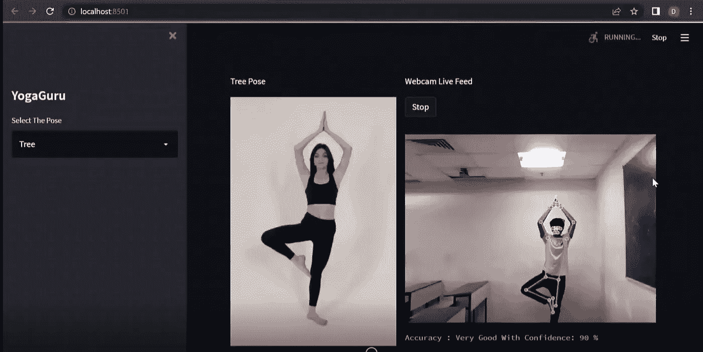
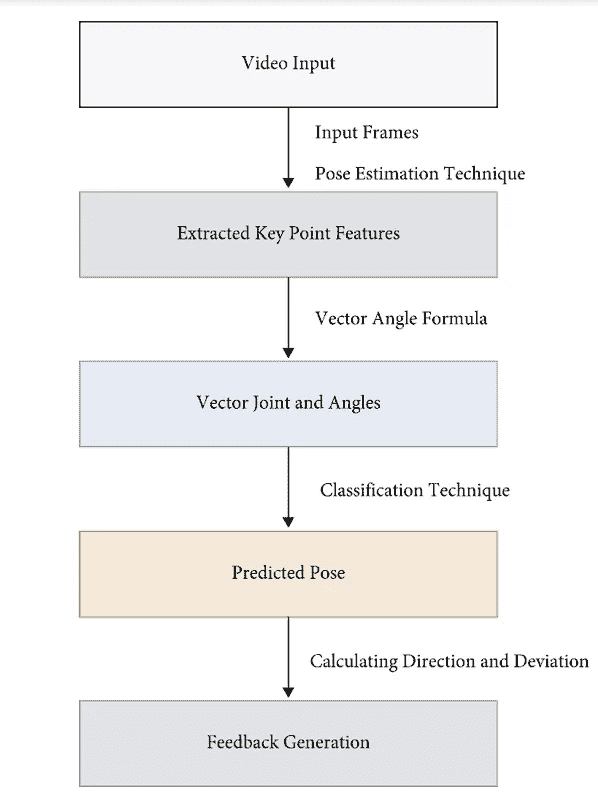
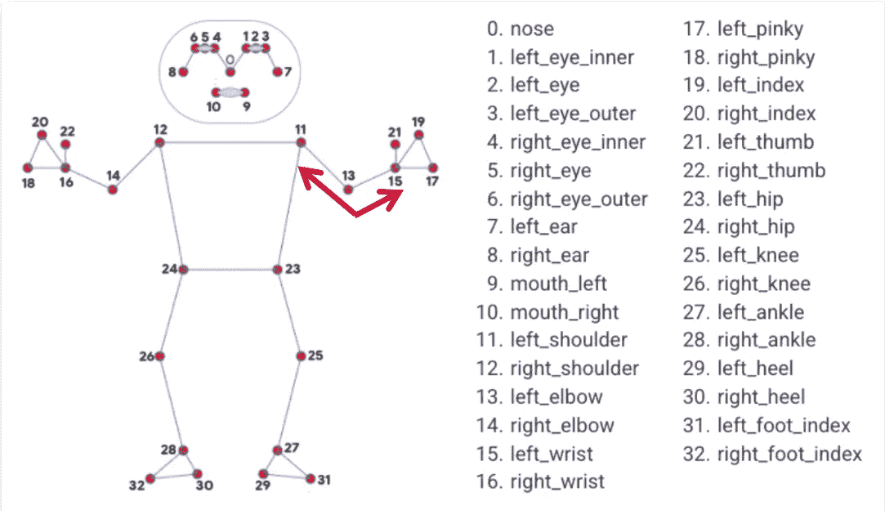

# YogaGuru(第 1 部分):数据收集

> 原文：<https://medium.com/codex/yogaguru-part-1-data-collection-cb643bde7ff8?source=collection_archive---------34----------------------->

YogaGuru 是一个考虑到瑜伽在我们日常生活中的重要性而开发的项目。瑜伽姿势，像任何其他运动一样，必须正确进行，因为不正确的姿势是无益的，并可能造成伤害。这表明，在做瑜伽时，你应该有一名教练陪同。在今天的生活方式下，请老师或参加瑜伽课程并不总是可能的。

YogaGuru 使用基于人工智能的方法来克服上述困难。它捕捉用户的身体点，并根据他们的表现提供实时反馈，帮助他们识别所做瑜伽姿势的准确性。

因此，解决上述问题的简单方法是瑜伽古鲁(它不是一个超级英雄/人，而是一个照顾我们内心平静和灵魂的应用程序😉)

YogaGuru 的演示

这是一个基于机器学习的项目，它使用谷歌的 Mediapipe 库从直播摄像机馈送中获取用户视频图像，并以高精度和高效率提供身体标志的位置作为输出，然后将其传递给经过训练的机器学习模型，该模型预测姿势执行的精度。

我将分享一步一步的方法来制作你自己的瑜伽。本项目将分为三个部分
A)数据收集
B)数据准备和建模
C)模型与项目整合

> 这篇博客将只关注数据收集部分

## 需要哪些数据？

了解解决我们的问题需要什么数据是任何数据科学过程的重要部分，在数据科学过程中，根据项目的需要收集数据。在给出关于所执行的瑜伽步骤的反馈之前，必须需要以特定的格式获取数据，并将其传递给预测输出的模型。因此，为了获得数据，我们将使用与休闲方式不同的方式，即，不是使用计算机视觉和图像处理来存储图像本身以训练模型，然后进一步使用它，我们将考虑从练习瑜伽的用户的身体标志位置获得的关节之间的角度。

## 为什么使用身体标志而不是图像处理？

图像处理需要大量的计算能力和高水平的图像处理理解。相反，我们可以使用 mediapipe(一个 python 库)通过 ***无需高计算能力*** 从实时视频馈送中捕捉身体标志位置，这样我们的反馈将非常接近实时反馈。

此外，我没有太多关于图像处理的知识😋

## 什么是 mediapipe，它是如何工作的

MediaPipe 是一个构建机器学习管道的框架，用于处理视频、音频等时序数据。MediaPipe 以预构建的 Python 包的形式提供随时可用且可定制的 Python 解决方案。

更多细节可在[这里](https://google.github.io/mediapipe/)找到

## 让我们从这个流程图来理解项目的运作:

## 如何获取所需数据:

对于特定的体式，我们需要不同的身体关节角度，也需要不同的精确度，比如瑜伽老师、好的练习者、新手等的关节角度。

现在，为了得到角度，我们需要首先找到身体的标志，然后我们可以使用基本的数学来找到三个点之间的角度。Mediapipe 给了我们大约 **33 个地标**，但是我们几乎不需要它们。考虑一个这样的连接是由点(11，13，15) *形成的左肘关节，参见下图*。我们必须找到角度，并将其存储在数据帧中，以便进一步处理。

图片来源:Mediapipe 网站

完成所有这些后，我们将生成一个数据帧，其中有特定瑜伽体式的数据点，但我们需要找到我们可以假设为 100%正确的数据点，然后将其与其他数据点进行比较，以设置它们的精确度，并生成一个包含不同精确度的数据点的数据集。这是训练我们的机器学习模型所必需的，以便在理解准确性和身体角度(数据点)之间的关系时找到模式。

嗯。够了理论让我们来点 ***代码*** 。

现在我们已经完成了数据收集，接下来是数据转换和建模。你很快就会找到这个博客，下一个博客会继续你的瑜伽练习。

希望你喜欢！

在 Github 的[https://github.com/Devendra116/YogaGuru](https://github.com/Devendra116/YogaGuru)找到项目。

跟进 YogaGuru 的通知(第 2 部分):数据准备和建模。