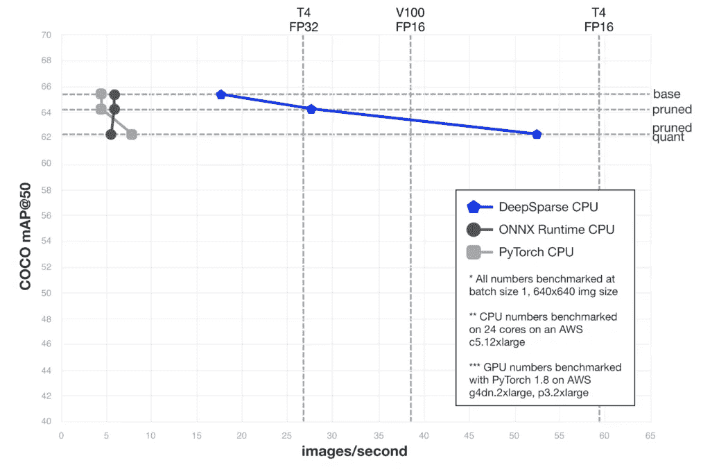
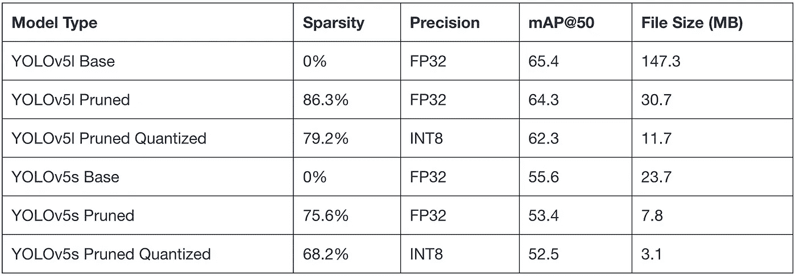
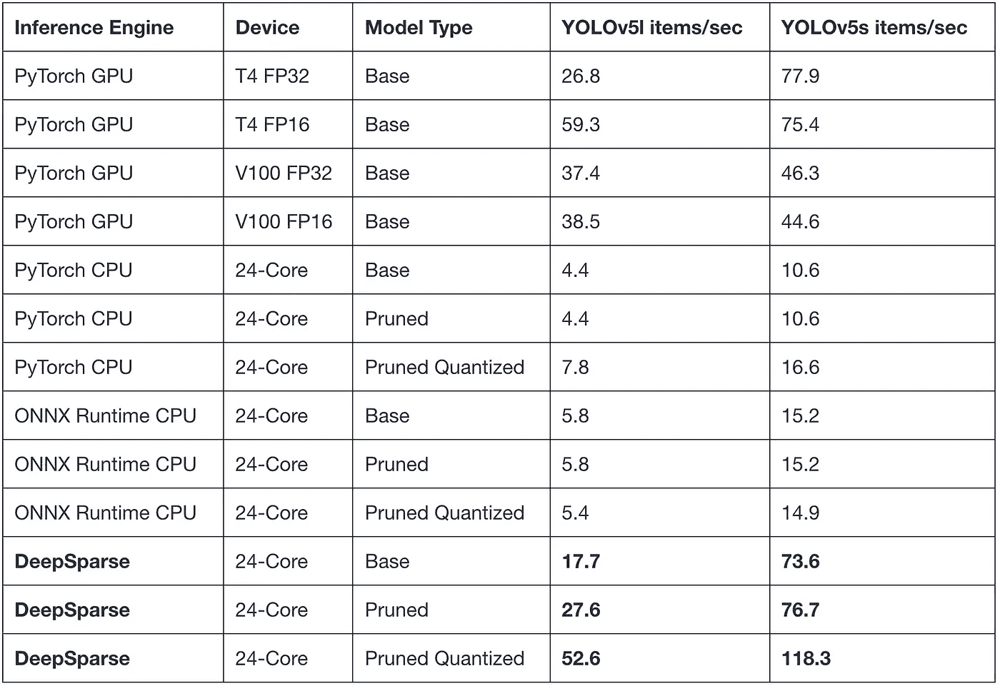
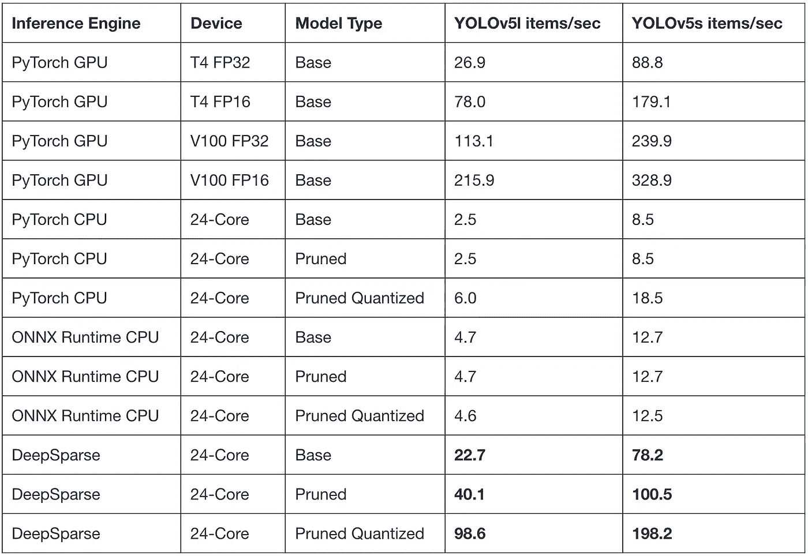
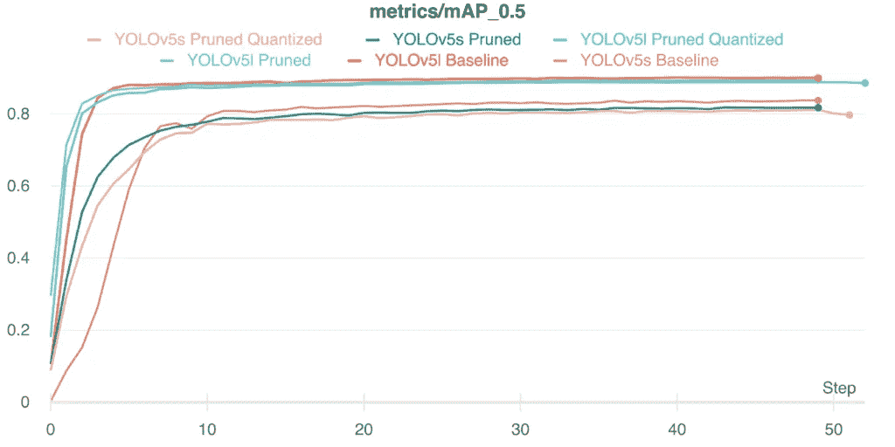

# YOLOv5:通过稀疏化在 CPU 上实现微小的内存占用和 GPU 结果

> 原文：<https://medium.com/codex/yolov5-tiny-footprint-gpu-results-on-cpus-neural-magic-18252946f85e?source=collection_archive---------11----------------------->

# 修剪和量化 YOLOv5，以 12 倍的较小模型文件将性能提高 10 倍。然后轻松应用您的数据并部署到商用 CPU 上。

Neural Magic 通过使用最先进的修剪和量化技术结合 [DeepSparse 引擎](https://docs.neuralmagic.com/deepsparse/)，提高了 YOLOv5 模型在 CPU 上的性能。在这篇博文中，我们将介绍我们的一般方法，并演示如何:

1.  利用 [Ultralytics YOLOv5 知识库](https://github.com/ultralytics)和 [SparseML 的](http://github.com/neuralmagic/sparseml)稀疏化[配方](https://github.com/neuralmagic/sparseml/blob/main/integrations/ultralytics-yolov5/tutorials/sparsifying_yolov5_using_recipes.md)创建高度修剪和 INT8 量化的 YOLOv5 模型；
2.  在新数据集上训练 YOLOv5，利用 [SparseZoo](https://sparsezoo.neuralmagic.com/?repo=ultralytics&page=1&order_by=created&descending=true) 中的预稀疏化模型，用您自己的数据复制我们的性能；
3.  使用前面提到的集成和从 [Neural Magic YOLOv5 模型页面](http://neuralmagic.com/yolov5)链接的工具复制我们的基准。

我们在 2021 年 8 月 31 日围绕上述三个话题进行了现场讨论。这里 **可以查看[。](https://neuralmagic.com/resources/on-demand-webinars/live-discussion-sparsifying-yolov5-for-better-performance-smaller-file-size-and-cheaper-deployment/)**



*图 1:不同 CPU 实现的 YOLOv5l(批量 1)与常用 GPU 基准测试的实时性能对比*。

除了 YOLOv5，我们还稀疏化了[拥抱脸 BERT](https://neuralmagic.com/blog/pruning-hugging-face-bert-compound-sparsification/) (并为[问答](https://neuralmagic.com/use-cases/sparse-question-answering/)和[情绪分析](https://neuralmagic.com/use-cases/sparse-sentiment-analysis))、 [ResNet-50](https://neuralmagic.com/blog/benchmark-resnet50-with-deepsparse/) 和 [YOLOv3](https://neuralmagic.com/blog/benchmark-yolov3-on-cpus-with-deepsparse/) 编写了具体的端到端教程，显示出比其他 CPU 实现显著的加速比。

## 在 CPU 上实现 GPU 级性能

2020 年 6 月，Ultralytics 通过创建和发布 YOLOv5 GitHub [库](https://github.com/ultralytics/yolov5)迭代了 YOLO 对象检测模型。新的迭代为非常成功的 YOLO 家族增加了新的贡献，如 [Focus](https://github.com/ultralytics/yolov5/issues/804) 卷积块和更标准的现代实践，如复合缩放等。该迭代还标志着 YOLO 模型首次在 PyTorch 内部进行本地开发，从而在 FP16 和量化感知训练(QAT)上实现更快的训练。

YOLOv5 的新发展带来了更快、更准确的 GPU 模型，但也增加了 CPU 部署的复杂性。复合缩放——同时改变网络的输入大小、深度和宽度——产生了小型的、受内存限制的网络，如 YOLOv5s，以及更大的、受计算限制更多的网络，如 YOLOv5l。此外，由于 YOLOv5s 的内存移动，后处理和焦点块花费了大量时间来执行，并降低了 YOLOv5l 的速度，尤其是在较大的输入大小时。因此，为了在 CPU 上实现 YOLOv5 型号的突破性性能，需要额外的 ML 和系统改进。

直到今天，GPU 和 CPU 之间的部署性能还是截然不同的。以 YOLOv5l 为例，在批处理大小为 1 且输入大小为 640×640 时，性能差距超过 10 倍:

*   运行 PyTorch 的 AWS 上的一个 T4 FP16 GPU 实例实现了 **59.3 项/秒**。
*   运行 ONNX 运行时的 AWS 上的一个 24 核 C5 CPU 实例达到了 **5.8 项/秒**。

好消息是 CPU 有惊人的能力和灵活性；我们只需要利用它来实现更好的性能。

为了展示不同的系统方法如何提高性能，我们用 [DeepSparse 引擎](https://docs.neuralmagic.com/deepsparse/)替换了 ONNX 运行时。DeepSparse Engine 拥有专有的改进，可以更好地将 CPU 硬件的优势融入 YOLOv5 模型架构。这些进步通过网络利用 CPU 上可用的大型缓存在深度方向上执行[。使用我们在密集的 FP32 网络上使用 ONNX 运行时的相同 24 核设置，DeepSparse 可以将基本性能提升到 **17.7 项/秒**，提高了 3 倍。这还不包括我们现在正在积极开发的新算法所能实现的额外性能提升。在接下来的几个版本中会有更多的消息—](https://neuralmagic.com/blog/how-neural-magics-deep-sparse-technology-works/) [敬请期待](https://neuralmagic.com/contact/)。

DeepSparse 引擎上的密集 FP32 结果是一个显著的改进，但它仍然比 T4 GPU 慢 3 倍以上。那么，我们如何缩小差距，在 CPU 上达到 GPU 级别的性能呢？由于网络现在很大程度上受计算限制，我们可以利用稀疏性来获得额外的性能改进。[使用 SparseML 的配方驱动方法](https://docs.neuralmagic.com/sparseml/source/recipes.html)进行模型稀疏化，加上大量的修剪深度学习网络的研究，我们成功地创建了高度稀疏和 INT8 量化的 YOLOv5l 和 YOLOv5s 模型。将稀疏量化的 YOLOv5l 模型插回到具有 DeepSparse 引擎的相同设置中，我们可以实现 **52.6 项/秒** —比 ONNX 运行时好 9 倍，并且几乎与最佳可用 T4 实现具有相同的性能水平。

视频 1:在 4 核笔记本电脑上比较 DeepSparse 引擎和 ONNX 运行时的修剪-量化 YOLOv5l。

## 对数字的深入探究

基准测试 YOLOv5s 和 YOLOv5l 有三种不同的变体:

1.  基线(密集 FP32)；
2.  修剪过的；
3.  修剪-量化(INT8)。

在下面的表 1 中报告了所有这些模型在[可可](https://cocodataset.org/#home)的验证集上的 [IOU](https://towardsdatascience.com/intersection-over-union-iou-calculation-for-evaluating-an-image-segmentation-model-8b22e2e84686) 为 0.5 时的 mAP(值越高越好)。修剪和量化的另一个好处是它为部署创建了更小的文件。另外还测量了每个模型的压缩文件大小，也可以在表 1 中找到(值越低越好)。这些模型将在后面的章节中引用，并提供不同部署设置的完整基准。

下面的基准测试数据是在 [AWS](https://aws.amazon.com/) 的现成服务器上运行的。基准测试和[创建模型](https://github.com/neuralmagic/sparseml/tree/main/integrations/ultralytics-yolov5)的代码[分别在](https://github.com/neuralmagic/deepsparse/tree/main/examples/ultralytics-yolo)[深度稀疏报告](https://github.com/neuralmagic/deepsparse)和[稀疏报告](https://github.com/neuralmagic/sparseml)中开源。每个基准包括从预处理到模型执行再到后处理的端到端时间。为了生成每个系统的准确数字，运行了 25 次预热，报告了 80 次测量的平均值。结果以每秒项数(项数/秒)记录，数值越大越好。

为每个使用案例选择的 CPU 服务器和核心数量确保了不同部署设置和定价之间的平衡。具体来说，使用 [AWS C5 服务器](https://aws.amazon.com/ec2/instance-types/c5/)是因为它们是为计算密集型工作负载而设计的，并且包括 [AVX512 和 VNNI](https://www.intel.com/content/dam/www/public/us/en/documents/product-overviews/dl-boost-product-overview.pdf) 指令集。由于 CPU 服务器的一般灵活性，核心的数量可以变化，以更好地适应确切的部署需求，使用户能够轻松平衡性能和成本。显而易见，CPU 服务器更容易获得，模型可以部署在离最终用户更近的地方，节省了昂贵的网络时间。

不幸的是，云中可用的通用 GPU 不支持使用非结构化稀疏性的加速。这是由于缺乏硬件和软件支持，是一个活跃的研究领域。在撰写本文时，新的 [A100s](https://www.nvidia.com/en-us/data-center/a100/) 确实有对半结构化稀疏性的硬件支持，但还不容易获得。当支持变得可用时，我们将更新我们的基准，同时通过模型稀疏化继续发布准确、更便宜、更[环保的](https://thenextweb.com/neural/2021/03/16/solving-big-ais-big-energy-problem/)神经网络。



*表 1: YOLOv5 模型稀疏化和验证结果*。

**延迟性能**

对于延迟测量，我们使用批量大小 1 来表示图像可以被检测和返回的最快时间。一个 24 核、单路 AWS 服务器用于测试 CPU 实现。下表 2 显示了测量值(以及图 1 的来源)。我们可以看到，将 DeepSparse 引擎与修剪和量化模型相结合，提高了下一个最佳 CPU 实现的性能。与 PyTorch 运行修剪量化模型相比，对于 YOLOv5l 和 YOLOv5s，DeepSparse 都要快 6–7 倍。与 GPU 相比，DeepSparse 上修剪量化的 YOLOv5l 与 T4 匹配，DeepSparse 上的 YOLOv5s 比 V100 快**2.5 倍**，比 T4 快**1.5 倍**。



*表 2:yolov 5*的延迟基准数(批量 1)。

**吞吐量** **性能**

对于吞吐量测量，我们使用批量大小 64 来表示吞吐量性能基准测试的正常、批量用例。此外，在我们的测试中，64 的批处理大小足以使 GPU 和 CPU 的性能完全饱和。一个 24 核、单路 AWS 服务器也被用来测试 CPU 实现。下表 3 显示了测量值。我们可以看到 V100 的数字很难被击败；然而，修剪和量化结合深度稀疏打败了 T4 性能。这种组合还击败了下一个最好的 CPU 数量，YOLOv5l 的 CPU 数量为 **16x** ，YOLOv5s 的 CPU 数量为 **10x** ！



*表 3:yolov 5*的吞吐量性能基准数(批量 64)。

## 用你自己的数据复制

虽然上述基准测试结果值得注意，但 Neural Magic 尚未看到许多在 COCO 数据集上训练的部署模型。此外，从私有云到多云设置，部署环境各不相同。下面，我们将介绍将稀疏模型转移到您自己的数据集以及在您自己的部署硬件上对模型进行基准测试时可以采用的其他资产和一般步骤。



*图 2:yolov 5 车型*的 [*VOC 数据集*](https://pjreddie.com/projects/pascal-voc-dataset-mirror/) *上的转移学习结果。*

**稀疏迁移学习**

稀疏迁移学习研究仍在进行中；然而，在过去几年里，基于彩票假说的有趣结果已经发表。强调计算机视觉和自然语言处理结果的论文显示，稀疏迁移学习从[到](https://arxiv.org/pdf/2007.12223.pdf)[在下游任务中从零开始修剪一样好，胜过密集迁移学习](https://arxiv.org/abs/1905.07785)。

本着同样的精神，我们已经发布了一个关于如何将稀疏 YOLOv5 模型中的学习转移到新数据集的教程。就像检查 [SparseML 存储库](https://github.com/neuralmagic/sparseml)，运行 [SparseML 和 YOLOv5 集成](https://github.com/neuralmagic/sparseml/tree/main/integrations/ultralytics-yolov5)的设置，然后使用您的数据启动命令行命令一样简单。该命令从 SparseZoo 下载[预稀疏模型，并开始在数据集上训练。下面给出了从删减的量化 YOLOv5l 模型转移的示例:](https://sparsezoo.neuralmagic.com/?repo=ultralytics&page=1&order_by=created&descending=true)

```
python train.py --data voc.yaml --cfg ../models/yolov5l.yaml --weights zoo:cv/detection/yolov5-l/pytorch/ultralytics/coco/pruned_quant-aggressive_95?recipe_type=transfer --hyp data/hyp.finetune.yaml --recipe ../recipes/yolov5.transfer_learn_pruned_quantized.md
```

**标杆管理**

为了在您自己的部署上重现我们的基准并检查 DeepSparse 的性能，在 DeepSparse repo 中提供了代码作为[示例。基准测试脚本支持使用 DeepSparse、ONNX 运行时(CPU)和 PyTorch GPU 的 YOLOv5 模型。](https://github.com/neuralmagic/deepsparse/tree/main/examples/ultralytics-yolo#benchmarking-example)

有关选项的完整列表，请运行:

```
python benchmark.py --help.
```

例如，要在支持 VNNI 的 CPU 上对 DeepSparse 的修剪量化 YOLOv5l 性能进行基准测试，请运行:

```
python benchmark.py zoo:cv/detection/yolov5-l/pytorch/ultralytics/coco/pruned_quant-aggressive_95 --batch-size 1 --quantized-inputs
```

## 结论

DeepSparse 引擎与 SparseML 的配方驱动方法相结合，为 YOLOv5 系列模型提供了 GPU 级的性能。与其他 CPU 推理引擎相比，YOLOv5l 上的推理性能在延迟方面提高了 6–7 倍，在吞吐量方面提高了 16 倍。迁移学习教程和基准测试示例支持在您自己的数据集和部署上直接评估性能模型，因此您可以为自己的应用程序实现这些收益。

这些引人注目的胜利不止于 YOLOv5。我们将通过更高的稀疏度、更好的高性能算法和尖端的多核编程开发，最大化稀疏化和 CPU 部署的可能性。这些进步的结果将被推送到我们的开源回购协议中，让所有人受益。请启动我们的 [DeepSparse](https://github.com/neuralmagic/deepsparse) 和 [SparseML](https://github.com/neuralmagic/sparseml) GitHub repos 来支持我们的努力。

**有疑问或需要支持？**加入 DeepSparse [Slack](https://join.slack.com/t/discuss-neuralmagic/shared_invite/zt-q1a1cnvo-YBoICSIw3L1dmQpjBeDurQ) 社区，与我们的产品和工程团队以及对模型稀疏化和加速深度学习推理性能感兴趣的更广泛的社区进行互动。

*原载于 2021 年 8 月 6 日 https://neuralmagic.com*[](https://neuralmagic.com/blog/benchmark-yolov5-on-cpus-with-deepsparse/)**。**