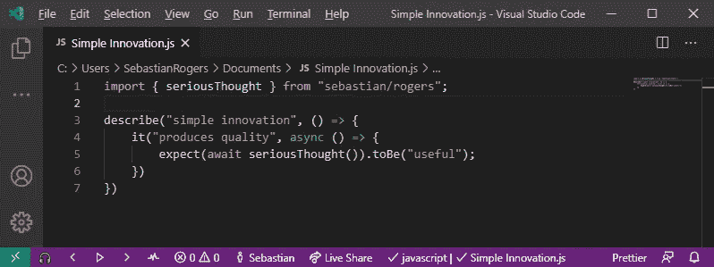

# 你不够投入 Git 投入的简单指南

> 原文：<https://medium.com/codex/you-arent-committed-enough-simple-guidelines-for-git-commit-db4301f45f87?source=collection_archive---------17----------------------->

TL:DR 不要害怕经常提交，因为这将帮助你把你的代码变更组织成逻辑上相关的组，这在出错的时候很有用

我正忙于将一个应用从 IE 11 兼容的 JavaScript 升级到 ES6 兼容的 JavaScript，这让我意识到我做得还不够。

它总是以相同的方式开始，我在代码库中选择需要做的任务，例如，在信封生成器中使用模板化的字符串，参见简单和小。

当我这么做的时候，我注意到它是一个. js 文件，而不是. ts 文件，所以我改变了它，现在我最好添加一些参数定义，一个类型不会伤害它，它会警告我，我使用了错误的对象成员。保持承诺，它可能是一个 await，最好把它的所有调用者都改成 async 方法，但是这个在模块定义的顶部，没有问题，我们将有一个自动调用的函数，并且那些函数的顺序与其他类似文件中的不匹配…

突然，我有 14 个文件改变了，当我成功地传输一个损坏的应用程序。我真的很想解开这个重大的变化，但是到底是哪一个呢？

那么，为什么我不在每个离散的任务后用一条消息快速提交呢？

我认为这是由于恐惧或缺乏信心，不知道承诺和推动之间的区别。

## 害怕遗忘

我正在编写代码，我已经意识到我真的真的应该做的十件事。我可以看到他们在我面前，他们身体上是痛苦的，只需要一分钟就可以修复。如果我停止承诺，那将会打破我的思维链，我将永远不会记得它们。全人类都将失去他们的善良。

这是因为提交是一件“大事”,它标志着整个思维链的完成。不，不是的。“推动”意味着完成，意味着已经准备好让其他人看到了。“提交”只是一个占位符,“此时我已经完成了”。

如果你真的认为你会忘记什么，把它记为待办事项。我倾向于在代码本身中这样做，就在我注意到问题的地方。然后，当我完成手头的任务并提交后，我可以回来处理这件事。我对 Visual Studio 代码使用 TODO Highlight(wayou . vs code-TODO-Highlight ),这样我可以很容易地看到 TODO 和 FIXMEs。这让我可以记录问题，然后重新专注于手头的任务。

在推送之前，我会检查 TODO 以及是否有修复它们的方法，每个方法都有自己的提交，或者我会在我们的源代码控制系统中将它们转移到 Bug、任务或用户故事中，并从代码中删除 TODO。所以它永远不会被忘记。这种情况会发生，尤其是当修复一个待办事项生成更多待办事项时，修复它们会生成更多待办事项。在这种情况下，可以肯定的是，代码需要大量的工作来重构，如果我停止重构，那么我们不会在本周发布。

## 害怕看起来像个孩子

坚持住。在同行评审中，我会不会看起来像一个完全不称职的人，一个显然从未学会如何干净、良好地编码的人？所有这些提交都是为了一个简单的修复，为什么我不一次完成呢？在我工作的时候，我在代码中放入了多少错误或低效的东西？当管理人员在代码库上运行统计数据时，我的名字将会出现在数千个提交中。回到学校，孩子，学习正确编码。

这是典型的不安全感或冒名顶替综合症。是时候把这个论点颠倒过来了。

*   每次提交都是针对一个单独的项目，显示出清晰的思路和重点。这就像一个函数或类只有一个单一的职责。
*   如果它处理的事情很重要，并且没有任何不相关的变化，那么每个提交都可以被独立地审查。这使得审查员的工作变得更加容易，而不是更加困难。
*   每一次提交都可以被视为一次渐进的重构，尤其是在有相关单元测试的情况下。如果不是，我们可以更精确地分配责任。
*   最后看看我实际做了多少工作，这是一个真正的衡量标准，我解决了 11 个问题，而我旁边的 Joella 只做了一个。这是一个真实的例子，说明为什么你不应该对自然玩家使用可游戏性指标。

事实上，多次小规模提交是一个成熟开发人员的标志。

## 害怕效率低下

这是一个奇怪的问题，来自与另一个开发人员的对话。

> 我不想用太多的提交来扰乱源代码控制系统，以防它从纯粹的数量中崩溃。

一个不理解比例的经典例子，给出了吉娜·赫尔顿的比例定律:

> 规模每次都会杀了你

这是塞巴斯蒂安·罗杰斯的第一个推论

> 当你不是在大规模经营的时候，认为你是在大规模经营将会使你变弱

还有第二个推论，在这种情况下不合适

> 当你在大规模经营的时候，认为你没有在大规模经营意味着你已经死了。

如果你的源代码控制系统和微软用来控制 Office mono-repo 或 Ubuntu Linux repos 的是同一个系统，那你就没有大规模地运营。即使这里的整个团队每小时提交十次，我们也只是触及了可以存储和检索的内容的表面。

如果我们真的开始在 GitHub 上突破界限，我们无论如何都会放弃提交，然后继续推进。

# f；BF(完成了，但是忘记了)

在每一件完整的事情之后提交，这显示了思维的清晰，虽然可能永远不需要，如果你不得不专注于一个不好的改变，你可以调查它而不用担心副作用。