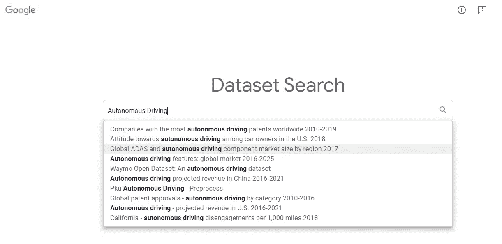

# 您现在可以访问 2500 万个数据集！

> 原文：<https://medium.com/codex/you-can-have-access-to-25-million-datasets-right-now-633e7d6b07ba?source=collection_archive---------1----------------------->

研究的一个例子:自动驾驶！

## [法典](https://medium.com/codex)

## 谷歌于 2020 年 1 月 23 日发布了一个令人印象深刻的数据集储存库和搜索工具，拥有超过 2500 万条记录。

在网络上，数以百万计的几乎任何主题的数据集都会让你感兴趣。如果你想买一只小狗，你可以找到…