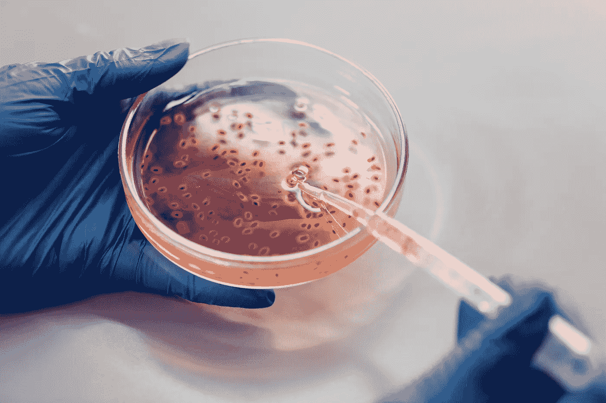

# 到 2023 年你可能会被基因编辑？—生物技术的未来就在这里！

> 原文：<https://medium.com/codex/you-could-be-genetically-edited-by-2023-the-future-of-biotech-is-here-b061b92e392d?source=collection_archive---------5----------------------->

## 如何为 2023 年的生物技术做准备

照片由[爱德华·詹纳](https://www.pexels.com/@edward-jenner?utm_content=attributionCopyText&utm_medium=referral&utm_source=pexels)从[派克斯](https://www.pexels.com/photo/food-plate-dawn-glass-4031442/?utm_content=attributionCopyText&utm_medium=referral&utm_source=pexels)拍摄

# 基因工程和编辑人类的基因

未来就是现在。我们谈论的不仅仅是最新最棒的小玩意和小发明。我们正在谈论将永远改变我们生活的东西:虚拟…