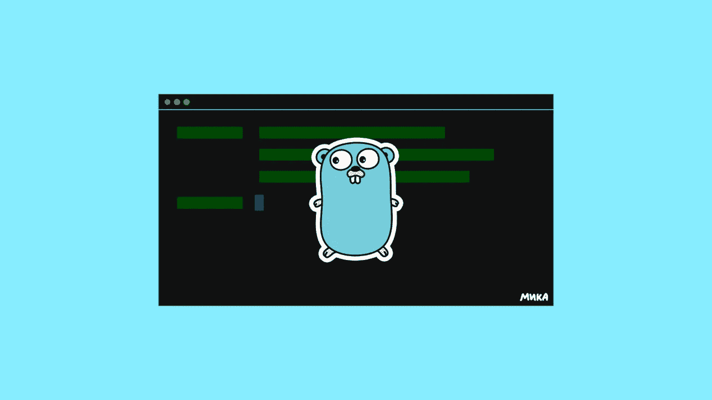

# 你不需要理解去欣赏它

> 原文：<https://medium.com/codex/you-dont-need-to-understand-go-to-appreciate-it-f62d13865d41?source=collection_archive---------6----------------------->

来源:作者。

“你为什么不用 Python？”这个问题我听过多少次了？从房间的另一头扔过来。通过互联网。穿过杂货店的过道。就好像人们看了我一眼，就意识到我在开发交易软件。而*不是*使用 Python。到目前为止，这是我们队内部的笑话。我们都有纹身，上面写着，“因为，打字强。”我们对 Python 探测的标准回应。此外，语法…