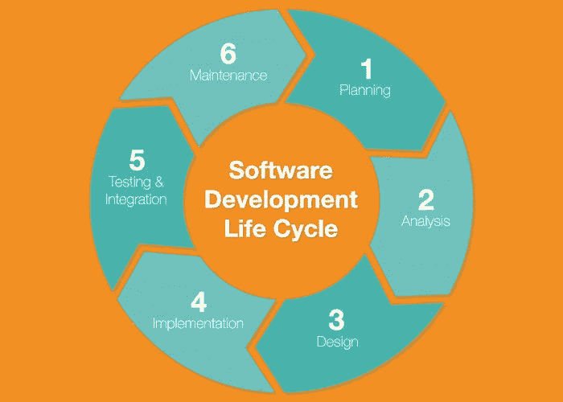

# 您与 SDLC 合作了吗…..是的，你认识我

> 原文：<https://medium.com/codex/you-down-with-sdlc-yeah-you-know-me-2ad91b422b6c?source=collection_archive---------21----------------------->

## *看看软件开发生命周期的内部情况*

几乎你认识的每个人每天都与应用程序有一些互动。如果你有一部智能手机，大部分时间花在应用程序上。其中一些应用程序可以帮助你与他人联系，一些可以帮助你购买或出售某些东西，还有一些只是为了好玩。在这一点上，每一种商业模式都需要某种应用程序来保持相关性。但是你有没有停下来想一想它们的生产过程？原来有一种被称为软件开发生命周期的可靠方法。它是一套将流程分解成更小的连续步骤的程序，有助于改善产品管理。

# **方法论**

可以采用方法或框架来为一个公司或一组个人设定标准。主要的想法是以一种深思熟虑和有条不紊的方式将一套严格的制度落实到位。依次地，一个接一个地，每个阶段都被执行，直到应用程序到达生命周期的终点。

***一些流行的有:***

*   混乱
*   敏捷
*   看板法

大多数现代公司都采用了其中的一种或它们的变体，因为应用程序的开发可能是一个漫长而艰苦的过程，没有一些合适的系统。

# 软件开发生命周期的各个阶段

需要采取许多步骤来确保项目的成功。每个阶段可能有一些子阶段，但循环基本上可以分为 6 个阶段。

# **1。规划**

**规划**阶段是指当你真正遇到需要解决的需求或问题时，可以用应用程序来处理。开始一个计划来执行这个过程。开始提问，找出一些核心原则，如谁是目标受众，用什么语言编码，谁是竞争对手，如何营销这个想法，或预算问题。

# 2.分析

**分析**阶段是你来寻找前一阶段所提问题的答案。做一些市场调查，并提出一个发展纲要。此外，这将是确定所需应用程序的核心特性和功能以及谁将从事这项工作的大好时机，即 it 团队或自由开发人员。

# 3.设计和线框

对于**设计**阶段，你将把你在分析中找到的答案记在心里，以提出设计的总体思路。例如，如果它是一个充当企业在线商店的应用程序，那么现在就是解决支付方式和所有电子商务功能的时候了。线框化是一个开发术语，用于构建所有功能如何组合和协同工作的清晰图像，在流程的这个阶段也很常见。画出草图来想象什么是想要的和需要的，最终形成一个原型来继续前进。花时间考虑需要采取什么措施来构建后端。

# 4.履行

到了**实现**阶段，大部分的开发实际上都发生了。有了一个满意的原型，应该有一个需要修改或重新安排的东西的列表，以便最终有一个合理的设计。需要设置合适的存储解决方案。后端将需要服务器。该应用程序将需要通过应用商店分发。需要编写实际的代码。为应用程序挑选一些截图来展示它，这应该类似于在线框中创建的愿景。

# 5.测试和集成

接下来是**测试**和**集成**阶段，在此阶段，事情转移到质量保证部门。不仅要考虑功能以确保一切正常，还要考虑用户界面和 UX。app 如何预制给普通用户？它是否流畅且反应灵敏？容易导航吗？这些都是这个阶段问的问题。其他需要考虑的是显卡是否符合标准，它是否跨平台兼容，或者推出更新是否容易。

# 6.部署和维护

最后，我们已经到达了过程的顶点，**部署**。在那里你可以开始享受你所有的劳动成果…如果你完全正确地遵循这个过程。但是，在启动之前，应该有一个周密的营销活动或广告计划。毕竟，如果没有人知道它的存在，精心制作的应用程序又有什么用呢？确保 SEO(搜索引擎优化)和 ASO(应用程序商店优化)是正确的，并考虑在网上创建一个登陆页面，这样人们可以更容易地找到并下载。此阶段的**维护**部分绝对不容忽视。许多(如果不是全部的话)应用程序将需要处理客户投诉并修复任何残留的 bug。客户的反馈对于继续开发应用程序和确保成功非常有用。

除了 SDLC 之外，还有许多其他方法和过程模型用于开发软件。这个只是最广泛使用和认可的。这种处理事情的方式将会极大地有助于项目的启动，并确保项目进行到底。让我知道你是否喜欢这些内容，或者看看我的 LinkedIn、Github 或我的其他一些软件开发博客。

 [## Jamon Dixon -全栈开发者-熨斗学校| LinkedIn

### 全栈式 web 开发人员，对事物的工作原理充满好奇，并具有解决问题的能力。拥有强大的…

www.linkedin.com](https://www.linkedin.com/in/jamondixon/)  [## Jamondixon -概述

### 最近毕业于 Flatiron 软件工程专业，拥有 Ruby on Rails、JavaScript、React 和 React Native 等方面的经验

github.com](https://github.com/Jamondixon)