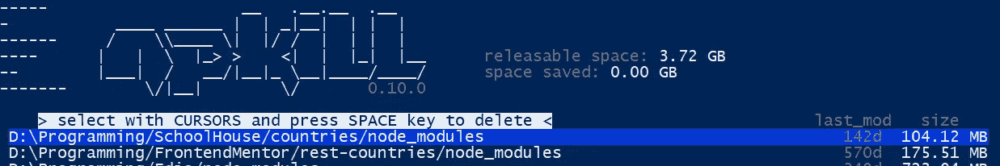

# 作为一名 JavaScript 开发人员，您需要这样做

> 原文：<https://medium.com/codex/you-need-to-do-this-as-a-javascript-developer-622d5208ca52?source=collection_archive---------8----------------------->

## 请删除您的节点模块文件夹

不幸的是，我的笔记本电脑现在几乎已经寿终正寝了。我需要在情况变得更糟之前备份我的编程文件。在这样做的时候，我意识到了一些事情，我希望每个人都应该经常这样做。


[韦斯利·廷吉](https://unsplash.com/@wesleyphotography?utm_source=medium&utm_medium=referral)在 [Unsplash](https://unsplash.com?utm_source=medium&utm_medium=referral) 上拍摄的照片

# **难以想象的大量节点模块和依赖关系**

开始任何节点项目都需要下载一堆依赖项。对于小的 API 项目来说，也需要为`node_modules`文件夹留出相当大的存储空间。Ryan Dahl 意识到了这个错误，创建了一个新的运行时环境，称为 Deno，其中所有的模块都是从互联网上导入的。您可以在此了解更多关于 Deno 的信息:

[](/codex/deno-your-node-js-alternative-fecd9b77aec5) [## Deno:您的 Node.js 替代方案

### 新的 JavaScript 运行时环境

medium.com](/codex/deno-your-node-js-alternative-fecd9b77aec5) 

虽然这篇文章的主题不是告诉你迁移到 Deno，而是在你不需要的时候例行地删除文件夹。

# 为什么要删除节点模块文件夹？



作为一名在本地机器上有多个项目的 JavaScript 开发人员:

1.  **占用大量空间—** 节点模块文件夹因占用大量磁盘空间而臭名昭著。
2.  **无用的空间—** 如果你面对事实，你要么正在做一个项目，要么已经放弃了。大多是后者。如果你近期内不会再次访问这个项目，你不需要`node_modules`文件夹。
3.  **完全可逆—** 最棒的是，当您决定将来运行项目时，您有一个命令:`npm i`来检索所有依赖项。

# 如何删除节点模块文件夹？

点击每一个项目目录，手动删除你的文件夹，会非常累。因此，有一个命令可以帮助你快速定位你的`node_module`文件夹，并通过简单的点击删除它们。

我假设你已经安装了`node`和`npm`。如果你在没有安装这些软件的情况下阅读这篇文章，我会感到困惑。

```
npx npkill
```

NpKill 是用来“杀死节点包”或节点模块文件夹的工具。你可以在他们的 [GitHub](https://github.com/voidcosmos/npkill) 上找到官方文档。

你会看到一个界面，你可以使用**上下箭头键**在可用的`node_module`文件夹之间导航，使用**空格键**删除特定的文件夹。


[https://github.com/voidcosmos/npkill](https://github.com/voidcosmos/npkill)

要在完成后退出工具，请按 ESC 键。

**注意:**有些节点模块文件夹显示在项目的根节点模块文件夹中。为了节省时间，删除一批节点模块文件夹并退出，再次运行命令，继续删除。

**编辑:**和一个朋友聊天的时候，我解释说这篇文章是关于如何老练地删除文件夹的。😜编程是解决原本不存在的问题的艺术。😂

我希望你喜欢读我的文章，并学到了一些东西。谢谢大家！✌️

```
If you wish to read every article from me, consider joining the Medium 
program with this [referral](/@cybercoder.naj/membership) link.

**Want to connect?**

My [GitHub](https://github.com/cybercoder-naj) profile.
My [Portfolio](https://cybercoder-naj.github.io) website.
```