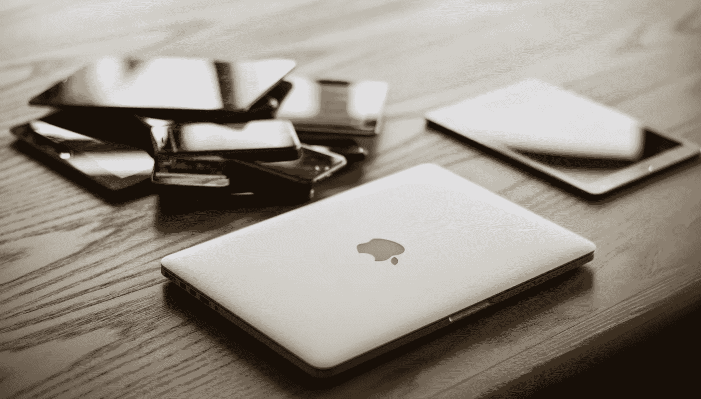

# MFA:你对抗黑客的最佳防御

> 原文：<https://medium.com/codex/you-need-to-use-strong-multi-factor-authentication-now-3acd48963105?source=collection_archive---------8----------------------->

## 药典

## 以正确的方式使用 MFA 保护您的数据

多因素身份认证已经存在多年了，但包括我在内的人们并不总是朝着这个方向努力。我们可以将其视为快速登录的障碍。但并不是所有的 MFA 都是如此，有些只是简单地插入 USB 设备，或者在应用程序上点击批准。

## 什么是 MFA

多因素身份验证或双因素身份验证(2FA)是指您使用第三方设备/应用程序来验证您的身份，以便您尝试登录的应用程序/网站知道您已获得登录授权。这一点很重要，因为用户凭据(可能是您的用户凭据)的数据泄露正在增加。它们正被试图进入账户的网络罪犯所利用。它还可以防止暴力攻击，就像他们能够获得密码一样，他们仍然需要有一个 MFA 令牌。

MFA 通过输入只有授权用户才能访问的代码，强制尝试登录的用户验证自己是授权用户。

## 多种纤维织物的类型

有很多种 MFA。以下是最常见类型的列表。

**安全问题**:你设置的，针对你生活的一组问题。

**Email** :发送到你收件箱的代码

**电话**(通话/短信):通过短信或电话发送的代码

**移动应用**:发送到您已经在移动设备上配置的应用的代码。

**生物识别**:生物识别验证。视网膜扫描仪和指纹扫描仪。

**硬件**:产生代码或印有代码的物理设备，如 Yubi key

# 并非所有的 MFA 都是平等的

如你所见，有许多不同的选项可供选择。然而，它们并不像彼此那样安全。让我们看看它们。

## **最弱**

安全问题很容易被猜测或推断出来。人们通常用简单的问题/答案来设置他们的安全问题，你这样做是为了让自己记住它，但攻击者可以很容易地在你的脸书上找到你母亲的娘家姓，或者在 Instagram 上找到你宠物的名字。

电子邮件和电话 MFA 更强，但仍有其弱点。如果您没有在您的电子邮件上设置强 MFA，或者如果您的电子邮件帐户上根本没有 MFA，那么攻击者可以很容易地通过暴力进入您的帐户，猜测您的安全问题，或者如果您非常不幸，在数据泄露中找到您的凭据。

至于电话，短信和电话可以被拦截和欺骗。这是犯罪分子进入账户的常见方式，尤其是名人账户。例如，攻击者可以使用社交工程打电话给你的提供商，让他们相信他们就是你，并让他们将帐户转移到他们的新 SIM 卡上。现在他们会收到所有的电子邮件和电话。

## 中端

移动应用可能是目前推出的最常见的 MFA 类型。这在公司内部尤其突出。它易于设置、管理和使用。它更强大，因为你需要手机来获取代码，代码在一段时间间隔内变化。

然而，像大多数事情一样，黑客已经找到了一种方法来绕过它。因为没有设备，你无法重定向代码或获取代码，你需要让用户告诉你代码。这应该很难吧？不完全是。攻击是如何工作的相当有趣。它利用鱼叉式网络钓鱼，这是一种有针对性的电子邮件攻击，让您点击链接并输入详细信息。

攻击者首先找到他们想要访问的网站。然后，他们建立一个真正令人信服的网站副本。攻击者找到一个用户，创建一封令人信服的电子邮件，要求用户出于某种原因登录他们的帐户。邮件里的链接是到假网站的。一旦目标点击链接，它就会把他们带到虚假网站，并要求他们登录。当他们登录时，系统会提示他们输入 MFA 代码，他们输入代码并选择 enter。然后，攻击者将目标重定向到正确的站点，并使用他们的凭据和 MFA 令牌登录。但是攻击者在目标知道的情况下，使用目标的凭据和 MFA 令牌打开并行会话。

这利用了网络钓鱼，但表明用户提供的令牌可以用来对付他们。一些应用程序允许您发送批准/解除提示，这将有助于避免这种攻击，因为它绕过代码并向服务器而不是网页进行认证。

## 最强

硬件设备是最强的 MFA 类型。这是因为您实际上需要该设备，并且您需要将该设备插入您的 PC/手机进行身份验证。这些设备使用非常长的密钥来防止暴力。

最后，生物识别非常安全，除了两件事。指纹很容易提取，可以用来绕过一些传感器，但它需要一个像样的质量打印。如果你身边有攻击者，那么他们可以很容易地将你的手机对准你的脸，为他们解锁手机。

所有这些都有缺陷。有些人比其他人更难走动。最后，最好的方法是对你的安全进行分层。确保您的身份验证具有身份验证。希望像所有事情一样，这让你停下来，想想如何保护你的账户