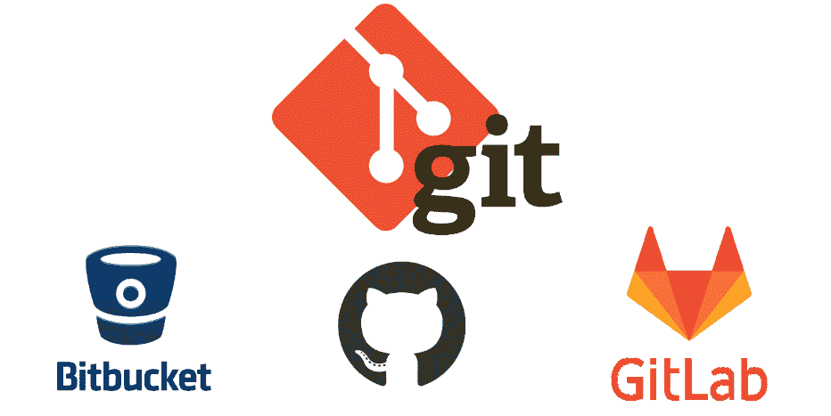
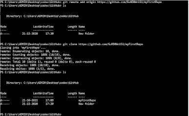
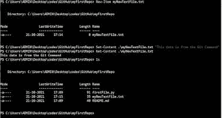
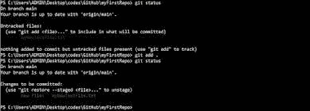

# 您应该知道这些 Git 命令|第 3 部分

> 原文：<https://medium.com/codex/you-should-know-this-git-commands-part-3-74890e6415c8?source=collection_archive---------4----------------------->

# Git 是什么？为什么要学？

Git 是一个由 Linux 维护的版本控制工具，它是由 Linux 内核的创造者 Linus Torvalds 创造的**。它被许多开源技术用来维护他们的软件，这些软件正在被世界各地的人们开发。GIT 允许开发人员同时使用不同版本的软件，并且维护起来也很容易，而不是使用单一版本的软件。它也是**高度安全、快速和灵活的**。**

使用 Git，我们可以轻松地管理多个软件和版本，我们还可以跟踪应用程序中所做的更改。使用 GIT 命令可以安全方便地完成合并、拉取、推送、提交等操作。版本控制特性可以通过一个简单的例子来理解，假设你开发了一个有两个版本的软件，1.0.0 和 2.0.0。现在，其中一个开发人员需要开发版本 1.0.0 并修复一个 buy，因此使用 GIT 他可以轻松地使用该版本，而不会影响版本 2.0.0 的功能，因为当开发人员开发版本 1 时，将会创建一个新的分支或块的一部分，该分支或块将与其他分支隔离开来，如果完成后没有错误，该块可以添加到主分支中进行生产。这就是 GIT 非常适合这项工作的原因。

让我们从学习重要的 Git 命令开始。

# 1.git 初始化:

这是一个从存储库开始的命令，如果我们使用其他命令，有时可以用 git 克隆来代替。首先，我们需要在终端中找到要创建存储库的文件夹，并键入以下命令。

# 2.git 克隆:

当没有要使用的存储库，但是我们正在使用文件夹中没有的其他存储库时，可以使用此命令。简而言之，这就像将 GitHub 或 bitbucket 中的在线知识库复制到我们的本地机器中，并开始在其中工作。

这个命令的语法是**git clone repository _ line**

# 3.git 远程添加原点

这个命令用于设置我们的 Github 帐户中的存储库，我们正在处理这个存储库。为此，您需要提供 GitHub 帐户的凭证来使用这个命令。在上一篇文章中，我们创建了一个名为 myFirstRepo 的存储库，我们将使用这个存储库进行演示，您可以使用任何存储库。

*   **= > git 远程添加原点< repo-link >**

因此，在上面的图片中，我们可以看到，我已经将原点设置为 myFirstRepo 存储库，并将库克隆到我的本地计算机中，这样我们就可以克隆存储库，在克隆文件夹之前，只有一个名为“新文件夹”的文件夹。在克隆之后，存储库的所有内容都添加到与存储库名称或 myFirstRepo 同名的文件夹中。

在上图中，我们使用 **PowerShell** 命令“ **New-Item** 创建了一个名为 myNewTextFile 的新 txt 文件，并使用“ **Set-Content** 命令向其中添加了数据。

# 4.git 状态和 git 添加。

此命令可用于查看需要提交到存储库中的文件的状态，通过使用 git add 命令，我们可以将文件添加到准备提交文件的暂存区域。

*   **= > git 状态**
*   **= > git add。**(或)
*   **= > git 添加 myNewTextFile.txt**

# 5.git 提交-m”消息

该命令用于提交到主存储库中，但是现在更改不会反映在主存储库中，您可以使用**git log-one line**命令查看日志。通过使用 commit 命令，可以创建一个新节点，并将其推送到 git 存储库。

*   **= > git commit -n "我的新提交消息"**

欲了解更多信息，请访问:

[https://www . mayhemcode . com/2021/10/you-should-know-this-git-commands-part-3 . html](https://www.mayhemcode.com/2021/10/you-should-know-this-git-commands-part-3.html)

*原载于 2021 年 10 月 21 日 https://www.mayhemcode.com**T21*[。](https://www.mayhemcode.com/2021/10/you-should-know-this-git-commands-part-3.html)