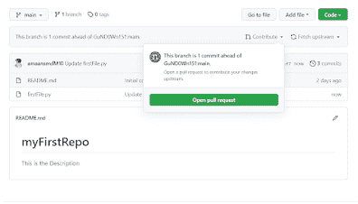

# 您应该现在就了解这个 GitHub 特性|第 2 部分

> 原文：<https://medium.com/codex/you-should-know-this-github-feature-right-now-part-2-4f52dadd257a?source=collection_archive---------10----------------------->

在文章[理解 GitHub](https://www.mayhemcode.com/2021/10/understanding-github-in-nutshell-part-1.html) 、[中，我们学习了使用 GitHub 的基本知识，比如创建存储库、派生其他存储库。让我们更进一步，看看我们可以在 GitHub 中实现的更多功能和特性。我们将学习如何对知识库做出贡献，](https://www.mayhemcode.com/2021/10/understanding-github-in-nutshell-part-1.html)[如何提出拉和推请求](https://www.mayhemcode.com/2021/10/you-should-know-this-github-feature.html)。

# GitHub 拉和推请求

所以，我们对开源技术做出贡献的方式是通过拉和推请求，首先，让我们理解这实际上意味着什么。在上一篇文章中，我们学习了如何派生其他人的，但是我们也知道在存储库的副本中进行不影响原始存储库的更改。因此，现在拉和推请求开始出现了。每当存储库的开发人员想要在代码的特定部分得到帮助时**，他就会发出一个拉请求**。我们可以在 GitHub 上找到这些请求，如果我们可以通过修改代码来解决问题，我们可以向开发人员发出推送请求。在这之后，他审查代码并决定是否将它与一个**主/主分支**或任何其他分支合并。

# 如何提出拉取请求？

让我们用一个简单的例子来理解这一点，我上次创建了一个名为 myFirstRepo 的存储库，现在让我们创建拉和推请求。为了开始这些，让我们分叉我们想要贡献的库，在**分叉库**和编辑代码之后，我们需要做一个推送请求。

这个过程无法用一个帐户来演示，所以我请求我的一个朋友为回购做出贡献。如我们所见，我的朋友已经完成了回购并修改了代码。现在，如果他想让更改反映在原始存储库中，那么他需要通过单击 Contribute 选项发出 Pull 请求，如上图所示。

我们可以看到，他刚刚添加了一个新行“print("After Editing ")”,因此当我们单击“Open pull request”时，我们将能够看到他们所做的更改。

然后我们需要点击**创建一个拉取请求**，这将向原始存储库的开发者发送一个请求。我们可以在页面的 Pull request 选项卡中看到一个通知。

然后就看开发者**是否将其与分支**合并。

# 什么是 GitHub 分支？

GitHub 分支是另一个重要的方面。分支可以被认为是这个软件的不同版本，可以有很多分支，比如主软件**，主软件**，开发软件。我们可以这样使用分支，全世界都在使用生产分支，开发人员在开发分支工作，主软件在主分支。总是建议不要在主分支中发出拉请求，因为主分支包含所有主要的软件代码，如果您修改的代码有一些错误，那么它可能会影响软件或应用程序。

因此，现在我们可以将修改后的代码添加到主分支中，因为这只是为了演示。然后，我们可以看到主存储库反映了这些变化。并且代码与存储库合并。这里我们可以注意到的另一件事是，在主存储库的**贡献者的标签**下，我们可以看到我的朋友也被添加了，因为他贡献了部分代码。通过这种方式，我们可以为开源技术做出贡献。

# 如何找到合适的存储库进行贡献？

找到合适的库来做贡献也是一项艰巨的任务，但是 Github 的一个特性让我们的生活变得更容易，让我们看看如何去做。登录你的帐户，进入主页，现在你可以看到一个像拉请求的选项，点击它。

在这里，我们可以根据经验水平、使用的语言或框架等来搜索存储库。这是一个非常强大的工具，你可以找到正确的存储库。此搜索选项可以与选项和命令一起使用，例如。**is:open is:issue language:python label:“good first issue”**在这里我们可以看到我们正在搜索打开并使用 python 语言的 pull 请求。我们还提到了 Good First Issue，这意味着它对初学者很有好处，然后我们可以看到世界各地的开发人员提出的一系列拉请求，我们可以选择其中的任何一个并开始为其做出贡献。

欲了解更多信息，请访问:

[https://www . mayhemcode . com/2021/10/you-should-know-this-github-feature . html](https://www.mayhemcode.com/2021/10/you-should-know-this-github-feature.html)

*原载于 2021 年 10 月 18 日 https://www.mayhemcode.com**的* [*。*](https://www.mayhemcode.com/2021/10/you-should-know-this-github-feature.html)