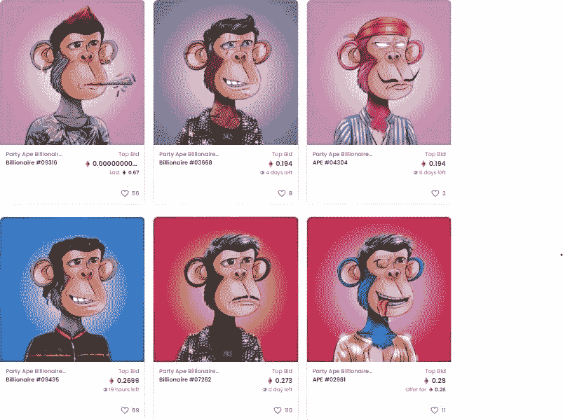
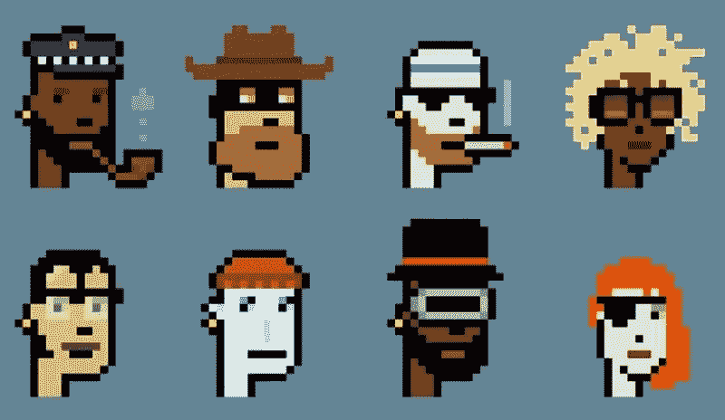

# 你应该了解一下 NFT 的原因

> 原文：<https://medium.com/codex/you-should-learn-about-nfts-here-s-why-77e75d016927?source=collection_archive---------9----------------------->

如果你关注关于加密货币的新闻，你可能会听说 NFT 在几天内占领了整个市场。但是 NFT 到底是什么，为什么每个人都想在这里投入大量资金。让我们来解决我们对此的所有疑问。

# 什么是 NFT？

让我们直接问什么是 NFT。NFT 或不可替代的令牌类似于你在区块链拥有某物的证书或证明。它不是像黄金或货币一样的真实世界实体。就像其他加密货币一样，它是一种**数字或虚拟资产**。但是有一些东西使它不同于其他东西，因为我们需要知道名字的含义。

可替换意味着如果你给予一件东西，你可以在一些交换中得到同样的东西，例如，如果你用加密货币交易一些东西，你将再次获得相同的加密货币，这意味着交换项目和你交换的项目都是相同的。但在 [**不可替代**](https://www.mayhemcode.com/2021/12/you-should-learn-about-nfts-heres-why.html) **的情况下，它们是独一无二的**并且不可互换，因为它们在全世界只有一个。简而言之，我们也可以通过思考来理解事物，因为我们正在收集一些只有你拥有而其他人没有的独特实体，这方面的一个简单例子可以是**蒙娜丽莎的画**，这在整体中只有一幅。代币可以是任何东西，可以是绘画、艺术品或任何独特的数字资产。NFT 正在进行许多项目，制作独一无二的艺术品，售价接近数千美元。顺便说一下，这里要注意的一点是 NFT 只能用以太坊来买卖。但是你可能会有一个疑问，为什么我想买这么贵的艺术品，难道我不能通过右键点击并下载图像来将图像保存在我的电脑上吗？我们来回答这个问题。

上图来自一个名为 [Party Ape 亿万富翁俱乐部](https://draft.blogger.com/blog/post/edit/3504568035593819778/7634151983948499810#)的项目，该项目在 OpenSea 进行营销。

这是 NFT 的另一个特点。正如我们之前所讨论的，它们是独一无二的，因此所有权的证明是如何维护的。因此，即使我们将图像保存在我们的设备中，也没有所有权证明，因为细节存储在区块链网络中。这也是区块链做的，我们都知道在区块链内操作数据有多难，NFT 可以使用任何区块链技术，但当我们使用以太坊交易时，它使用的是 T2 以太坊区块链网络。所有的 NFT 都存储在区块链中，带有它们唯一的识别码和主人的详细信息。这些**代币可以使用以太网**出售或交易。但是实际上除了交易和销售之外，还有很多事情要做。

# 如何交易和出售 NFT 氏症

我想这就是你们正在阅读这篇文章的原因。有很多方法可以获得 NFT 奖并出售。最好的方法是去 NFT 市场，所有可用的代币都可以在那里买到。这是一个地方，所有的项目将提供和营销。在实际购买代币之前，您需要了解一些术语。

首先，除了市场之外，还有一些地方你可以以更便宜的价格买到 NFT，而且价格只有市场上原价的 1/10。这叫做**铸造**，就是**在代币进入市场**之前购买代币，但是怎么做呢？。在一个项目推出代币之前，他们实际上在其他平台和他们自己的网站上发布代币，他们在那里进行拍卖，你可以从那里购买代币。你也可能会收到一个随机的家伙的不和谐邀请，他想让你加入他们的 NFT 服务器，这都是宣传的一部分。

在这一点上，社区非常重要。如果有相当多的人愿意购买令牌，那么最终价格将会飙升，还有一些其他参数可以提高 NFT 的价格，其中一个主要参数是令牌的历史**比如谁**创造了令牌**是一些著名的艺术家还是一个普通人，谁更早拥有这个 NFT，等等。还有一个因素是令牌的稀有性，我们知道它们是独一无二的，但有些东西在其他艺术品中也可以看到，例如，相同的发型或相同的眼镜等，每个 NFT** 都有一个**稀有度分数，它告诉我们来自其他人的令牌有多稀有。**

# NFT 的未来是什么？

事实上，NFT 有很多未来。它就像一个非常罕见的项目的数字集合。决定它未来的另一个重要因素是它可以在游戏中作为皮肤或角色使用。换句话说，如果你在某个游戏中有大多数人没有的皮肤，那么你真的可以把它卖给以太坊，也可以用它买其他皮肤。你可以玩你拥有的角色，就像上面显示的一只猿。

这也带来了一些趋势，比如未来的一切都将有一个独特的身份，就像所有权的证明。绘画、艺术品、皮肤或任何数字资产都可以被视为 NFT，可以与其他代币进行交易。但是大多数人投资于此，期望它的价格会在未来暴涨，因为它们很稀有，这是这项技术如何运行和维持的主要动机。

*原载于 2021 年 12 月 3 日*[*【https://www.mayhemcode.com】*](https://www.mayhemcode.com/2021/12/you-should-learn-about-nfts-heres-why.html)*。*