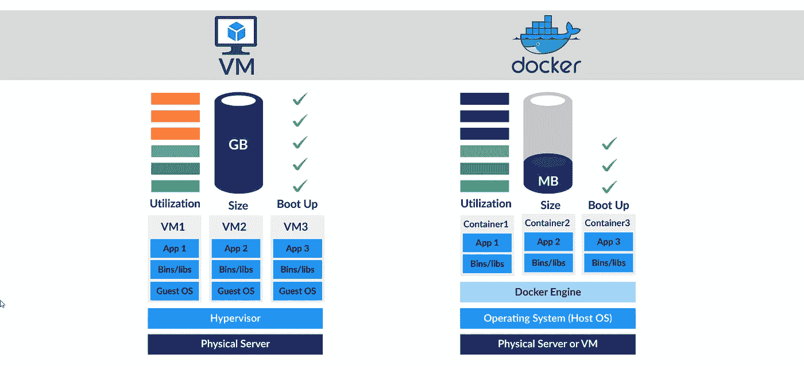
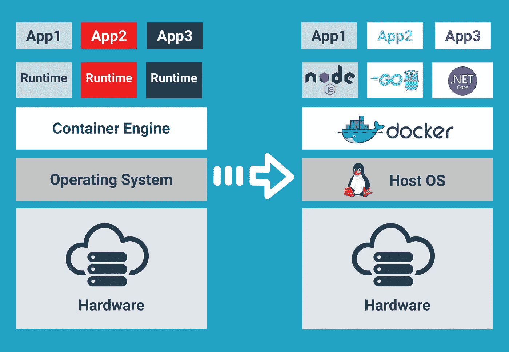

# 你应该马上学习 Docker！！原因如下

> 原文：<https://medium.com/codex/you-should-learn-this-technology-right-now-b18962c7428d?source=collection_archive---------7----------------------->

嗯，所以你们大多数人可能知道 docker，也许你甚至不知道它。

让我们从问自己为什么需要 docker 开始思考这个问题。对于所有的开发人员来说，他们可能会遇到这样的情况:他们必须将自己的工作提交给老板并运行，但有时程序或软件可能会在您的 pc 或笔记本电脑上运行，但可能无法在他们的设备上运行。或者简单一点，举个例子，你正在用某个数据库制作一个节点应用程序，你已经完成了所有的工作，它工作得很好，但是当你把它发送给其他人时，有时它可能不工作。可能由于不同的依赖关系，或者可能节点应用程序无法与数据库服务器交互，这个问题有时可能很严重，因为我们必须检查使用哪个版本和使用哪个软件，这可能是一项繁琐的工作。

现在多克也参与进来了。Docker 是一个容器。所以首先让我们谈谈容器。你可以把集装箱想象成某个船坞附近的集装箱，而船坞就是码头工人。因为容器的所有内容都与其他容器隔离，所以 docker 容器也是如此。如今，计算机软件中的隔离非常重要，原因有很多:首先，它提供了安全性，如果容器的一部分受到影响，它不会影响到其他容器。如果软件有问题，我们可以很快解决。

# 但是 Docker 实际上存储了什么呢？

我们有时可能会听说虚拟化或虚拟机箱或 VMware，这是让我们在太空 pc 上运行不同操作系统的软件和技术。码头工人把它带到了一个新的高度。在基础的虚拟机箱体系结构中，它有一个主操作系统，然后是虚拟机管理程序，我们可以在不同的虚拟机箱上安装不同的操作系统，但在 docker 中，它删除了虚拟机管理程序部分，并直接与主机操作系统交互，这一点要清楚得多。与虚拟盒子相比，docker 的尺寸更小，这是一个加分项。

# Docker 入门…

为了构建和使用 docker，我们需要一些命令和经验

让我们启动终端，执行一些 docker 命令。

sudo apt-get 安装 docker

因此，docker 有一个网站所有者有 [Docker Hub](https://hub.docker.com/) ，那里有 Docker 所需的所有图像，我们可以从中提取并开始构建它。为此，我们将提取一个 ubuntu 图像

**码头工人拉乌班图**

我们现在将创建一个名为 Our_First_docker_container 的容器

**docker run-d-t—name Our _ First _ docker _ container ubunto**

就是这样，您只需在几秒钟内构建您的第一个 docker 容器，通过虚拟化，这可能需要更多的时间。

查看我们可以使用的所有正在运行的进程。

要进入容器，我们可以使用下面的命令

**Docker PS Docker exec-it {您的容器名称} bash**

有关 Docker 及其用途的更多信息，请访问:

https://www.mayhemcode.com/2021/06/what-is-docker.html

*原载于 2021 年 6 月 4 日 https://www.mayhemcode.com***。**