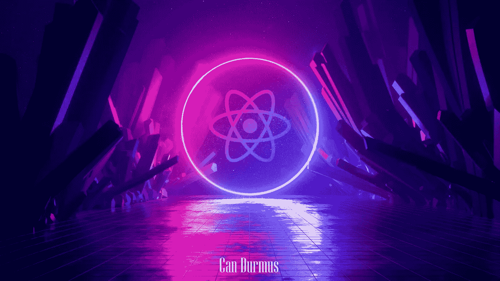

# 你应该只选择一个反应:帧运动与 GSAP

> 原文：<https://medium.com/codex/you-should-pick-only-one-framer-motion-vs-gsap-9c4352f571a4?source=collection_archive---------0----------------------->

## Web 开发技巧

## 一个设计良好的动画可以很容易地将网站带到另一个层次，但是使用正确的工具和动画设计一样重要。

照片由**[**danielcunhac**](https://imgur.com/user/danielcunhac)**上传**[**Imgur**](https://imgur.com/gallery/65bUFNy)**，**编辑[**作者**](/@candurmuss)******

****如今，很难想象一个专业的现代网站没有…****