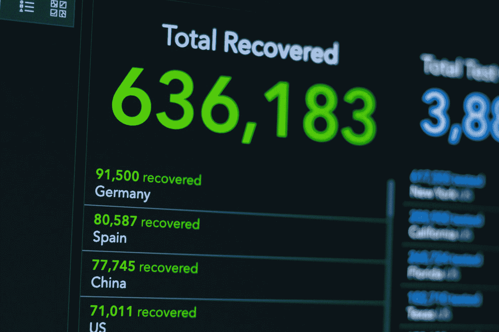

# 如果不知道如何处理数据，你将一事无成

> 原文：<https://medium.com/codex/you-wont-make-it-far-without-knowing-how-to-work-with-data-8aeb94661d6?source=collection_archive---------2----------------------->

[KOBU 机构](https://unsplash.com/@kobuagency?utm_source=medium&utm_medium=referral)在 [Unsplash](https://unsplash.com?utm_source=medium&utm_medium=referral) 上拍摄的照片

作为开发人员，不处理大量数据或需要复杂逻辑的数据很容易。因此，很容易忽视提高数据处理技能的需要。当你试图推进你的事业时，这个问题就变得很明显了。在那里，一切都与数据有关，并不都与编程有关。