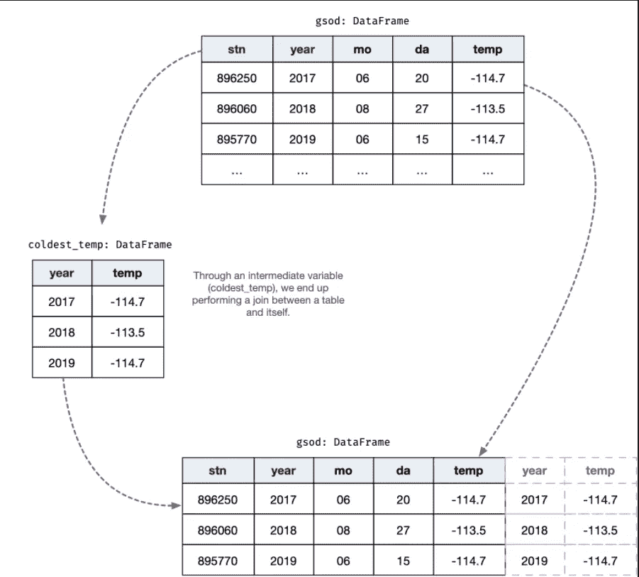
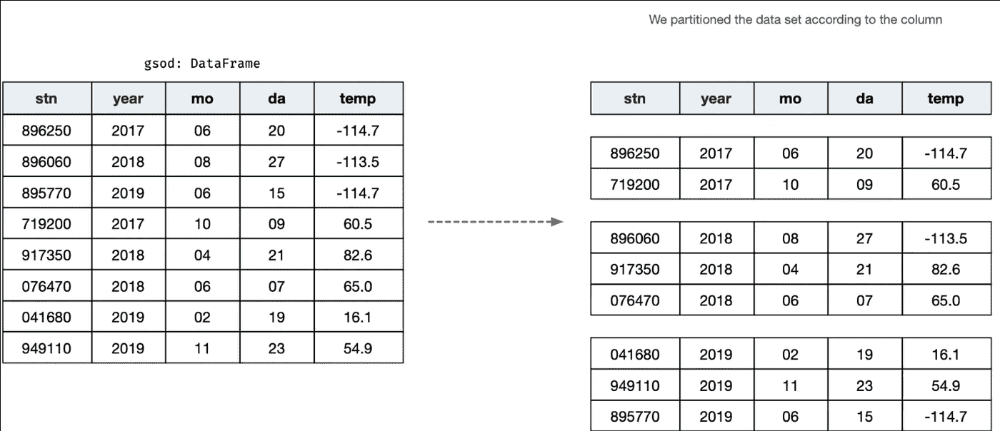

# 不同视角下的数据:窗口功能

> 原文：<https://medium.com/codex/your-data-under-a-different-lens-window-functions-9f41a2b31354?source=collection_archive---------15----------------------->

## 文章

## *摘自* [*数据分析用 Python 和 PySpark*](https://www.manning.com/books/data-analysis-with-python-and-pyspark?utm_source=medium&utm_medium=organic&utm_campaign=book_rioux_data_11_4_19) *作者 Jonathan Rioux*

*本文介绍了窗口函数和它们支持的数据转换类型。*

通过在[manning.com](https://www.manning.com/?utm_source=medium&utm_medium=organic&utm_campaign=book_rioux_data_11_4_19)的结账处将 **fccrioux** 输入折扣代码框，使用 Python 和 PySpark 进行数据分析，可享受 40%的折扣。

当执行数据分析或特征工程(这是机器学习中我最喜欢的部分！)，没有什么比窗口函数更让我开心了。当你第一眼看到它们时，它们看起来像是*分割-应用-组合*的淡化版本。然后你打开百叶窗，砰！在一个简短的、富有表现力的代码体中进行强大的操作。

那些不知道窗口功能的人注定要重新实现他们的功能，很糟糕。这是我辅导数据分析师、科学家和工程师的经验。如果你发现自己在努力

1.  排名记录
2.  根据一组条件识别顶部/底部记录
3.  从表中的上一次观察中获取值
4.  构建趋势特征(即总结过去观察结果的特征，如上周观察结果的平均值)。

你会发现窗口函数会成倍提高你的生产力，简化你的代码。

窗口函数填补了群组聚集(`groupBy().agg()`)和群组映射 UDF ( `groupBy().apply()`)变换之间的空隙。分组聚合方法和分组映射 UDF 都依赖于*分区*来根据谓词分割数据帧。组聚合转换将为每个组生成一条记录，而组图 UDF 允许生成任何形状的数据框；窗口函数始终保持数据框的尺寸不变。窗口函数在我们在一个分区中定义的*窗口框架*中有一个秘密武器:它决定了函数的应用中包含哪些记录。

窗口函数主要用于创建新列，所以它们利用了一些熟悉的方法，比如`select()`和`withColumn()`。因为我们已经熟悉了添加列的语法，所以我用不同的方法来处理本章。首先，我们看看如何依靠一些我们已经知道的概念来模拟一个简单的窗口函数，比如 groupbys 和 joins。接下来，我们熟悉了窗口函数的两个组成部分:窗口规范和函数。然后，我应用并剖析了三种主要类型的窗口函数(汇总、排名和分析)。配备了窗口函数应用程序的构建块，我们通过引入有序和有界窗口来打破窗口规范，其中我引入了窗口框架的概念。最后，我们兜了一圈，引入 UDF 作为窗口函数。

窗口函数本身并不复杂，但是有很多新的术语，它们的行为一开始可能并不直观。

## **生长并使用一个简单的窗口函数**

当学习一个新概念时，我发现当我能够用我目前所知道的从基本原则出发来构建它时，我会轻松得多。这正是我学习窗口函数时所发生的事情:我首先使用大量 SQL 指令复制它们的行为。完成后，我很清楚为什么窗口函数如此有用。想象一下，当我发现它们被编入 PySpark，并附带一个漂亮的 Python API 时，我有多高兴。给我涂上快乐的颜色！

在这一节中，我们遵循完全相同的路径:我首先使用以前章节中的技术复制一个简单的窗口函数。一旦我们很好地理解了管道，我将介绍窗口函数的语法以及它们如何简化您的数据转换逻辑。我希望当窗口功能最终为我“点击”时，你会得到和我一样的兴奋。

在本节中，我们使用一个数据集，其中包含一系列气象站的天气观测数据，按天进行汇总。窗口函数在处理类似时间序列的数据(如每天的温度观测值)时尤其出色，因为您可以按日、月或年对数据进行切片，并获得有用的统计数据。

**清单 1。阅读本章示例所需的数据:GSOD NOAA 天气数据。**

```
gsod = spark.read.parquet("./data/window/gsod.parquet")
```

现在有了数据，我们开始提问吧！接下来的部分说明了窗口函数背后的思维过程，然后才是术语和语法。

## **识别每年最冷的一天，漫漫长路**

在本节中，我们通过前面章节中学习的功能来模拟一个简单的窗口函数——`join()`方法。这里的想法是为窗口功能提供一种直觉，并去掉一些围绕它们的魔法。为了说明这一点，我们从一个简单的问题开始询问我们的数据框架:*每年记录的最低温度是何时何地的*。换句话说，我们需要一个包含三条记录的数据帧，每年一条，显示该年记录的气象站、日期(年、月、日)和最冷一天的温度。

让我们来绘制思维过程。首先，我们将得到一个包含每年最冷温度的数据帧。这将为我们提供两个列(`year`和`temp`)及其值。在清单 2 中，我们创建了`coldest_temp`数据帧。这个数据框获取我们的历史数据，按`year`列分组，我们通过`agg()`应用的`min()`聚合函数提取最小值`temp`。

**清单 2。使用** `**groupBy()**` **计算每年的最低温度。**

```
coldest_temp = gsod.groupby("year").agg(F.min("temp").alias("temp"))
 coldest_temp.orderBy("temp").show()

 # +----+------+
 # |year|  temp|
 # +----+------+
 # |2017|-114.7|
 # |2018|-113.5|
 # |2019|-114.7|
 # +----+------+
```

## 人们，地球是冷的！

这提供了年份和温度，大约是原始 ask 的 40%。为了获得其他三列(`mo`、`da`、`stn`)，我们可以在原始表上使用左半连接，使用`coldest_temp`的结果来解析连接。在清单 3 中，我们在`year`和`temp`列上使用左半等价连接来连接`gsod`和`coldest_temp`。因为`coldest_temp`只包含每年最冷的温度，左半连接只保存来自`gsod`的对应于该年温度对的记录；这相当于只保留了温度最低的那一年的记录。

清单 3。使用左半自连接计算每年的最冷站/日。

```
coldest_when = gsod.join(
     coldest_temp, how="left_semi", on=["year", "temp"]
 ).select("stn", "year", "mo", "da", "temp")

 coldest_when.orderBy("year", "mo", "da").show()

 # +------+----+---+---+------+
 # |   stn|year| mo| da|  temp|
 # +------+----+---+---+------+
 # |896250|2017| 06| 20|-114.7|
 # |896060|2018| 08| 27|-113.5|
 # |895770|2019| 06| 15|-114.7|
 # +------+----+---+---+------+
```

如果您注意清单 2 和清单 3 中的代码，我们正在执行`gsod`表和来自`gsod`表的东西之间的连接。一个*自连接*，即当你将一个表与其自身连接时，通常被认为是数据操作的反模式:虽然它在技术上没有错，但它可能会很慢，并使代码看起来比它需要的更复杂。这看起来也有点奇怪:当您想要将包含在两个或更多表中的数据链接起来时，连接表是有意义的。将一个表与其自身连接起来感觉是多余的，正如我们在图 1 中看到的:数据已经在(一个)表中了！



图一。当表最终与自身连接时，就会发生自连接。您可以用窗口函数替换大多数自连接。

幸运的是，窗口函数可以给你同样的结果，而且速度更快，代码更简单。在下一节中，我们将使用窗口函数来重现相同的数据转换，从而简化和加速我们的数据转换代码。

## 创建和使用简单的窗口函数获得最冷的日子

本节通过替换上一节的自连接示例来介绍窗口函数。我引入了`Window`对象，并对其进行了参数化，以将数据框分割成列值。然后，我们使用传统的选择器方法在数据帧上应用窗口。

在文章的开始，我在介绍 UDF 熊猫集团地图时，将窗口功能和拆分-应用-合并模式进行了比较。为了与来自 SQL 的窗口函数术语保持一致，我对 split-apply-combine 的三个阶段使用了不同的词汇表。

1.  我们将*分割*数据帧，而不是分割。
2.  我们将*选择窗口*上的值*，而不是应用*
3.  组合/联合操作在窗口函数中是隐式的(即没有显式编码)。

窗口函数应用于数据窗口，根据列上的值进行拆分。每个分割称为一个*分区*，获取应用于其每个记录的窗口函数，就像它们是独立的数据帧一样。然后将结果合并成一个数据帧。在清单 4 中，我创建了窗口，根据列`year`中的值进行分区。`Window`类是一个构建器类，就像`SparkSession.builder`一样:我们通过在`Window`类标识符后追加方法来链接参数化。结果是一个包含参数化信息的`WindowSpec`对象。

**清单 4。使用** `**Window**` **构建器类创建一个** `**WindowSpec**` **对象。**

```
from pyspark.sql.window import Window  ❶

 each_year = Window.partitionBy("year")  ❷

 print(each_year)
 # <pyspark.sql.window.WindowSpec object at 0x7f978fc8e6a0>
```

❶ **我们从** `pyspark.sql.window` **导入** `Window` **。因为它是我们将用于窗口函数的唯一对象，所以不需要导入整个模块。**

❷ **根据一个或多个列的值进行分区，我们将列名(或一个** `Column` **对象)传递给** `partitionBy()` **方法。**

一个`WindowSpec`对象本身只不过是一个最终窗口函数的蓝图。在我们的例子中，我们在清单 4 中创建了一个名为`each_year`的窗口规范，其中包含指令“根据‘year’列中包含的值对这个`WindowSpec`将应用到的数据帧进行分区”。当您将它应用到您的数据框时，真正的神奇就发生了。对于我们的第一个窗口函数应用程序，在逐行处理之前，我打印了完整的代码，再现了前面看到的自连接方法。检查窗口应用程序和左半连接之间的区别，如清单 5 所示。

**清单 5。使用左半自连接计算每年的最冷站/日(bis)。**

```
coldest_when = gsod.join(
     coldest_temp, how="left_semi", on=["year", "temp"]
 ).select("stn", "year", "mo", "da", "temp")

 coldest_when.orderBy("year", "mo", "da").show()

 # +------+----+---+---+------+
 # |   stn|year| mo| da|  temp|
 # +------+----+---+---+------+
 # |896250|2017| 06| 20|-114.7|
 # |896060|2018| 08| 27|-113.5|
 # |895770|2019| 06| 15|-114.7|
 # +------+----+---+---+------+
```

**清单 6。使用窗口函数选择每年的最低温度，包括时间和地点。**

```
gsod.withColumn("min_temp", F.min("temp").over(each_year)).where(  ❶
     "temp = min_temp"
 ).select("year", "mo", "da", "stn", "temp").orderBy(
     "year", "mo", "da"
 ).show()

 # +----+---+---+------+------+
 # |year| mo| da|   stn|  temp|
 # +----+---+---+------+------+
 # |2017| 06| 20|896250|-114.7|
 # |2018| 08| 27|896060|-113.5|
 # |2019| 06| 15|895770|-114.7|
 # +----+---+---+------+------+
```

❶ **我们在定义的窗口内选择最低温度*(这里:每年)。***

是时候解包一些代码了。首先，我们通过`withColumn()`方法定义一个列`min_temp`，它收集了`temp`列的最小值。现在，不是选择整个数据帧的最低温度，而是使用`over()`方法将`min()`应用于*到*我们定义的窗口规格。对于每个窗口分区，Spark 计算最小值，然后在每个记录上广播该值。与聚合函数或 UDF 相比，这是一个重要的区别:在窗口函数的情况下，*数据帧中的记录数量不会改变*。虽然`min()`是一个集合函数，但是因为它是用`over()`方法应用的，所以窗口中的每条记录都附加了最小值。这同样适用于来自`pyspark.sql.functions`的任何其他聚合函数，例如`sum()`、`avg()`、`min()`、`max()`和`count()`。

## **窗口“函数”只是列上的方法(几乎)**

由于窗口函数是通过`Column`对象上的方法应用的，所以您也可以在`select()`中应用它们。您也可以在同一个`select()`中应用多个窗口(或不同的窗口)。Spark 不允许你在`groupby()`或`where()`方法中直接使用窗口，它会抛出一个`AnalysisException`。如果您想根据窗口功能的结果进行分组或过滤，在使用所需操作之前，使用`select()`或`withColumn()`将列“具体化”。

例如，清单 6 可以像清单 7 一样重写，将窗口定义放入 select 中。因为窗口是逐列应用的，所以在一个 select 语句中可以有多个窗口应用程序。

**清单 7。使用一个** `**select()**` **方法内的窗口函数。它的工作方式与任何列操作一样。**

```
gsod.select(
     "year",
     "mo",
     "da",
     "stn",
     "temp",
     F.min("temp").over(each_year).alias("min_temp"),
 ).where(
     "temp = min_temp"
 ).drop(  ❶
     "min_temp"
 ).orderBy(
     "year", "mo", "da"
 ).show()
```

❶ **我们删除了** `min_temp` **，因为它在** `where` **子句中发挥了作用，不再需要(它将始终等于结果数据帧中的 temp)。**

查看本章末尾的练习，尝试多窗口应用程序。

在幕后，PySpark 实现了应用于列时的窗口规范。我在这里定义了一个相当简单的窗口规范:根据`year`列的值划分数据帧。就像使用*分割-应用-组合*模式一样，我们根据`year`列值对数据帧进行分区。

**你可以通过多列** `partitionBy()` **！只需在** `partitionBy()` **方法中添加更多的列名。**

对于每个窗口分区(见*但是数据帧已经有分区了！在广播每个记录的结果之前，我们计算聚合函数(这里是`min()`)。简单地说，我们计算每年的最低温度，并将其作为一列附加到今年的每条记录中。我创造性地将新列命名为`min_temp`。*



图二。我们根据`year`列对`gsod`数据帧进行分区，并计算每个分区的最低温度。属于该分区的每条记录都附加了最低温度。生成的数据框包含相同数量的记录，但新列`min_temp`包含一年中最冷的温度。

接下来，我们只需要保存温度实际上是一年中最低温度的记录。为此，我们只需要用`filter()`(或`where()`)来保存`temp = min_temp`所在的记录。因为窗口函数应用程序为每条记录提供了一个与当年最低温度相对应的`min_temp`字段，所以我们又回到了常规的数据处理技巧。

就这些了，伙计们！我们的第一个窗口函数。这是一个有目的的简单例子，用来确定窗口规格、窗口功能和窗口分区的概念。在下一节中，我将比较这两种方法的应用和速度，以及为什么窗口函数更容易、更友好、更快。

## **但是数据帧已经有分区了！**

我们又一次遇到了词汇问题。大多数人认为*分区*是每个执行器节点上数据的物理分割。现在我们也使用带窗口函数的分区来表示数据的逻辑分割，它可能等于也可能不等于 Spark 物理分割。

不幸的是，大多数在线文献都不会告诉你它们指的是哪个分区。幸运的是，一旦你理解了 Spark + Window 函数的概念，就很容易知道哪个是哪个。在本文中，我将使用*窗口分区*来讨论由窗口规范的应用程序产生的逻辑分区。

## **比较两种方法**

在这一节中，我从代码可读性的角度比较了自连接和窗口函数两种方法。我们还讨论了窗口和连接的性能含义。当执行数据转换和分析时，代码清晰性和性能是代码工作体的两个最重要的考虑因素；因为我们有两种执行相同工作的方法，所以从清晰度和性能的角度比较它们是有意义的。

与自加入方法相比，使用窗口函数使你的意图清晰。有了名为`each_year`的窗口，代码片段`F.min("temp").over(each_year)`读起来几乎像一个简单的英语句子。自连接方法完成了同样的事情，但是代价是一个稍微有点神秘的代码:*为什么我要将这个表连接到…* *本身？*

就性能而言，窗口函数避免了潜在的高成本自连接。当处理大型数据集时，窗口函数只需要在(较小的)分区上执行函数之前将数据帧分割成窗口分区。当你考虑到 Spark 的运营模式是将大型数据集分割到多个节点时，这是非常有意义的。

找到哪种方法最快将取决于数据的大小、可用的内存以及连接/窗口操作的复杂程度。我更倾向于窗口函数，因为它们更清晰，更忠实地表达我的意图。正如我在编码时对自己重复的那样，*让它工作，让它清晰，然后让它快速*！

最后，这将是下一节的内容，窗口函数比仅仅计算给定窗口上的聚合测量值要灵活得多。接下来，我介绍排名和分析函数，它们提供了一个新的窗口(明白吗？)超过你的数据。“总结并加入”的方法很快就会失败！

本文到此为止。如果你想了解更多，可以在曼宁的 liveBook 平台上查看这本书[这里](https://livebook.manning.com/book/data-analysis-with-python-and-pyspark?origin=product-look-inside&utm_source=medium&utm_medium=organic&utm_campaign=book_rioux_data_11_4_19)。