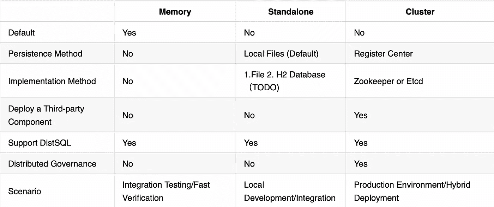

# Apache ShardingSphere 操作模式的详细指南

> 原文：<https://medium.com/codex/your-detailed-guide-to-apache-shardingspheres-operating-modes-e50df1ee56e4?source=collection_archive---------5----------------------->

在[Apache sharding sphere](https://shardingsphere.apache.org)5 . 0 . 0 GA 版本中，我们加入了新概念操作模式，并提供了三种配置方式:内存、独立和集群。为什么 ShardingSphere 提供这些操作模式？它们在实际开发场景中有哪些区别？

这篇文章可以帮助你更好地理解 ShardingSphere 的新操作模式。

## **背景:分布式治理**

分布式治理是 ShardingSphere 中集群部署的基础。在以前的版本中，用户需要在配置文件中配置治理标记来启用分布式治理:

```
governance:
name: # Governance Name
 registryCenter: # Configuration Center 
 type: # Governance Persistence Governance Type such as Zookeeper             and etcd
serverLists: # Governance Service Lists, including IP address and   port number (comma-separated), such as host1:2181,host2:2181 
overwrite: #Decide whether the local configuration overwrites the configuration of the configuration center. If yes, after every startup, the local configuration still works.
```

分布式治理最重要的特性包括持久的用户配置和[元数据](https://dzone.com/articles/shardingshpheres-metadata-loading-process)。

它们也是支持[分布式 SQL](https://opensource.com/article/21/9/distsql) (DistSQL)的基本能力。在之前的 ShardingSphere 5.0.0 故事中，DistSQL 的核心开发人员已经详细分享了 [DistSQL](/nerd-for-tech/intro-to-distsql-an-open-source-more-powerful-sql-bada4099211) 的概念、语法和用法，他们还展示了如何[开发自己的 DistSQL](/codex/how-to-develop-your-distributed-sql-statement-in-apache-shardingsphere-2939eb689c61) 。

总的来说，DistSQL 为 ShardingSphere 的用户提供了类似数据库的体验:用户可以使用 DistSQL 来构建和管理整个 ShardingSphere 分布式数据库生态系统。

与其他标准 SQL 一样，DistSQL(被称为分布式数据库生态系统的操作语言)需要确保任何配置和操作元数据都可以持久化，以在系统恢复时保持数据一致性。

在以前的版本中，只有当您启用分布式治理时，才能实现该特性。这就是 DistSQL 在其早期开发阶段只在分布式治理场景中可用的原因。


## 我们为什么创建操作模式

基于当前分布式治理功能给出的集群部署能力，ShardingSphere 现在将其分布式能力重新定义为**集群模式**。

集群模式支持将 ShardingSphere 作为无状态计算节点进行多实例部署，并且通过注册中心，它可以实时同步集群中所有实例的元数据。

该模式自然支持 DistSQL:在该模式下，您可以使用 DistSQL 在计算/存储节点上执行节点联机/脱机或禁用等操作。

过去，DistSQL 仅限于分布式场景。为了解决这个问题，ShardingSphere 首先需要弄清楚如何在非分布式环境中存储元数据。最简单的解决方案是将元数据写入本地文件，因此当服务重新启动时，可以根据不同的配置从本地文件加载元数据。

与分布式场景中使用的集群模式不同，本地文件不能在多个 ShardingSphere 实例之间实时共享配置。在**独立模式**下，所有配置更新仅在各自的实例中有效。

ShardingSphere 5.0.0 不仅为用户提供了更好的功能，还构建了稳定且用户友好的 API 来优化用户体验。

除了集群模式和独立模式，另一种有用的模式叫做**内存模式**。我们为什么要设计它？因为有些用户需要快速启动 ShardingSphere 的集成但不需要持久化配置。例如，有些人可能使用 ShardingSphere 来快速验证一些功能，或者只是想测试集成。考虑到这样的场景需求，我们创建了内存模式。

到目前为止，ShardingSphere 有三种模式，即内存、独立和集群。就我们的 API 设计而言，操作模式并不难理解，它们非常适合 ShardingSphere 的实际用例场景。此外，三种操作模式可以**支持 DistSQL** 快速构建和管理分布式数据库服务。

5.0.0 版本中删除了`governance`配置方法，取而代之的是，我们开始使用不同的操作模式。

```
mode:
 type: # Mode Type Standalone/Cluster
 repository:
 type: # Persistence Type, Different modes have different implementations: Standalone-File and Cluster-ZooKeeper/Etcd
 props: # Different persistence types have different user-defined configurations. 
 …
 overwrite: false # Decide whether to use local configuration to overwrite local/remote configuration
```

接下来，我将详细解释三种操作模式的基本概念，并向您展示如何在使用 ShardingSphere 进行开发时选择正确的操作模式。

## 概念和应用场景

**记忆模式**

内存是默认的工作模式，所以不需要配置`mode`。在这种模式下，用户不需要配置任何持久性组件或策略，因为由本地初始化配置或 SQL/DistSQL 操作引起的任何元数据更改只在当前线程中起作用，并且在服务重新启动后会恢复配置。

内存模式非常适合集成测试:这很方便，因为开发人员在集成 ShardingSphere 并进行集成测试后，不必清理运行痕迹。

**独立模式**

默认情况下，ShardingSphere 的独立模式为本地文件提供了一种持久性方法。它可以将元数据信息(例如数据源和规则)保存到本地文件中，因此即使服务重新启动，仍可以从本地文件中读取配置，以确保元数据的一致性。

独立模式便于开发工程师快速构建 ShardingSphere 的本地开发环境，测试集成和验证特性。

该模式的配置如下所示:

```
mode:
 type: Standalone
 repository:
 type: File
 props:
 path: …
 overwrite: false
```

默认情况下，独立模式可以保存本地文件。默认情况下，配置保存在用户目录`.shardingsphere`中，但是您也可以通过配置`path`来定制您的存储路径。

**集群模式**

我们建议您在实际的部署和生产环境中应用集群模式。此外，如果您采用同时具有 JDBC 和代理的混合部署架构，则必须使用集群模式。

该模式可以提供分布式治理能力。通过集成独立部署的第三方注册中心，该模式可以实现元数据持久化，在多个实例之间共享数据，实现分布式场景下的状态协调。集群模式也是 ShardingSphere 的横向扩展能够极大地增强计算能力并为高可用性等核心特性奠定基础的原因。

我们以 Zookeeper 为例，演示模式配置:

```
mode:
 type: Cluster
 repository:
 type: ZooKeeper
 props:
 namespace: governance_ds
 server-lists: localhost:2181
 retryIntervalMilliseconds: 500
 timeToLiveSeconds: 60
 maxRetries: 3
 operationTimeoutMilliseconds: 500
 overwrite: false
```

我们还比较了三种模式之间的差异(如下表所示)。我们的建议是，你先考虑自己的需求，再选择合适的模式。



## **总结**

ShardingSphere 的三种操作模式几乎可以满足各种环境中从测试到开发到部署的所有用户需求。

结合 ShardingSphere 卓越的可插拔架构，开发者还可以灵活定制每种模式的持久化方法，创建自己的操作模式，使操作模式更适合自己的开发和业务需求。如果您对分布式治理感兴趣，请随时联系 ShardingSphere 社区。

# Apache ShardingSphere 开源项目链接:

[ShardingSphere Github](https://github.com/apache/shardingsphere)

[ShardingSphere Twitter](https://twitter.com/ShardingSphere)

[切割球松弛通道](https://join.slack.com/t/apacheshardingsphere/shared_invite/zt-sbdde7ie-SjDqo9%7EI4rYcR18bq0SYTg)

[投稿指南](https://shardingsphere.apache.org/community/cn/contribute/)

**作者**

孟浩让

> SphereEx 高级开发工程师& Apache ShardingSphere PMC。
> 
> 他之前在京东科技负责数据库产品 R&D，对开源和数据库生态系统充满热情。目前，他专注于 ShardingSphere 数据库生态系统的开发和开源社区建设。

