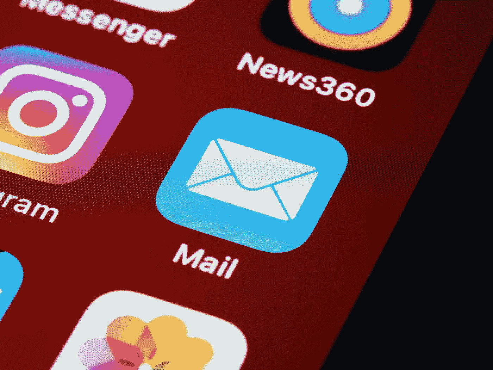
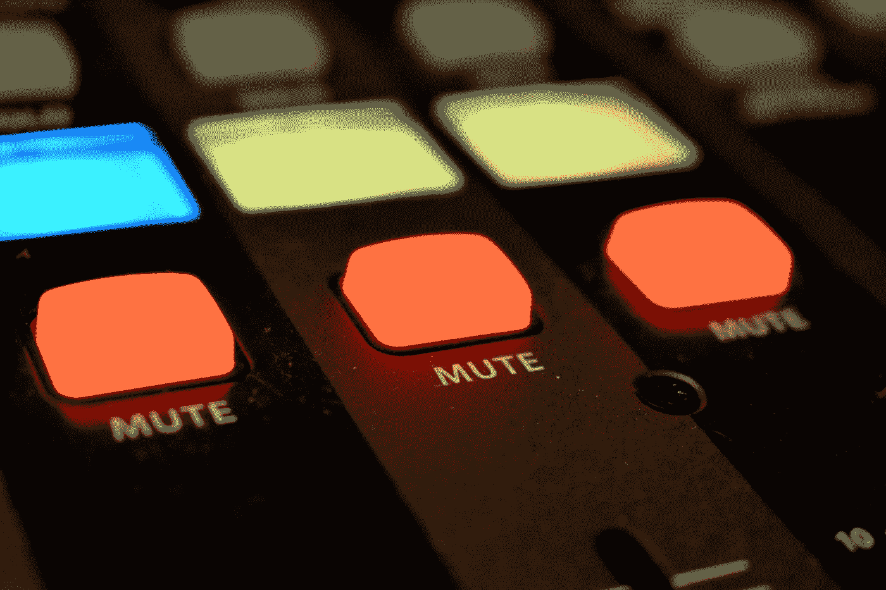

# 您的电子邮件收件箱需要一些帮助。

> 原文：<https://medium.com/codex/your-email-inbox-needs-some-help-40700f8b4a6b?source=collection_archive---------12----------------------->

*收件箱零？是的，这是一件真实的事情，也是可以实现的。如果你早上醒来，打开手机或电脑，看到成百上千封邮件，我们就有工作要做了。我们浪费了太多的时间去浏览邮件，而不去关心阅读。在这里，我将展示一些我减少和简化电子邮件收件箱的方法。*

# 实现零收件箱包括三个主要目标:

-减少电子邮件的数量(比如亚马逊每天三次告诉你你的购物车已经满了。)

-让我们的电子邮件程序为我们排序(使用自动过滤器)

-处理我们的电子邮件收件箱(最难的部分)

现在让我们来实现这些目标，看看我们能为此做些什么。

由[约书亚·埃克斯坦](https://unsplash.com/@dcemr_e?utm_source=medium&utm_medium=referral)在 [Unsplash](https://unsplash.com?utm_source=medium&utm_medium=referral) 上拍摄的照片

**减少邮件数量**

电子邮件像水一样流动，如果你不关掉水龙头，你将会呆在水下。幸运的是，有一些方法可以减少我们的电子邮件数量。一个很好的起点是订阅列表。几乎所有你输入电子邮件地址的东西都想把你加入电子邮件列表，这样他们就可以向你推销东西了。虽然这很好，人们可以从这种模式中获得巨大的价值，比如灵媒每日文摘，或者关注你最喜欢的灵媒作家(我)，但有些事情太多了。现在只要翻翻我的收件箱，我就会收到大量的邮件，它们来自我从未打过交道的公司，来自我从未去过的杂货店，还有那些隐晦的“对不起”主题。没有一样对我有用。我不时需要做的是检查我的收件箱。如果我看到一个我不想要的发件人，并且我知道打开它是安全的，我会打开它并滚动到电子邮件的底部。大多数时候，你会看到一个“退订”按钮。点击它，它就是众多不碍事的发件人之一。对你给谁发邮件地址吹毛求疵也会减少邮件数量。

照片由 [Mark Duffel](https://unsplash.com/@2mduffel?utm_source=medium&utm_medium=referral) 在 [Unsplash](https://unsplash.com?utm_source=medium&utm_medium=referral) 上拍摄

**让我们的电子邮件程序为我们排序**

像 Gmail 这样的电子邮件程序有很酷的功能，你可以将收到的邮件自动分类到文件夹中，以便更好地组织。谷歌概述了如何为你的 Gmail 制作过滤器。你可以制作很多滤镜，这是受你的创造力限制的。当你制作过滤器时，你可以在你的边栏上制作多个文件夹，谷歌会将收到的邮件过滤并分类到这些文件夹中。

由[Damir spanick](https://unsplash.com/@spanic?utm_source=medium&utm_medium=referral)在 [Unsplash](https://unsplash.com?utm_source=medium&utm_medium=referral) 上拍摄的照片

**处理我们的电子邮件收件箱**

一旦你开始例行检查你的收件箱，减少你收到的邮件，并有一个好的过滤系统。只剩下一件事要做了，那就是查看你的电子邮件。我更喜欢在这方面有一个常规，我每周都做。这对每个人来说都是不同的。有些人使用电子邮件工作，所以他们需要每天处理或更多。无论你需要什么样的频率，确保你始终如一。这是确保你定期到达零收件箱的唯一方法。

如果你喜欢这篇文章，给它一些掌声，并在这里查看我的一些其他文章。请随意关注我。

[*2022 年 5 款惊人的生产力应用*](/codex/5-amazing-apps-for-productivity-in-2022-183a3ae6643)