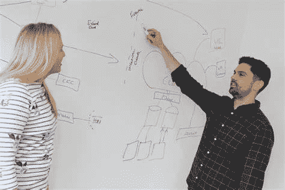

# 你的工程师同事必须经历和你一样的面试

> 原文：<https://medium.com/codex/your-engineer-coworkers-have-to-go-through-the-same-interview-you-do-bcd8414b293b?source=collection_archive---------9----------------------->

[听播客版本！](https://devblabs.podbean.com/e/your-coworkers-go-through-the-same-interview-that-you-do/)

软件工程面试可能很难*。*喜欢哭着爬回家，使劲喝一杯热巧克力。

没有什么比在白板或文本编辑器上写代码更好的体验了，当问题进行到一半时，你会对自己说，“啊啊啊……现在怎么办？”面试官坐在你后面敲铅笔看着你挣扎(旁注，面试官是不是没心没肺？)

这是痛苦的，有时是屈辱的，这让我们许多工程师想知道是否有更简单的方法。难道不应该有更简单的方法来获得一份没有压力的工作吗？

我的答案很可能是肯定的。但是我还没有听说有人找到它，所以我们现在只能用这种紧张的方法。这也许并不全是坏事。

直到我工作了 10 年，我才意识到你的同事也必须经历和你一样的面试过程。

我大学毕业后的第一份工作面试超级简单。有人问了我几个逻辑问题(“如果 a = b，b + c = d，那么…”)和一些关于我大学生涯的情感问题(“你喜欢编程入门吗？”).然后我得到了工作机会。

我欣喜若狂！这是我大学毕业后的第一份工作，我非常紧张。我已经得到了帮助挑选我的西装，我已经强调，强调了。最后，这变得异常简单。

但你知道我和谁一起工作吗？混合了

1.  喜欢低压力环境的绝对天才
2.  在其他地方很难通过面试的人

我的第二次工作面试并没有更大的压力。我被要求概括地描述我以前的工作经历，并谈论一个大学项目。然后有人问我如何处理工作中的压力，以及其他一些基于行为的问题。你知道下一份工作我和谁一起工作吗？混合了

1.  绝对的天才
2.  那些很难通过更严格的技术面试的人

正是在这份工作中，我参与了招聘和面试。我愉快地进行了类似的采访。直到我做了一个绝对灾难性的招聘决定。面试被缩短了(安排 snafoo ),所以我没有问所有的问题。这位候选人从第一天开始就很挣扎，最终与公司分道扬镳。

那时我突然想到，“也许面试有点难也没关系。”

在我的第三份工作中，我参加了一次紧张的面试。这是 4 次编码挑战，5 轮行为面试，最后我筋疲力尽。我的妻子试图和我交谈，却得到了不相关的漫无边际的问题答案。很激烈。但你知道我和谁一起工作吗？

1.  绝对的天才

或者至少是那些能够通过长时间艰苦的技术面试的人。解决棘手的技术问题。

总之，请记住，你的同事必须通过和你一样的招聘门槛。如果你顺利通过，没有挑战，你至少会和一些只能在酒吧工作的人一起工作。如果你有压力和挑战，你会和能在酒吧工作的人一起工作。不要被艰难的面试吓跑，他们会给你一个未来同事会是什么样的指标！