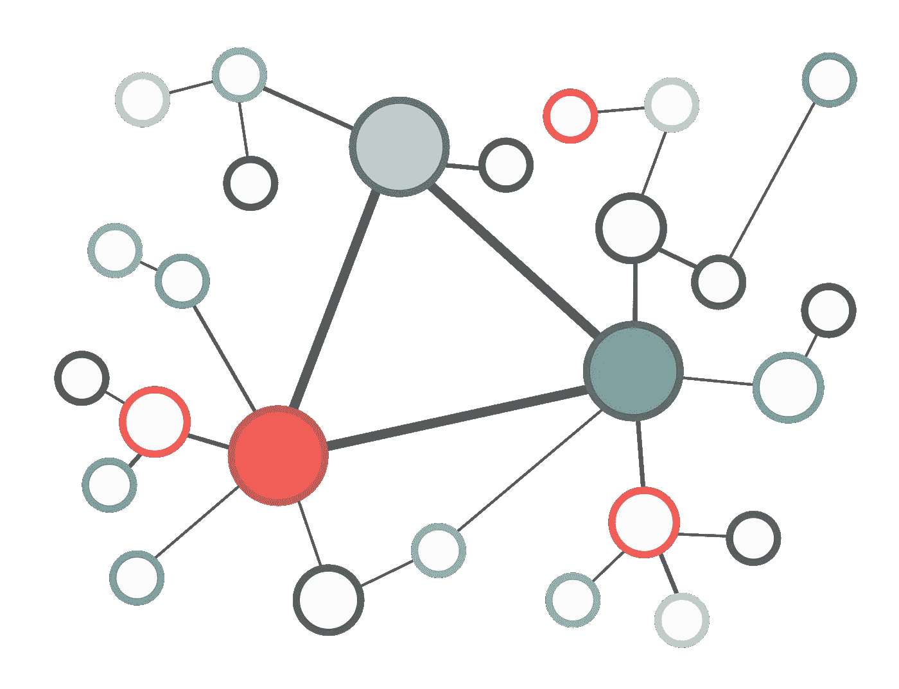

# 您的 GraphQL 入门套件

> 原文：<https://medium.com/codex/your-graphql-starter-kit-e4aa87d84463?source=collection_archive---------13----------------------->



前端和后端之间的通信是任何 web 应用程序的一个非常重要的方面。在这个例子中，我将向您展示为一个新项目实现 GraphQL，甚至将它添加到一个现有项目中，并没有您想象的那么困难。

使用 GraphQL，可以在一次调用中获取前端特定部分所需的数据，即使数据是从多个源加载的。

在这个非常简单的小教程中，我将使用 javascript，但是也支持所有主要的编程语言。

运行 graphql 查询需要什么？让我们用这个只有一个字段的非常简单的查询来找出答案:

```
{
  ping
}
```

响应也将是单个字段:

```
{
  "data": {
    "ping": "pong"
  }
}
```

我们需要做的第一件事是建立一个 web 服务器，这里我将使用 [express](https://www.npmjs.com/package/express) 框架。

为了允许服务器处理 graphql 请求，我们需要定义*类型*、*解析器*，当然，还要安装一些 graphql 库。

1.  **类型定义**

查询中的每个字段都必须与类型定义中的字段相匹配。*查询类型*对象保存所有顶级字段，这是“根”对象，我们必须定义的第一个对象。

```
const typeDefs = gql`type Query { ping:String}`;
```

Graphql 现在知道查询“ping”应该返回一个字符串，下一步是使用解析器定义这个字符串的值。

**2。解析器**

解析器是一个函数，它返回要分配给特定字段的值:

```
const resolvers = { Query: { ping: () => 'pong' }};
```

一个解析器函数最多可以有 4 个参数，但是在我们的简单例子中，它们是不需要的，所以我们只使用一个箭头函数。

**3。Graphql 服务器**

我们需要安装 npm 包 [apollo-server-express](https://www.npmjs.com/package/apollo-server-express) 和 [graphql](https://www.npmjs.com/package/graphql) 。

```
const express = require('express');const { ApolloServer, gql } = require('apollo-server-express');const gpserver = new ApolloServer({ typeDefs, resolvers });await gpserver.start();

const app = express();gpserver.applyMiddleware({ app });

await new Promise(resolve => app.listen({ port: 4000 }, resolve));console.log(`🚀 Server ready at [http://localhost:4000${gpserver.graphqlPath}`);](http://localhost:4000${server.graphqlPath}`);)
```

一旦服务器启动，你可以使用工具[studio.apollographql.com](https://studio.apollographql.com/)开始发送查询。

**对象 vs 标量**

标量是单字段数据: *String* ， *Boolean* ， *ID* ， *Int* 和 *Float* 。

一个对象可以由多个字段组成。假设我们想要创建一个杂货店的购物收据。这里， *ShoppingBag* 和 *ShopItem 是*两个 GraphQL 对象类型，每个都有两个字段*。*

让我们在根查询对象中添加一个新字段: *receipt* ，类型为 *ShoppingBag:* 我们现在可以在查询中请求字段 *shop* 和 *items* 。

请注意，字段 *items* 需要一个 *ShopItem* 对象数组。

```
const typeDefs = gql`
 type ShoppingBag { shop: String items:[ShopItem] } type ShopItem { name: String price: Float } type Query { ping: String receipt: ShoppingBag }`;
```

当字段是对象类型时，Graphql 总是寻找附加的解析器。这里我们需要一组 ShoppingBag 对象的解析器:

```
const resolvers = {
 Query: { ping: () => 'pong', receipt: () => { return { shop:"Wallmart" }; } }, ShoppingBag: { shop(obj){ return obj.shop; }, items(obj){ return [ { name:"Water", price:20.5 }, { name:"Milk", price:30.5 } ] ; } }};
```

以下是我们对“购物小票”的查询:

```
{
  receipt{ shop items{ name price } }}
```

以下是 graphql 的回复:

```
{   
  "data": {     
    "receipt": {       
      "shop": "Wallmart",       
      "items": [         
                 { "name": "Water", "price": 20.5 },
                 { "name": "Milk", "price": 30.5 }       
               ]    
    }   
  } 
}
```

如果有错误，它们将显示在*错误*键下，在*数据*之前。

**数据库**

如果您的数据存储在数据库中，您可以使用 *context* 构造函数来链接您的数据库客户机，以便您可以在解析器中使用它。

记住:不要在解析器中使用回调，只使用承诺。

```
const gpserver = new ApolloServer({ typeDefs, resolvers, context: async ()=>({ db: dbcli }) });
```

**前端部分**

一旦服务器端一切就绪，您就可以使用 [Apollo 客户机](https://www.apollographql.com/docs/react/get-started/)并访问 react 钩子来执行 graphql 查询。将 react 的强大功能与 graphql 相结合将允许您轻松地添加新功能。

感谢您的阅读！您现在已经准备好运行您的第一个 graphql 查询，甚至可以开始创建您自己的类型和解析器。