# 机器和深度学习中的人类运动指南

> 原文：<https://medium.com/codex/your-guide-to-human-movements-in-machine-deep-learning-755f59d96295?source=collection_archive---------5----------------------->

*这篇文章讲述了在机器和深度学习计算环境中处理人体运动内容的商业案例和开发方法。我们将人体运动内容定义为通过视频流、摄像机、深度传感器或佩戴在感兴趣的关节位置的可穿戴传感器捕捉到的任何人体运动、活动或行为。注意，本指南侧重于使用人体关节位置作为数据，从人体运动内容中生成信息。这种数据方法在全球范围内符合隐私保护政策。*

对我们大多数人来说，我们人体的运动和活动是我们生活中不可或缺的一部分。人体运动是我们健康管理、竞技运动或受伤康复的健身运动。人体运动是为了举起和背着我们的孩子，或者帮助一位年长的邻居从车上拿购物袋。运动中的人体执行我们的日常生活。这样做，我们的人体运动包含了我们身体在工作或玩耍、疼痛或快乐时的有用信息。我们如何获取这些信息以了解更多、提供更多帮助或为所有人创造更安全的环境？

对我们身体运动的评估通常是围绕我们一天中感觉运动的“好”程度。然而，从商业角度来看，理疗师、培训师、运动员、医生、安全经理、生产车间操作员等专业人士需要关于人体运动的定量信息。在这些领域以及人类生活受到人类决策者影响的其他领域，准确和精确的数据至关重要。

这就是运用计算、计算机视觉和人工智能进步的价值所在:能够大规模生成运动人体的定量信息。有了人工智能，我们可以看到看不见的东西，量化不可量化的东西，并将人类运动作为数据进行管理，就像任何其他数据集一样。因为运动是如此复杂，所以需要人工智能。身体运动每分钟产生数万个数据点。记住，你整天都在 3 个空间平面(长度、宽度和深度)中移动，并穿越第四个平面，时间。只有人工智能可以利用这些数据，产生大量的信息。

例如，物理治疗师生活中的一个月可能导致超过 50 个病人的超过 24，000 分钟的人体运动内容。对于每个患者，PT 的目标是在规定的时间表内改善患者的结果(比如说，8 周内每周 2 次)。借助人工智能，患者可以使用计算机视觉和人工智能算法来捕捉运动基线，测量患者运动进展的变化或缺乏进展。有了人工智能，病人治疗师和像病人治疗师这样的专业人员可以通过点击一个按钮来管理和生成客观的、数据驱动的病人结果信息，从而帮助更多的病人。现在，任何负责人类健康、运动或健身表现的临床医生或从业者都可以做到这一点。

在健康、运动或健身之外，人类的活动内容无处不在！涉及人为因素的其他行业包括监控数千个摄像机的安全和安保操作员，他们只需要紧急人类活动或行为的通知；或者在制造环境中负责工人安全和任务执行的直线经理；或者零售店寻求了解客户的产品和员工参与度。

## 人体运动技术价值链

现在，您已经了解了使用人工智能来量化人类活动内容的背景，让我们来看看当前人类运动和活动的技术价值链。我们从这里开始:

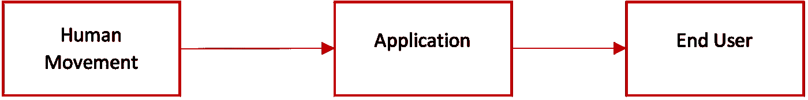

示意图:方框 1 人体运动；方框 2 代表应用程序；方框 3 代表最终用户；每个框由框之间从右向左移动的箭头连接。

首先，人体运动内容来源于摄像机、深度相机和传感器、可穿戴传感器捕捉的视频流以及录制的视频。这些数据(人体运动内容)移动到一个软件应用程序，该应用程序旨在为最终用户提供价值。这里的最终用户可以是任何对一个人的健康、安全或运动表现做出决策的人。

乍一看，这似乎很简单，就像任何其他软件构建一样，您可能会想，“好吧，有什么问题？”嗯…在计算人体运动内容的领域中存在几个挑战:

1.视频或相机流中的人体运动内容必须首先通过使用身体的一般特征来识别为人体:头、肩膀、两臂、臀部、腿、脚以及直立行走。我们需要软件来识别身体上这些关节的位置。

2.视频和相机流挤满了场景中的许多其他对象，这使得提取身体关节位置成为应用程序中要解决的复杂挑战。因此，技术价值链包括“姿势估计器”，又名“骨骼跟踪器”，又名“身体标志”。它们表现为中间件软件库，主要依赖于预训练的 ML 和 DL 算法，用于从不同视频帧中提取骨骼跟踪和关节位置。如今市场上知名的姿态估计器有 [Wrnch](https://wrnch.ai/) 、 [OpenPose](https://github.com/CMU-Perceptual-Computing-Lab/openpose) 和 [Azure Kinect 身体跟踪器](https://docs.microsoft.com/en-us/azure/kinect-dk/body-sdk-download)。

现在，我们已经修改了我们的图表，以包括这个重要的软件。

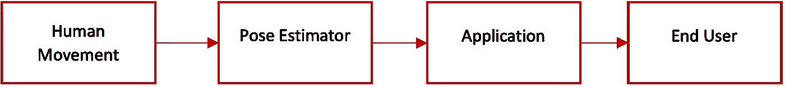

示意图:方框 1 人体运动；(新)框 2 姿态估计器；方框 3 申请；方框 4 最终用户；每个框由框之间从右向左移动的箭头连接。

“太好了！我们现在可以为我们的最终用户构建人体运动应用程序吗？”还没有。

姿势估计器成功地提供不同的人体关节位置作为相机环境中的数据，但是现在我们有了各种各样的新问题:

1.姿态估计器不产生可用于为我们的最终用户创建可理解的数据故事的信息和/或知识。姿势估计器不执行识别特定运动或评估身体运动表现的任务，例如，执行特定锻炼的最佳方式，这两者可能在最终用户的数据故事中起作用。

2.姿势估计器不会告诉你身体运动是随时间顺序发生的。

3.姿态估计器不能在序列中找到运动的开始和结束。例如，计算运动或活动的重复次数。

4.姿态估计器不会归一化关节位置以满足您的应用要求。标准化身体关节数据是必要的，因为我们的身体关节位置根据长度而不同。如果最终用户想要知道哪些关节或运动与基线相比是不正确的，则进入应用程序的骨架数据和基线骨架数据必须具有共同性，即被标准化。

现在，技术价值链需要另一个组成部分:基于人工智能的分析。姿态估计器之后留下的这些挑战只能通过构建和训练 ML & DL 算法来解决。这些算法需要一种数据结构来解决运动人体的空间和时间问题。

如果你是一名开发人员，也许你已经做过人体运动的实验。假设你录下自己跳了二十次。您想要创建一个演示应用程序，它可以自动计算视频中的跳转次数。您可能已经使用 OpenPose 库从视频中生成了您的关节位置，然后在这一步之后，您陷入了困境，因为您无法找到一种算法来训练这种数据，或者您找到了一种算法，但您无法自动检测每次跳跃的开始和结束。你没有指示应用程序查看或定义“计数”，应用程序如何计数？

这个相当简单的例子描述了人类运动的这类技术问题。一旦身体开始按顺序移动，来自人体骨骼数据的信息和知识就需要人工智能分析来管理人体内容数据的数量和速度。

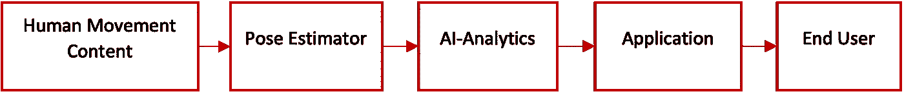

示意图:方框 1 人体运动；方框 2 姿态估计器；(新)方框 3 人工智能-分析；方框 4 申请；方框 5 最终用户；每个框由框之间从右向左移动的箭头连接。

## 4D 分析与 3D 分析

让我们看看分析的类型，它们之间的区别，以及哪种类型的分析适合您的软件目标。

数据是任何分析的第一步。理解它将阐明我们的算法的混合选择策略。这里的问题是，“人体运动数据是什么样的？”正如技术价值链提到的，视频中的每一帧都使用姿势估计器转换成关节位置。单个关节位置是<x y="" z="">，其中 X、Y 和 Z 是实数，表示摄像机空间环境中的关节位置。一些姿态估计器主要根据与姿态估计器一起使用的视频类型，仅生成关节位置的<x y="">。姿态估计器不仅找到单个关节的位置，而且找到多个关节的位置，统称为骨架标志特征。在数据结构中组织这些关节位置的一个好主意是矩阵格式，其中每行代表一帧，每列代表一个特定的关节位置，例如，单元(1，2)可以是 t1 视频帧内的右手腕位置<x y="" z="">。我们可以称每个矩阵为一个序列。</x></x></x>

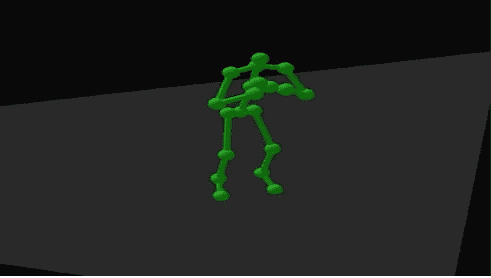

图 1 单蹲框架(排)可视化

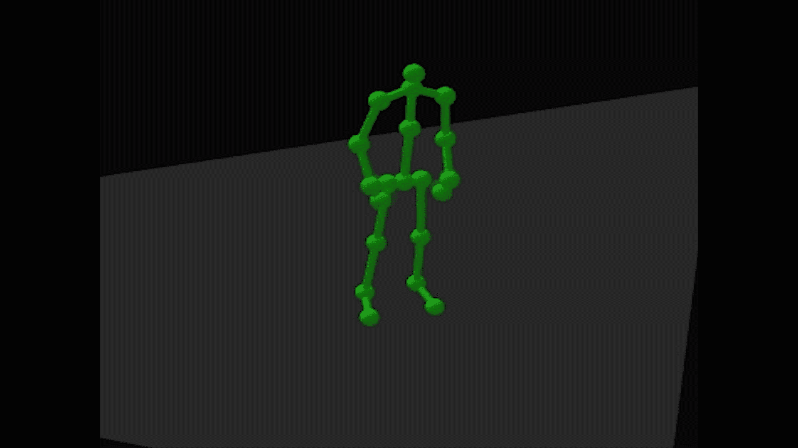

图 2 后坐序列(矩阵)可视化

注意这些关节的位置(列)之间存在关系，即父子关系或身体骨骼，这一点非常重要。此外，每个帧(行)都与其前后的帧相关。为了产生可重复且可靠的分析，您需要为您的数据结构建立一个永远不会改变的特定顺序。

一种分析类型称为 3D 分析，在这种分析中，您将一个帧与另一个帧进行比较/分类，而不管这些帧出于特定目的的时间顺序。一个常见的例子是指示关节相对于特定练习的最佳可能位置的误差，如下图所示。在这些可视化中，很明显，与图 3 中的基准相比，图 4 中的人 1 并没有将他们的臀部一直向下推。

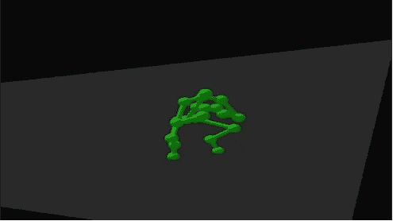

图 3 深蹲框架基准

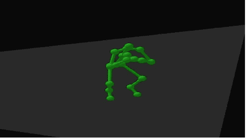

图 4 蹲架人 1

您可以在预期关节之间使用简单的欧几里德距离度量，但只有当您能够规格化两个骨骼时，结果才有意义，因此身体大小和长度不会影响结果。或者，你可以使用经典的机器学习算法，如 SVM、逻辑回归、KNNs 等等。找出两个框架之间的差异。3D 分析方法——不管你将使用何种算法组合——在你试图提取信息的动作仅仅是一个姿势或一帧时非常有用，例如保持一个瑜伽姿势。另一方面，**如果运动由多个姿势或矩阵表示，你必须将时间视为第四维**，这需要成为分析的一部分。图 2 是一个很好的例子，深蹲不是一个单一的姿势，而是由时间关系连接的多个姿势。

4D 分析是考虑时间因素和位置因素的混合算法。这种分析比 3D 分析复杂得多。复杂性包括:

1.能够处理时间关系的算法选择有限。可以处理序列和多维时间序列数据的 ML/DL 算法类别包括 LSTMs、转换器、隐藏条件随机场和隐藏马尔可夫模型。这些算法和预期模型中的每一个都非常复杂，并且需要巨大的超参数估计。

2.缺少可以理解姿势之间时间关系的预训练算法。

3.缺乏一个好的数据集来测试你的方法的准确性和精确性。

4.缺乏标签和人体运动数据管理工具，您可以在其中建立自己的数据集，并训练自己的分类器和算法。

我敢打赌，你会问，“如果 4D 分析是如此复杂，我们为什么不坚持三维分析？”任何一种分析的目标都是以一种能够清晰地讲述故事的方式来展示和组织数据。3D 分析缺少了**时间**的一个关键因素。如果你的动作只是一个没有时间因素的姿势，3D 会做得很好。忽略多次姿势移动的时间因素会导致误导和不完整的信息。

一个很好的例子是比较作为数据的下蹲运动与作为性能基准运动的下蹲运动之间的生物力学相似性。在大多数情况下，下蹲的开始和结束姿势看起来和图 5 一样。此外，起始姿势之后的每个其他姿势在结束姿势之前具有等同的姿势，如图 5 姿势 1 和 3 所示。完整的下蹲序列要求你从一个站立的姿势开始，然后向下，再回到一个站立的姿势。

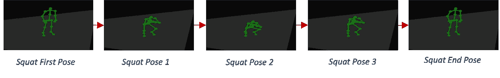

图 5:图像序列描述了完整的下蹲运动序列，从站立姿势开始，移动到下蹲姿势 1 中间，到下蹲姿势 2，膝盖弯曲 90-100 度，然后回到下蹲姿势 3 中间，到结束下蹲姿势站立。

另一方面，让我们设计一个新的想象中的蹲，如图 6 所示，其中人只从较低的位置开始，向上移动到站立位置。通过使用 3D 分析来比较图 5 后坐和图 6 后坐，会错误地产生非常高的相似性分数。产生这个错误的相似性分数是因为即使时间顺序不正确，图 6 蹲下中的大多数姿势也可以在图 5 蹲下中找到。4D，或包括时间因素，是产生关于作为一系列动作的整个下蹲的正确表现的更准确的信息和知识的唯一方法。

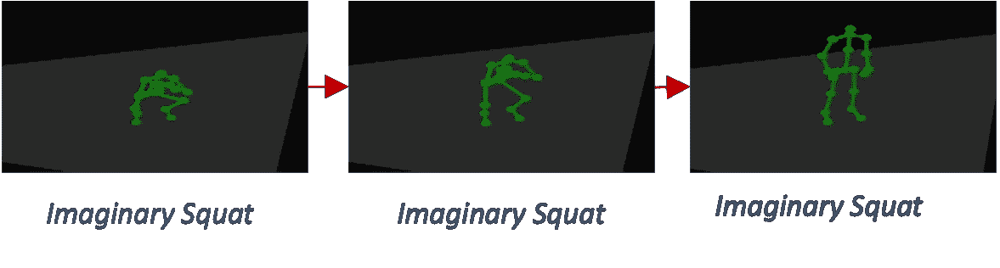

图 6:图像序列描述了一个错误的或想象的下蹲运动序列，不正确地从膝盖弯曲 90-100 度开始，然后移动到中间直到结束想象的下蹲姿势站立。下面是演示动作的 GIF

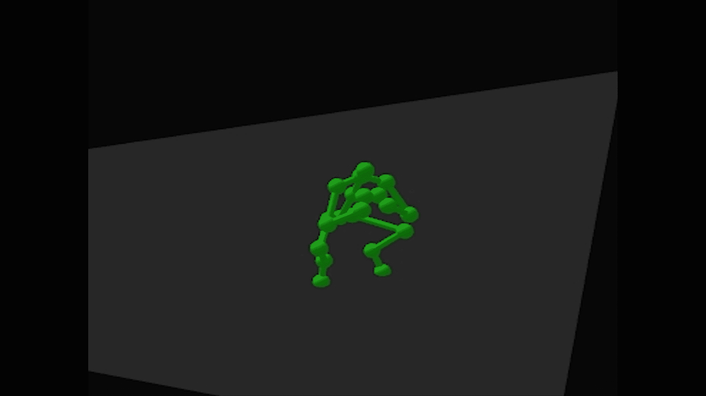

## linedanceAI 在技术价值链中的地位

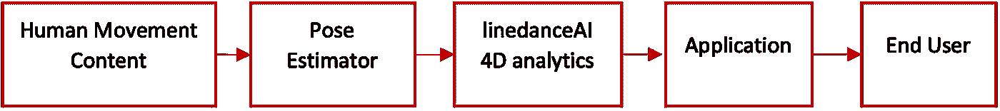

示意图:方框 1 人体运动；方框 2 姿态估计器；(新)方框 3 4D 分析；方框 4 申请；方框 5 最终用户；每个框由框之间从右向左移动的箭头连接。

linedanceAI 是一个 4D 人体运动分析平台，是人体活动识别和全序列分析的完整解决方案引擎。我们定制了新的算法组合和工具，专门解决时间问题和本文提到的其他 4D 分析挑战，以创建一个人工智能分析工具集，从人类运动内容中生成全面而准确的信息。

linedanceAI 的算法可以针对你的用例进行重新训练。该堆栈针对规模、速度和灵活性进行了优化。我们通过低数据要求和无超参数配置来做到这一点。堆栈灵活性可适应多种使用情形，并允许快速部署到您的市场。linedanceAI 的开箱即用算法可用于医疗保健、健身/运动、安全摄像头监控和工作场所安全管理等特定用例。

linedanceAI 提供了一个数据结构 SDK，专门用于处理不同的骨架结构和不同的关节数，以匹配用例中的动态需求。数据结构完全集成到算法混合和管道中的每个算法中。

linedanceAI 的专利算法及其 4D 分析方法是由一群高级数据科学家、机器学习工程师和人类运动分析博士构建和测试的，旨在将我们的 4D 世界转化为数字故事。

想跑项目？或者了解更多关于 ML & DL 中的人类运动和我们的最新新闻，请关注 LinkedIn 上的 [linedanceAI 页面](https://www.linkedin.com/company/linedanceai)，在那里观看我们的演示视频，或者[这里](https://www.youtube.com/channel/UCM4-BfZrVRVOc5-TyNo96Vg)。最好直接在 info@linedanceAI.com 联系我们。时间对我们有利。它在你的上面吗？