# 监督学习指南—分类

> 原文：<https://medium.com/codex/your-guide-to-supervised-learning-classification-6f0eeb8b7049?source=collection_archive---------8----------------------->

逻辑回归和决策树的一站式服务

凯勒·琼斯在 [Unsplash](https://unsplash.com?utm_source=medium&utm_medium=referral) 上拍摄的照片

以下博客是**“初学者的完整机器学习和深度学习**”系列的第五篇博客。在之前的博客中， [**你的监督机器学习指南——回归**](/codex/your-guide-to-supervised-machine-learning-regression-d6b822563e44) ，我们深入了解了什么是回归，以及我们如何才能制作回归中所需的模型；我们学习了简单线性回归、多元线性回归和逻辑回归。今天，我们将讨论分类和用于分类的不同基本模型。我们将从理论上了解这些模型是如何工作的，然后深入研究这些算法背后的数学。不用担心；我们将尽可能保持简单和容易。让我们开始吧！！！

# 分类

我们日常生活中的大多数任务可能是选择是否出门，我们是否能够做某事，一个物体是什么颜色，甚至是这个东西是什么；这些都是分类。作为一个人，对物体进行正确分类是很有必要的。此外，如果我们正在谈论制作一个类似于人类的程序，那么对事物进行分类一定是必不可少的。现在，如果我们进入之前博客中讨论的数学术语，“分类意味着预测离散变量或告诉对象的类别。”广义分类可分为二分类和多分类。

**二叉分类**:顾名思义，就是分类到两个类或类别中(记住，机器学习中离散类别用类是约定俗成的)。这就像我们要求我们的程序回答“是”或“不是”

**多类分类**:多类分类就是我们要预测两个以上的类的时候。它可以对汽车、自行车、卡车或公共汽车等交通工具进行分类。

我们知道什么是分类，但现在的问题是分类任务需要什么算法？如何建造它们？？因此，我们在下面列出了机器学习领域最常用的算法:

1.  **逻辑回归**
2.  **决策树**
3.  **随机森林**
4.  **支持向量机**
5.  **天真的偏见**
6.  **K-最近邻**

在上面的列表中，前两个是最基本和最容易理解的，我们将在这个博客中讨论它们。尽管如此，不要担心，所有剩下的技术都应该有一个单独的博客，他们会得到他们应得的。那么，让我们从今天的头脑风暴开始。

# 逻辑回归

许多人必须考虑为什么回归算法会出现在分类博客中。此外，许多人肯定在之前的帖子中了解到了这一点。那为什么会在这里？首先，让我们试着回答这个问题。逻辑回归本质上是一种回归算法，因为它预测的是[-1，1]范围内的连续函数，而不是某个离散类。然而，通过将这些连续值与决策函数结合，我们得到一个离散的类别，从而成为一种分类算法。

> **注**:逻辑回归结合决策函数是一种分类算法。否则，它只是一个回归算法。

**决策功能**

*决策函数*是一个试图将给定的连续值或点分成两个或多个类别的函数。在二分类的情况下，划分是在两个类中完成的，而在多类分类中，是在更多的类中完成的。示例:

决策功能。作者代码

上面定义的是 python 函数，根据该函数，如果值大于零，则数据点属于类 1，否则属于类 0。

**决定边界**

*决策边界*是 2D 中的一条线、3D 中的表面和多维中的超表面，它们相应地划分数据。决策函数给出了超曲面方程。下图显示了在决策函数的上述部分中定义的函数所需的决策边界。

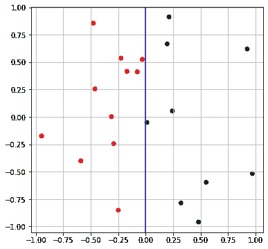

决策边界在蓝色分开两个类红色和绿色。作者图片

## **主要功能**

我们现在知道当通过**激活函数**时，逻辑回归如何执行分类任务。现在让我们从数学上理解这一点。在之前的文章中，我们已经了解了线性回归；为了提高您的记忆，线性回归为我们提供了作为特征的线性函数的连续值。由以下等式给出:

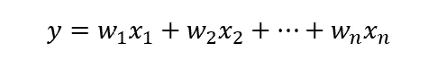

线性回归。作者图片

现在，上面的等式容易出现异常值(异常值是那些突然具有非常高或非常低的值的点)。此外，线性回归假设输出线性依赖于要素，但也可能存在一些非线性。因此，为了包括非线性并将上述方程值限制在一个范围内，我们使用**激活功能**。“sigmoid 函数”是在逻辑回归情况下使用的激活函数，由下式给出:

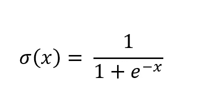

乙状结肠函数。作者图片

该函数在我们的方程中引入了非线性，并将输出限制在 0 和 1 之间。下图表示同样的情况:

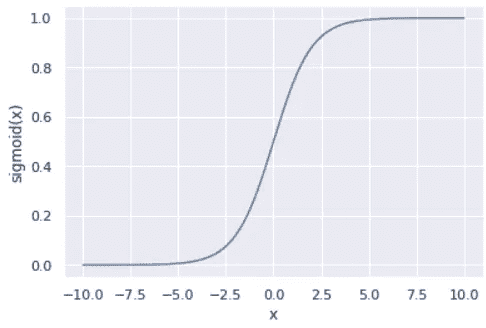

Sigmoid 函数图。作者图片

因此，表示逻辑回归的最终方程如下:

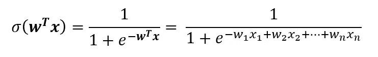

逻辑回归方程。图片 bu 作者

我们现在可以使用在**决策函数**部分中定义的决策函数进行分类，将整个空间分成两部分，代表两个类别，因此代表二元分类。

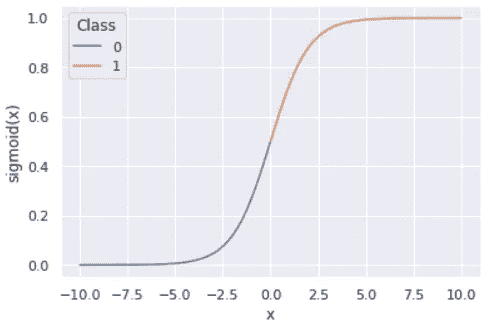

具有 sigmoid 函数的决策函数。作者图片

我们现在知道了逻辑回归如何预测离散类，但是 w₁，w₂ …wₙ被算计了？为此，我们需要一个损失函数。我们只能对连续数据应用**均方误差**，这里我们有离散数据。所以，这里我们用交叉熵损失或者二值交叉熵进行二值分类。

## 二元交叉熵

在选择损失函数或成本函数之前，要记住的第一个条件是损失函数必须是凸的，即它必须具有以下形状:

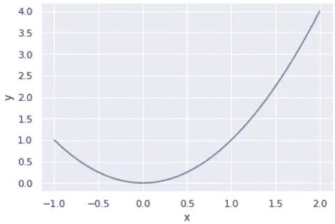

凸函数图。作者图片

原因是我们必须使用任何优化技术(如梯度下降)来最小化损失的函数。在逻辑回归的情况下，我们使用二元交叉熵，它由下式给出:

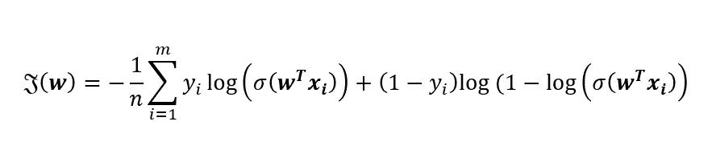

二元交叉熵。作者图片

迷茫！！让我们一步一步打破这个复杂的等式，逐步证明它。在开始之前，我们一直用名称来表示特性，但是如果特性的数量很大，那么编写所有的特性将是一件很乏味的工作。为此，我们将使用向量 **x** ，来描述数据点，其中:

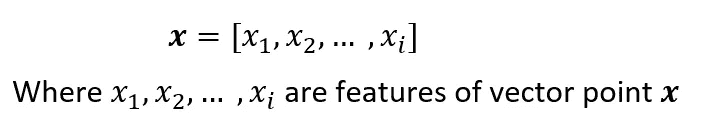

数据点 **x** 及其所有特征。作者图片

假设 **x** 是一个以 y 为类的数据点(在二分类的情况下，y = 1 或 y = 0)。来自逻辑回归的预测给出了预测类别 1 的概率。

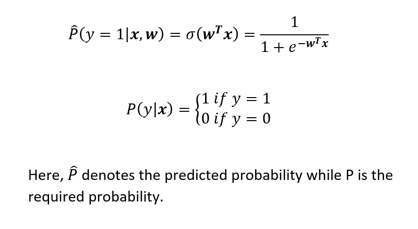

每个二元类的概率。作者图片

现在，我们的主要目标是找到由权重向量 **w** 给出的 **x** 的权重值，使得预测概率接近“真实概率”

现在，如果真实类是 1，那么预测必须由下式给出:

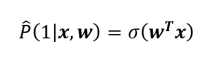

类 1 的概率。作者图片

那么如果真实类别是 0，则预测由下式给出:

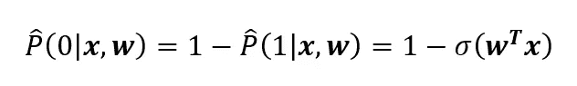

0 类概率。作者图片

结合以上两个等式，我们得到以下等式:

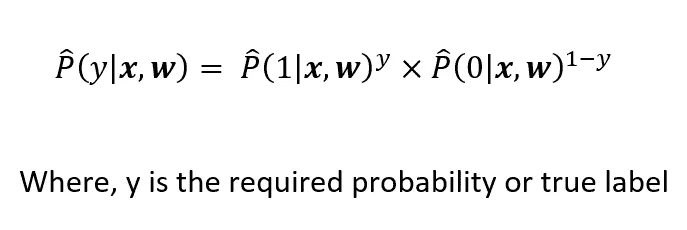

类别 1 和类别 0 的组合概率。作者图片

现在，评估与任何概率相关问题相关的性能的最佳方法是计算**似然函数。**对于给定的 *m* 个数据点，似然函数为:

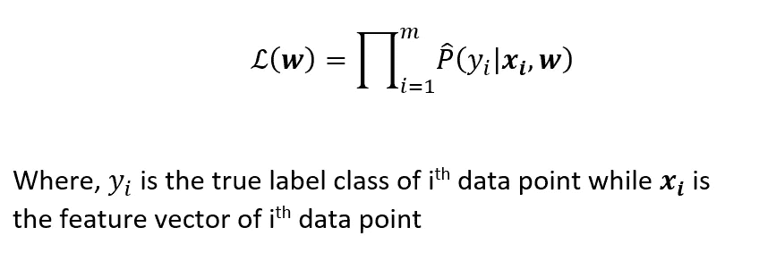

二元分类的似然函数。作者图片

我们必须找到使****w****最大化的所需权重 **w** 。但是，我们只能选择一个凸函数作为损失函数。因此，我们必须取其负对数，使其成为由下式给出的**对数似然函数**:**

**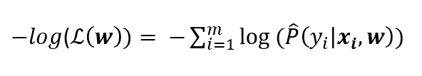**

**二元分类的负对数似然。作者图片**

**结合以上两个等式，我们得到所需的**二进制交叉熵**:**

**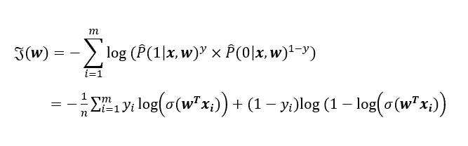**

**二元交叉熵证明。作者图片**

**我们必须最小化二进制交叉熵损失，以获得所需的权重向量 **w** 。最小化是通过使用**优化器**完成的，如**梯度下降**、**亚当优化** r 等。我们将在以后的文章中学习优化器。**

## **多类分类的范畴交叉熵**

**二叉交叉熵损失只在二叉分类的情况下使用，但实际生活中大部分情况是多类分类。所以，对于多类分类，需要改变的是激活函数。因为激活函数是将整个空间分成两类的原因，所以，我们将使用另一个激活函数，即 **softmax 函数**，并由下式给出:**

**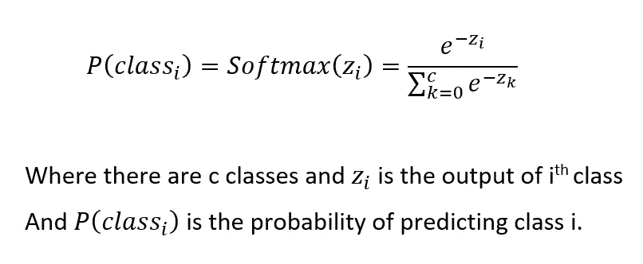**

**Softmax 函数。作者图片**

**上面给出了 iᵗʰ类的 softmax，这是特定类出现的概率，因此预测的类将是具有最高 softmax 值的类。但是 zᵢ的价值是什么呢？为此，我们需要明白，在二元分类的情况下，权重向量 **w** 的形状为(n，1)，其中 n 是特征的数量。而在这里，权重向量的形状是(n，c ),其中 n 是特征的数量，c 是类别的数量。在将数据点 **x** 与权重矩阵 **w** 相乘后，我们得到一个矩阵 **z，**，该矩阵给出了从 **softmax 函数**传递后该类出现的概率。下图总结了整个过程:**

**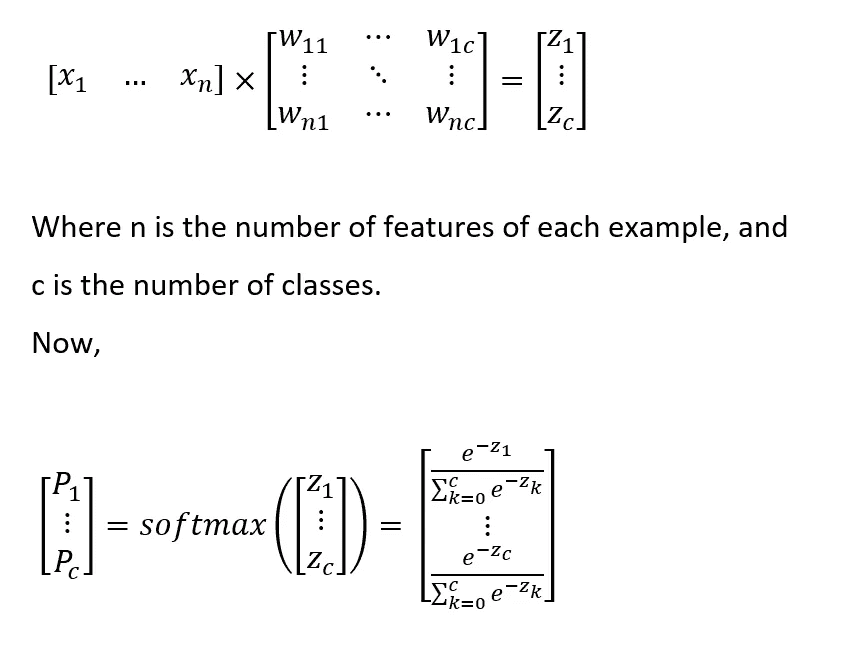**

**多类分类中求概率的程序。作者图片**

**现在，我们将遵循与二进制交叉熵相同的过程来计算损失函数。首先，我们通过以下方式计算预测的可能性:**

**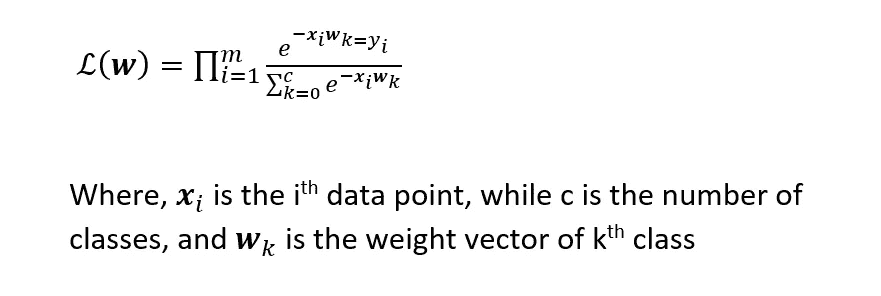**

**多类分类中的似然性。作者图片**

**接下来是计算对数似然的负*；负的原因和上面的二进制交叉熵一样。这个损失函数被称为**分类交叉熵**，由下式给出:***

**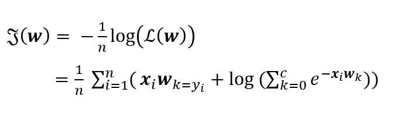**

**范畴交叉熵。作者图片**

# **决策图表**

**决策树分类器的工作方式几乎类似于任何人做决定的方式。基于从模型训练中学习到的规则集，每个数据点被分配一个特定的类。**

**考虑一个例子，我们想要决定我们今天是否应该在外面打羽毛球。对于这一点，我们会根据一些规则进行选择，比如是否有大风，天气如何，对方是否准备好了。只有满足所有这些规则，才能打羽毛球。**

**许多人一定已经在我们以前的博客中听说或读到过决策树可以用于回归和分类任务。这个算法一般被称为 **CART 算法:分类和回归树**。然而，在这个博客中，我们将只讨论分类部分。**

## **建造一棵树的过程**

**决策树背后的主要直觉是选择一个特征，做一个是/否的问卷，然后根据答案划分整个数据集。这个过程一直持续到类被隔离。二元和多类分类都使用这个过程。**

**使用上述过程将整个数据集组织成一个**树结构。**在这棵树中，每个被称为其**节点**的块会询问一个问题，之后要么给出预测，要么数据点移动到下一个节点。包含所有数据点的第一个节点称为**根节点。**此外，拥有所有类的最后节点被称为**叶节点**。**

**让我们用一个例子来理解；我们将使用著名的鸢尾花数据集，它包含三种不同类型的鸢尾，即 Setosa，Versicolour 和 Virginica。可用的特征是萼片长度、萼片宽度、花瓣长度和花瓣宽度。**

**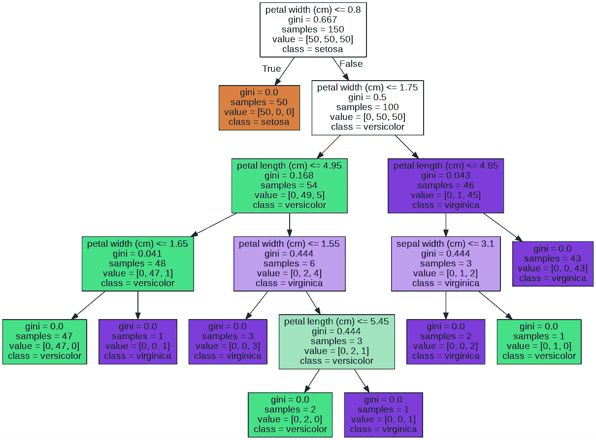**

**训练好的决策树模型的可视化。作者图片**

**上图显示了通过训练决策树并将其可视化而生成的决策树。如您所见，每个块或节点都包含一个问题，该问题决定了数据点应该前进的方向。**

## **完美树是 NP 难的**

**现在，问题出现了，我们应该继续问这个问题和划分数据集多长时间。这完全取决于特定节点中数据集的纯度。如果一个节点只包含一个类的数据，那么这个节点就是纯的，否则就是不纯的。所以，我们必须划分，直到我们得到所有的纯叶节点。**

**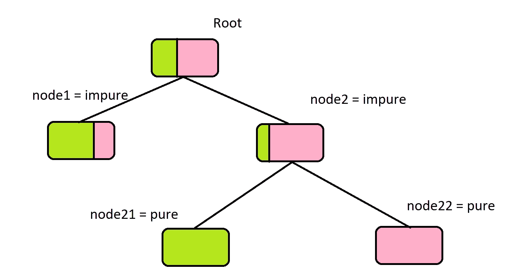**

**纯节点和不纯节点的插图。作者图片**

**下一个问题是如何决定数据必须划分的要素。完美或理想的树的概念来了。理想的树是尽可能最小的树，具有尽可能少的分裂数，并且能够准确地对所有数据点进行分类，即该树是纯的。但是寻找理想树是一个 NP-hard 问题，即在数据点的数量上需要多项式时间。因此，找到一棵完美的树在理论上是可能的，但在计算上是不可行的。使用**贪婪方法可以解决上述问题。****

## **贪婪的方法**

**贪婪的方法意味着我们必须局部优化问题，也就是说，我们必须选择最适合当前场景的特性，并一直这样做，直到损失最小。该过程忽略了全局最佳结果，而只关注局部最佳结果；这意味着它只选择当前的最佳拆分，而不寻找超出该节点的所有可能的拆分。**

**问题是必须使用什么算法来决定最佳的局部分裂。为此，我们必须要求一个损失函数，可以衡量分裂的纯度。**基尼系数**和**熵**可以作为该领域的损失函数。**

## **基尼杂质**

**基尼系数衡量一个数据点被错误分类的概率。值越低，分割越好。所以，这是一个用来寻找最优分割的方法。下面的公式给出了它:**

**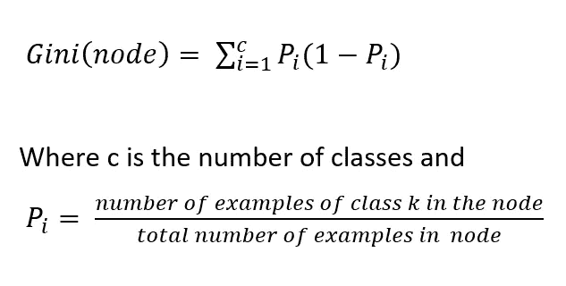**

**基尼杂质公式。作者图片**

## **熵**

**这个熵和我们很多人在高中化学和物理中学到的熵是一样的。熵是节点中随机性或混沌性的度量。纯节点的随机性为零，因为在该节点中只有一种类型的类。所以我们的目标是找到分裂，这将熵减少到 0，即最佳值。由公式给出:**

**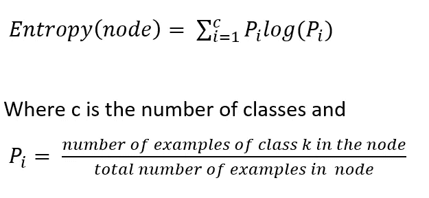**

**熵公式。作者图片**

> ****注意:**使用上述两种度量中的任何一种，我们继续划分节点，直到所有节点都是纯的或者损失(基尼或熵)停止减少。**

**现在，让我们用几行代码来看看整个过程。**

**作者完成决策树代码**

> ****注**:以上代码仅供参考，不要求彻底理解代码。未来，每个算法都将有自己的博客来解释代码。**

# **结论**

**这个博客教会了我们两个主要的分类器:逻辑回归和决策树。我们已经了解了逻辑分类中使用的损失函数二元交叉熵和分类交叉熵。我们如何联系他们？负号的意义和遵循的程序。在后面的博客中，我们将学习梯度下降，使用这些损失函数获得最佳权重的过程。在第二部分，我们学习了什么是决策树？该程序遵循了制作一棵和纯度概念决策树的方法。后来，我们知道制作一棵理想的树是 NP 难的，在计算上是不可能的。我们还研究了贪婪解:熵和基尼杂质。此外，行业中还有其他更复杂的分类器，但我们将在解释梯度下降后在本系列的后面部分讨论它们。
我们希望你喜欢这篇文章，并从中有所收获。如需更多更新，请关注我们并订阅我们的邮件列表。**

**谢谢你**

****本系列之前的博客:** [你的监督机器学习指南——回归](/codex/your-guide-to-supervised-machine-learning-regression-d6b822563e44)**

** [## 萨尔萨克·马利克-中等

### 如果没有合适的途径，发表一项研究工作会困难得多”发表一项研究工作有那么难吗？并且是…

medium.com](/@malikSarthak)  [## Harshit Yadav -中等

### 机器学习的鸟瞰图注:这是“完整的机器学习和深度学习…

medium.com](/@harshit_yadav)**