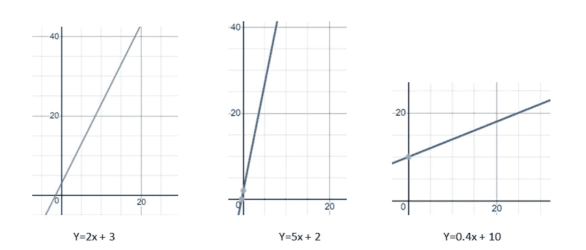
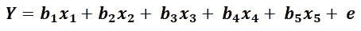

# 监督机器学习指南——回归

> 原文：<https://medium.com/codex/your-guide-to-supervised-machine-learning-regression-d6b822563e44?source=collection_archive---------7----------------------->

学习和发展回归工作的直觉

利亚姆·查默尔在 [Unsplash](https://unsplash.com?utm_source=medium&utm_medium=referral) 上的照片

> **注** : [机器学习的四大支柱#2 —线性代数和微积分](/codex/foundation-of-machine-learning-2-linear-algebra-and-calculus-9783d4592b98)是“初学者的完整机器学习和深度学习”系列的上一篇博客。建议在最后的博客中讨论之前的知识。

本博客中使用的少量代码和数据可以在这里[找到，如果你不知道如何编码或不理解本博客中的代码，请不要担心。这个博客不是一个编码教程。这个博客的目的是解释概念，你可以忽略代码，因为这个教程不依赖于代码，但是如果有人想深入研究，他们可以通过它。](https://github.com/harshit-wq/blog)

对于那些不熟悉所使用的代码或库的人，我们将发布一个博客作为这个系列的一部分，它将向您介绍所使用的代码和库。

# 博客概述:

1.  **简介**
2.  **监督机器学习**

*   **2.1 回归简介**
*   **2.2 分类介绍**
*   **2.3 连续和离散数据**

3.**回归**

*   **3.1 因变量和自变量**
*   **3.2 回归类型**
*   **3.3 简单线性回归**
*   **3.4 多元线性回归**

# 1.介绍

我们已经在本系列的前面讨论了监督和非监督机器学习。在这篇博客中，我们将了解更多关于监督机器学习中的回归以及它是如何工作的。你需要一点数学知识，不要太高；只要有线性代数的基础知识就有帮助了。

# 2.监督机器学习

正如我们之前的一篇博客([熟悉机器学习的世界](/@harshit_yadav/getting-familiar-to-the-world-of-machine-learning-ea31974ed0c4))中所讨论的那样，当我们基于一些带标签的数据集训练我们的模型时，它属于监督机器学习。现在，这种类型的机器学习进一步分为两个部分:

***2.1 回归*** :在回归中，我们试图预测“连续变量”(在前面讨论过)，如房价、covid 案例数量、股票价格、特定日期的温度等。

*   例如:假设给你一个学生学习多少小时的数据，你必须预测学生的分数。

***2.2 分类*** :在分类中，我们试图预测一些被称为“离散变量”(前面讨论过)的东西，比如花的类别、人类性别、是否是垃圾邮件等等。，我们确信输出将来自特定的类别列表。

*   例如:假设你的朋友养了一只宠物，她告诉你它的特征，它是[兔、狗、猫、牛]中的一种。现在你猜它是像狗还是像猫等等。

## 2.3 连续和离散数据

我们需要你为我们做两件事:

1.  猜一个数字。
2.  从[狗、猫、牛、兔]中挑选一种动物

你现在所做的，只是学习了什么是离散变量和连续变量。在第一个例子中，我们猜测某种形式的数字，可能是任何东西；我们没有限制，这是连续数据，可能是 10、100、10.10、57.80 等。然而，在第二个例子中，我们从一个定义明确的离散值池中挑选了一些值。

# 3 回归

回归是研究和使用数据，根据数据集的发现来预测连续变量。为此，我们需要了解因变量和自变量。

## **3.1 因变量和自变量:**

"因变量是一个依赖于不同因素的变量，这些因素作为自变量."

迷茫了？不要担心，请继续阅读

假设您有如下数据:

小时对马克。按作者

这个数据是关于一个学生学习了多少个小时和考试得了多少分。在这种情况下，您的因变量是学生在考试中的分数，该分数受学生学习小时数的影响，这是该数据中的自变量。

因此，小时=自变量，分数=因变量，正如我们已经知道的，分数取决于学习的小时数。

现在试着重读第一句话；它不会像以前那样令人困惑。

## **3.2 回归类型:**

现在回归可以用很多方法来完成。一些回归方法是:

1.  简单线性回归
2.  多元线性回归
3.  逻辑回归
4.  里脊回归
5.  套索回归
6.  多项式回归
7.  支持向量回归
8.  决策树回归
9.  随机福里斯特回归

我们将在这篇博客中讨论前两个，其余的将在后面的系列文章中讨论，因为它们有点超前。

## **3.3 简单线性回归:**

你听说过图形中的斜率吗？还是只是方程 y=mx+c？如果你有，那么你已经知道什么是简单线性回归。如果你没有，那么我们在这里等你。请继续阅读。

假设你花 10 美元买了两块巧克力，你能猜出 4 块巧克力的价格吗，那就是 20 美元。你可以用两种方法得出这个结果:

***首先是* :**

算出 1 块巧克力的价格，然后算出 4 块巧克力的价格。例如，如果两块巧克力是 10 美元，那么一块巧克力是 5 美元，这意味着四块巧克力是 20 美元

**T5 第二 :**

画一个图表(有点乏味，但确实有用)假设你问店主两块巧克力的价格，他告诉你 10 美元，4 块 20 美元，6 块 30 美元，以此类推，所以你可以画一个类似这样的图表。

巧克力的价格与数量。按作者

现在，如果有人问你 50 块巧克力的价格，看着图表，你可以说是 250 美元。

现在，您在第二种方法中所做的是创建一个简单的线性回归变量。实际上，在这个例子中，使用线性回归是没有意义的，因为这不是你需要线性回归的东西。这不是估计，而是肯定的事情。这是为了向你展示我们如何用图表来联系两个变量。现在，我们将了解如何对真实世界的数据使用线性回归。

让我们学习如何将简单的线性回归应用于现实世界的数据:

假设你想预测一个学生学习一定小时数会得多少分，你可以看看下面的数据，你可以在这里找到全部数据

学习时间与分数。按作者

现在我们想预测花在学习上的时间的分数。为此，我们将创建一个简单的线性回归模型。首先，让我们绘制一个学生成绩与学习时间的二维图表。它看起来会像这样:

按作者(编码)

现在，我们将尝试创建一条线性回归线来预测分数。现在如何划清界限？为此，我们必须想出一条与数据非常吻合的线来更准确地预测分数。仔细看这些图表:

按作者

那些蓝点代表数据点，红线代表我们的预测。你认为我们在哪个图表中接近准确答案？正确的答案将是右上方的图表，因为我们的预测线与数据非常吻合，我们的预测将非常接近实际答案。

但是为什么我们的直觉认为它应该是一个右上图呢？右上角的图表最小化了所谓的均方误差(MSE)；它越小，我们的预测线就越有效。让我们明白什么是 MSE。请看下图:

按作者(编码)

这些垂直线代表我们的预测有多少误差。在实际数据中，如果我们对这个误差的平方取一个平均值，我们就会得到一个叫做均方误差的东西。每当我们试图预测某件事时，我们都希望最小化实际答案和预测之间的误差。这个误差可以称为“成本”；因此，我们试图最小化这种成本，这种成本或误差是使用所谓的“成本函数”来计算的。在这种情况下，成本函数是均方误差。成本函数越小，或者我们可以说均方差越小，模型越好。

均方差。按作者

所以，现在你知道了哪一条线最适合我们的模型，但问题是我们是怎么做到的？我们如何到达那 4 条线？下面让我们了解一下:

所以图上的每一条线都可以用一个方程来表示，就是 y=mx + c，现在我们可以通过改变“m”来操纵这条线，这个“m”叫做斜率，“c”现在叫做截距。改变这两个属性可以改变线条。请看下面:

按作者

现在，我们可以猜测“m”的组合，即斜率，和“c”的组合，即截取足够的次数。这就是我们的计算机所做的，它检查“m”和“c”的不同组合，然后在足够的猜测之后，我们将挑选具有最低“成本函数值”的组合，即我们前面讨论过的具有最小均方误差的“m”和“c”的组合。

## **3.4 多元线性回归:**

在简单的线性回归中，我们看到了如何将一个因变量和一个自变量联系在一起以创建一个线性回归模型，但是如果我们有一个因变量和两个自变量呢？

假设你想预测一所房子的价格，那么它将取决于房子的面积、水的可用性、电的可用性等等。现在，让我们考虑一下，房子的价格只取决于两个因素:水电供应。现在我们如何用这两个来预测一个家庭的成本呢？

假设我们有一个数据集:

按作者

我们已经在简单线性回归中讨论了如何创建线性回归。如果我们只有两个变量，可以是价格对水或价格对电，图表将绘制为:

按作者(编码)

如果我们对数据进行线性回归，我们将得到:

按作者(编码)

所以现在我们有两个独立的变量:电力供应和水供应。我们希望使用它们来预测因变量房价，因此我们有三个变量来将其绘制成一个 3d 图，其中一个 z 轴表示房价，x 轴表示水的可用性，y 轴表示电的可用性。

如果我们将数据绘制在三维图上:

注意正象限，即(+x，+y，+z)，保持+x，+y，+z 轴的参考，以注意点的位置。

按作者(用于创建图表的站点:[链接](https://c3d.libretexts.org/CalcPlot3D/index.html)

现在我们如何拟合一个线性回归模型呢？如果你注意到，在我们的简单线性回归中，它是二维的，我们得到了线性回归模型，现在我们已经转移到三维，我们将得到一个平面？但是要在三维空间中定义一个平面，我们需要一个方程，你可以用这个方程指定三维空间中的任何平面:

按作者

我们看到，在简单线性回归的情况下，我们需要一个像 y=mx + c 这样的方程，但诀窍是找到斜率“m”和截距“c”。我们尝试了不同的值，这给出了不同的线，给出最小化成本函数(MSE，本例中为“均方误差”)的线给出了所需的线。(再读一遍，如果你迷路了，你会找到的，我们已经在简单的线性回归中讨论过了)。

我们将遵循同样的程序。我们将尝试不同的 a、b、d 值，给出最小 MSE(均方误差)的平面将为我们提供所需的平面，这将是我们的回归模型。(为了快速猜测 a、b、d，我们使用了一种称为“梯度下降”的优化技术，这将在另一篇博客中解释)。

在对 a、b、d 进行不同的尝试后，我们的计算机得出了使我们最小化 MSE 的值，该模型的这些值是

这是平面方程，它会给我们最小化的 MSE。如果我们在我们的 3-D 空间上画这个平面，我们会得到这样的东西:

作者(用于创建图表的站点:[链接](https://c3d.libretexts.org/CalcPlot3D/index.html))

按作者(编码)

这将是我们的线性回归平面，它根据特征输入告诉我们房子的价格，但这里出现的问题是

**如果有两个以上的特征呢？**

假设你有一个数据集，你的因变量是房子的价格。独立变量是(房屋面积、房间数量、楼层数量、水、电、位置)，所有这些都不能在三维图中表示，如果我们试图绘制这些数据，那么我们将需要一个 6-D 图，但这是不可能可视化的，我们不能超越三维空间，所以我们将需要一个超平面，但不是试图使用超平面概念来理解它，我们将这样理解它:

在三维空间示例中，我们看到线性回归方程类似于**Z = 0.19264305 * X+0.22561308 * Y+0.6171662125340589，**类似于方程。

按作者

因此，在这个等式中， **Z** 是房价，**x’**是特征变量(在这种情况下是水的可用性)，**y’**是特征变量(在这种情况下是电的可用性)，而 **a、b** 是给出所需线的特征的权重，因此在我们之前求解的示例中，特征 x 的权重是 **0.19264305，**特征的权重 **y** 因此，如果我们想要处理一个数据集，其中您的因变量是房价，自变量是(房屋面积、房间数量、楼层数量、水、电、位置)，而不是进入超平面理论，现在，我们可以遵循上述方程的模式，这将导致:

按作者

其中 **Y** 是房价， **X1** 是房屋面积特征， **b1** 是该特征的权重， **X2** 是房间数特征， **b2** 是该特征的权重，以此类推，直到位置特征为 **X5** 且其权重为 **b5** ，最后剩下的是

**这样，我们可以为包含更多要素的数据集创建线性回归。**

## **结论**

**线性回归广泛应用于机器学习领域。这是预测连续数据的强大而简单的算法之一。线性回归有不同的修改，如山脊线、套索线，在你熟悉梯度下降、过拟合和欠拟合等之后，这些将在本系列的后面介绍。**

**如果你是回归的绝对初学者，那会有很多东西需要消化。慢慢来，再次经历回归。如果你在第一次尝试中不清楚，它会变得更清楚。**

**如果你觉得这个博客有帮助，请考虑关注我们，从这个系列中接收新的信息博客。**

**上一篇博客— [机器学习的四大支柱#2 —线性代数和微积分](/codex/foundation-of-machine-learning-2-linear-algebra-and-calculus-9783d4592b98)**

**下一篇博客— [你的监督学习指南—分类](/codex/your-guide-to-supervised-learning-classification-6f0eeb8b7049)**

** [## Harshit Yadav -中等

### 熟悉机器学习的世界机器学习的鸟瞰图注意:这是第一篇关于…

medium.com](/@harshit_yadav)  [## 萨尔萨克·马利克-中等

### 机器学习的四大支柱# 1——统计与概率 Hola，机器学习爱好者们！这个博客是第二个…

medium.com](/@malikSarthak)**