# 无监督机器学习指南——聚类

> 原文：<https://medium.com/codex/your-guide-to-unsupervised-machine-learning-clustering-10ea9cd26412?source=collection_archive---------9----------------------->

构建聚类的直觉和逻辑，以及数据集上 K-Means 算法的可视化

来源— [链接](https://pixabay.com/photos/grapes-fruit-cluster-grape-5889697/)

# 介绍

在之前的博客中([熟悉机器学习的世界](/codex/getting-familiar-to-the-world-of-machine-learning-ea31974ed0c4)，我们了解了无监督机器学习。与监督机器学习不同，我们识别与其他数据点相关的数据点，因为这种类型的机器学习算法不像在监督机器学习中那样利用标记数据。如果你需要更多关于这个主题的澄清，试着阅读([熟悉机器学习的世界](/codex/getting-familiar-to-the-world-of-machine-learning-ea31974ed0c4))的“无监督机器学习”部分。

# 无监督机器学习

当我们需要在“未标记的数据集”中找出潜在的隐藏模式时，使用无监督的机器学习，无监督的机器学习进一步分为两个部分:

1.  聚类—将相似的数据点分组以形成不同的文化。
2.  关联——寻找数据点之间的重要关系。

在这篇博客中，我们将学习聚类是如何工作的，以及我们可以使用什么方法对未标记的数据进行聚类。

# 使聚集

假设你面前有一个装满鲜花的篮子，这个篮子可以包含任意数量的不同种类的鲜花。例如，篮子可以包含 5 朵类型 1 的花、3 朵类型 2 的花等。这里的问题是，你戴着眼罩，你看不到和区分不同种类的花。现在你如何区分一种花和其他类型的花？

因为你不能摘下眼罩，区分不同种类的花的一种方法是摘一朵花并把它放在篮子外面，摘另一朵花并试着感觉它是否与第一朵相似。如果相似，就把它们放在一起。如果感觉不一样，那就分开，然后选第三个，试着对照其他类别来感觉。

当你完成的时候，你会得到不同的文化。这就是聚类，将一个数据点与其他数据点进行比较，形成一个聚类。

# 基于聚类的顶级算法

有不同的方法对未标记的数据进行聚类。你用蒙眼布隔离不同种类的花的方法是其中一种方法。与此类似，可以有许多方式来形成集群。在机器学习中，这些方法被称为算法，有不同的聚类算法，如:

1.  k 均值聚类
2.  均值漂移聚类
3.  基于密度的噪声应用空间聚类
4.  EM 使用 GMM
5.  凝聚层次聚类

在这篇博客中，我们将讨论 K-Means 聚类算法。

# k 均值聚类

假设您有一个包含不同种类花卉特征的数据集。但是，您不知道有多少个类别，以及哪个数据点属于哪个类别，因此为了找到类别，我们对其执行 K-Means 聚类，以便从数据中了解更多信息。

每个数据点代表一朵花，它具有给定的花瓣长度细节和花瓣宽度细节，并且每个数据点可能属于我们不知道的某一种类的花。

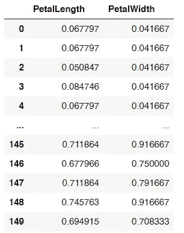

按作者

看下面的图片。这是花朵数据集的花瓣宽度与花瓣长度的对比图。

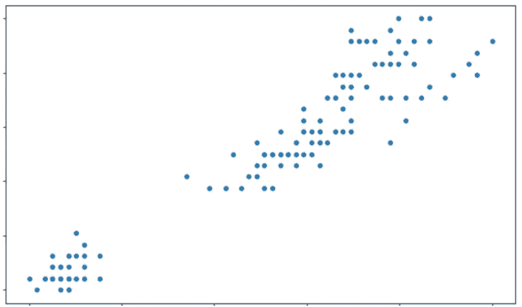

作者的 petalLength 与 petalWidth

在这种情况下，所有的蓝点代表一朵花，基于两个特征，即花瓣宽度和花瓣长度。现在我们不知道有多少种花，因为所有的数据点看起来都一样，只是花瓣长度和花瓣宽度的组合不同。

尝试找出哪个数据点属于哪个类别。你会怎么做？

你首先要做的是回答这些数据包含多少个类别，因为如果不知道有多少个类别，你将如何把数据分类。

现在，假设我告诉你，这些数据代表 2 个类别，比如 A 和 B。现在，我希望你找出哪些数据点可以归入 A 类，哪些数据点可以归入 B 类，因此，要回答这个问题，我们需要找出聚类和聚类的确切中心点，数据点将围绕该中心点进行识别，该聚类的中心点称为质心。(在这篇博客中，你会更好地理解这一点)。

所以，在 K-Means 聚类中，我们专注于寻找两个主要的东西

1.  **数据中有多少个聚类** —有一些方法可以在数据中找到正确的聚类数，比如肘法和剪影法。我们将在本博客的后面部分讨论这一部分。
2.  **形成的聚类的质心在哪里** —假设我们发现我们的数据中有 x 个类别。下一件事，我们想找到的是所有这些 x 聚类的中心在哪里，以及哪些数据点属于哪个聚类。

我们将首先解释第二个。我们将学习群集的质心，然后我们将学习如何找到正确的群集数量。

# 学习形成我们数据的集群

根据上图，我们可以假设有两个集群。然而，这可能是错误的，我们不能简单地侥幸猜测。我们将在后面学习如何在数学上确定。

目前，让我们假设我们的数据中最初有两个聚类，这意味着我们所有的数据点都属于这两个聚类中的一个。

**第一步**

我们随机选取两个数据点，并假设它们位于我们正在寻找的聚类的中心。它看起来会像这样-

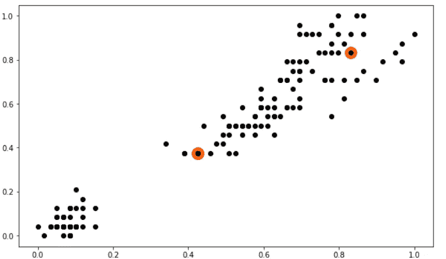

按作者

在这里，我们假设我们的质心现在在[0.42372，0.375]和[0.8305，0.833]。我们需要找到哪一个数据点属于两个集群中的哪一个。让我们在步骤 2 中了解一下。

**第二步**

为了找到数据点的所属性，我们找到数据点和两个聚类质心之间的距离，给出最小距离的聚类质心是我们的数据点所属的聚类。见下图及说明:

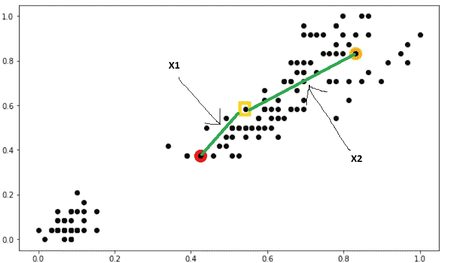

按作者

让我们以标有黄色的点为例。我们需要找到这个点属于哪个集群。为此，我们找到该点和聚类中心之间的距离，距离最小的那个被选为我们的数据点所属的那个。这样做之后，我们将获得所有数据点中哪个数据点属于哪个聚类。它看起来会像这样:

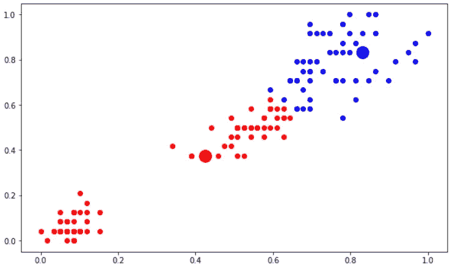

按作者

现在，我们已经确定了哪个数据点属于哪个集群。因为我们只是猜测了我们两种文化的重心，所以我们的猜测可能并不正确。让我们学习如何在步骤 3 中找到我们的聚类的质心的正确位置。

**第三步**

现在，请看上图。你认为我们的红色质心相对于其他点在正确的位置吗？

质心应该位于聚类中所有数据点的中心。如果我们找出一个聚类中所有数据点的平均值，我们将得到一个新的位置。在下图中，该位置标有“X ”:

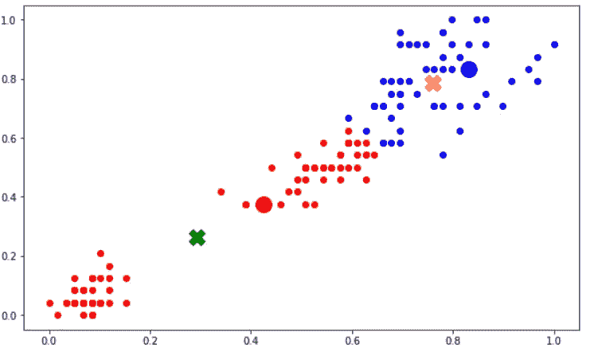

按作者

你看，所有红点的平均位置用绿色十字标出，所有蓝点的平均位置用黄色十字标出。这些是我们聚类数据的中心点，也是放置质心的更好位置。如果我们移动重心，它看起来会像这样:

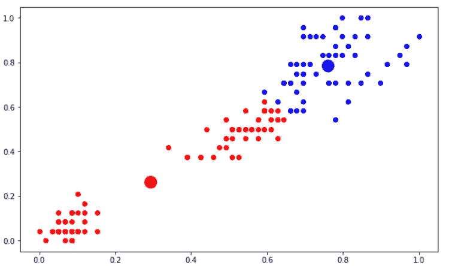

按作者

**第四步**

但是当我们移动我们的质心时，可能不是所有的红点仍然靠近红色质心。我们将再次需要找到每个数据点相对于闭包质心的隶属度。它看起来会像这样:

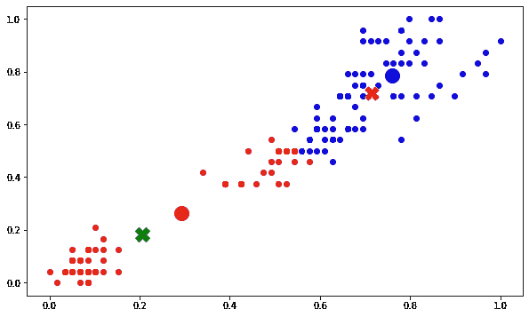

按作者

现在我们再次从第二步开始，取这些新的质心，我们继续这样做，直到我们的质心停止改变位置。一旦发生这种情况，我们可以自信地说，我们已经找到了质心，属于这个的数据点将落在那个簇下。通过下面的图片可以直观地理解整个过程:

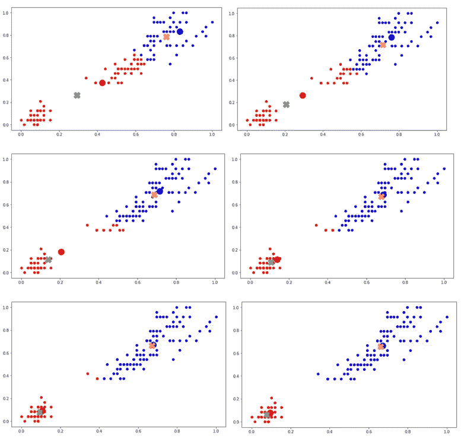

按作者

我们将得到最终结果为:

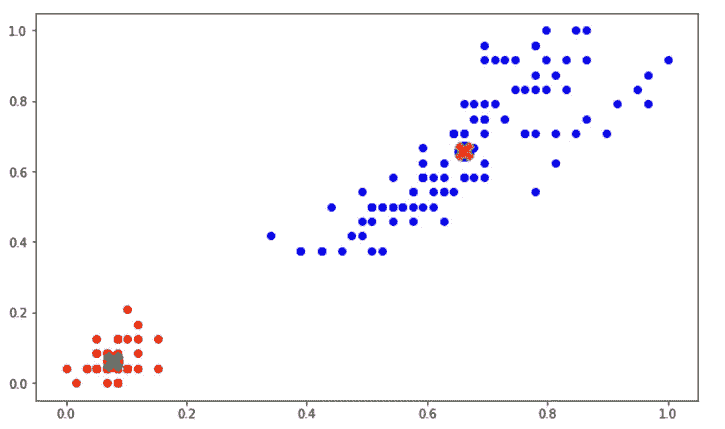

按作者

我们可以看到，新的平均值与质心相同，在更多的迭代中不会改变，它是固定的，这是我们获得的所需质心，我们可以直观地看到，它成功地描述了我们假设的两个集群，但仍然存在的问题是:-

真的是图像中的两个集群吗？这个问题仍然没有答案，我们将在一段时间内转移到这一点。

首先，让我们以 GIF 的形式来看看上面的过程:

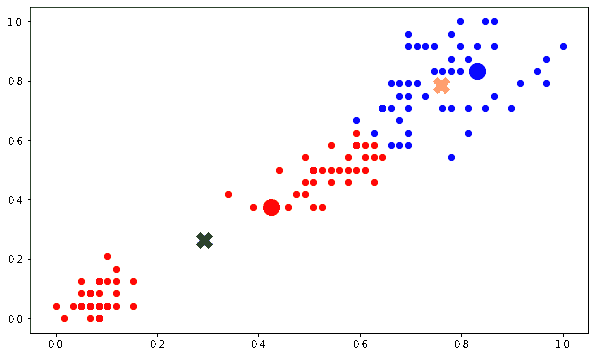

按作者

我们现在有两个集群，我们知道哪个数据点属于哪个集群。现在假设我们想了解我们的数据是如何分布在我们的质心周围的。最好的方法是将所有数据点到它们的聚类中心的距离的平方相加，我们的数据的这个值就是 5.1797747883

这个数字也被称为“惯性”，惯性是根据簇形心的最佳位置计算的。这意味着我们在迭代后找到的质心上计算惯性，当我们确定得到的质心时。

# 学习找到 K 中的“K”意味着:

在学习寻找数据的聚类中心时，我们假设数据中有 2 个聚类，但这可能是错误的，因为我们没有任何数学依据来支持这种猜测，让我们学习如何找到正确的聚类数。

我们开始猜测数据集中的聚类数或类别数。我们猜测数据中存在的聚类数。现在，假设我们猜测数据中的聚类在范围 1 到 15 之间。现在如何选择最佳猜测？

我们通过寻找质心的位置来挑选最佳猜测，该质心对于不同的 K 值给出最小的惯性(提前阅读以获得诀窍)。

让我们直观地理解这一点:

假设我们假设只有一个类别，因此我们说必须只有一个聚类，但是我们知道聚类有一个质心点，因此这个聚类也必须有一个质心点，现在为了验证 k=1 是否是最佳选择，我们尝试找到聚类的最佳质心。为了找到聚类的最佳质心，我们使用上面使用的策略并得出结果:

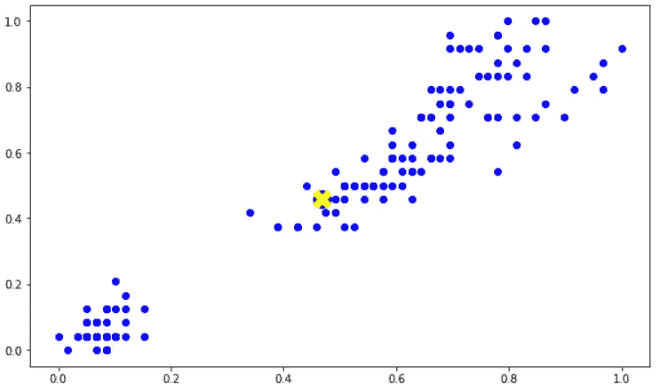

按作者

惯性是聚类中数据点到聚类质心的平方距离之和。k=1 时的惯性为 28.391514358368717，在学习质心位置时，我们发现 k=2 时的惯性为 5.179687509974783，k=3 时的惯性为 1.70509882255 随着 k 值的增加，我们的损失不断减少。

> 似乎唯一合乎逻辑的是，一旦我们的 k 变得等于我们拥有的数据点的数量，它将因为没有误差而变为零(考虑一下这一点，这可能是一个令人挠头的问题)，

因此，如果我们将它绘制在惯性对 K(簇的数量)的图表上，它将看起来像这样:

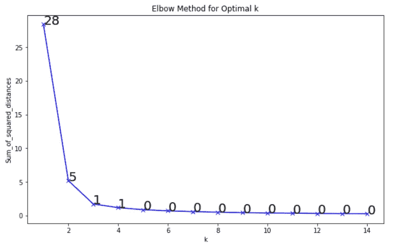

按作者

正如预期的那样，请注意图表是如何从指数变化到线性的，现在发生这种变化的点称为拐点，这是我们数据中存在的聚类数，这意味着我们关于数据包含 2 个类别的假设是错误的。集群的正确数量是 3。让我们看看我们的群集质心在哪里，让我们把它可视化:

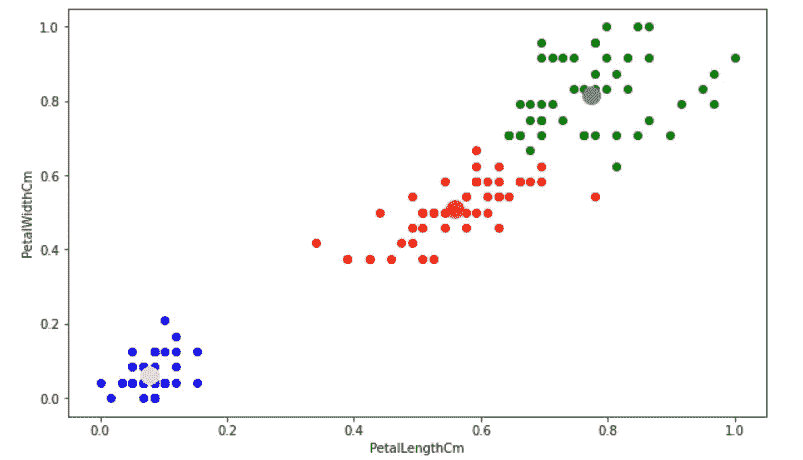

按作者

# 结论

在这篇博客中，我们看到了 K-Means 聚类算法如何在数据集上工作，在使用肘图选择正确的聚类数时应该注意什么，以及 k_means 算法如何找到形成的聚类的质心。

无监督的机器学习用于找出未标记的数据点如何与其他数据点相关，以及它们如何使用该信息进行聚类。在聚类算法中，要找到的主要内容是聚类质心和实际存在的聚类数量，我们可以通过不同的方式找到这些聚类，其中一种方式在上面进行了解释，即肘图。

无监督机器学习有许多应用，如欺诈检测、客户细分、特征提取等。

在之前的博客中，我们已经涵盖了监督机器学习，而这篇博客解释了无监督机器学习算法，下一篇博客将向您介绍我们在处理机器学习模型时需要注意的重要参数。

上一篇博客— [你的监督机器学习指南—分类](/codex/your-guide-to-supervised-learning-classification-6f0eeb8b7049)

 [## Harshit Yadav -中等

### 熟悉机器学习的世界机器学习的鸟瞰图——注意:这是第一篇博客…

medium.com](/@harshit_yadav)  [## 萨尔萨克·马利克-中等

### 阅读萨塔克·马利克在媒介上的作品。ML 研究员||人工智能实习生万事达| | IIT·鲁尔基…

medium.com](/@malikSarthak)