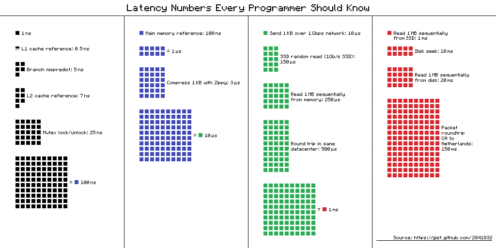
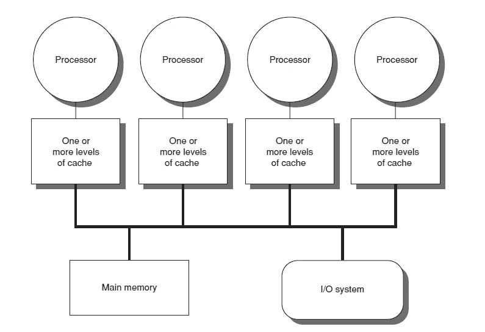

# 你的笔记本电脑是一个分布式系统

> 原文：<https://medium.com/codex/your-laptop-is-a-distributed-system-3afb252db0c2?source=collection_archive---------5----------------------->

迈克尔·泽兹奇在 [Unsplash](https://unsplash.com?utm_source=medium&utm_medium=referral) 上的照片

当我们想到分布式系统时，我们会想象多台机器相互通信以完成一个请求，也许是一个在分布式数据库中存储数据的节点集群，或者更抽象的概念，如 [CAP 定理](https://en.wikipedia.org/wiki/CAP_theorem)【1】中的一致性。

***但是你亲眼见过分布式系统吗？我不是指建筑图，我是指真正看到它。
我打赌你会，而且你可能会用你的笔记本电脑来阅读这篇文章。如果最后一句让你感到惊讶，继续读下去，我们会明白为什么。***

# 一致性

正如你已经知道的，内存是计算机用来存储数据的设备。内存因其速度、成本和易失性而异。在光谱的一端，我们有快速但昂贵的存储器，如 SRAM。另一方面，我们有硬盘驱动器，速度慢(与 CPU 速度相比)，便宜，非易失性，因为它们不需要电源来保存数据。在中间，我们有 [DRAM](https://en.wikipedia.org/wiki/Dynamic_random-access_memory) 技术，因其成本效益而受欢迎。
谈到速度，最好了解一下访问存储在内存中的数据所涉及的数字:

延迟数字—通过 Github 记入 [hellerbarde](https://gist.github.com/hellerbarde/2843375) 名下

*   访问 SRAM 中的数据需要 0.5 纳秒
*   从 DRAM 存取数据需要 1000 纳秒。大约比 SRAM 中的访问慢一千倍
*   从硬盘读取一个日期需要 200 万纳秒，也就是 2 毫秒。大约比访问 SRAM 慢一百万倍

让我们假设您有一个 1 GHz 的 CPU，经过一些简化[2]这意味着您的 CPU 可以每纳秒运行一条指令。在一个简单的实现中，如果我们要访问一个 DRAM，CPU 将需要等待大约 1000 个周期，基本上什么也不做，而不是运行 1000 条指令。 ***大量计算能力被浪费。*** 如果取而代之，我们使用 SRAM，内存将能够跟上 CPU，从而不会浪费宝贵的周期。

理想情况下，我们希望为我们的计算机配备最大容量的高速内存，但不幸的是，高速内存非常昂贵，这给我们带来了一个工程学的基本定理: ***天下没有免费的午餐*** 。工程就是在成本和性能之间找到最佳平衡点。

幸运的是，有两个特性可以帮助计算机设计者进行权衡:空间和时间局部性。空间局部性属性表示存储在最近执行的指令附近的指令有很高的执行机会。相反，时间局部性表达了程序在执行过程中多次使用同一块数据的倾向。这些突然出现的特性并不会让我们感到惊讶，因为 CPU 一个接一个地运行指令，程序在执行过程中往往会多次访问数据。这些有些直观的属性建议按层次组织我们的内存，较快的内存靠近 CPU (SRAM 通常用于缓存和 CPU 寄存器)，较慢的内存位于层次的上层(DRAM 也称为主内存)。
在读取操作中，CPU 试图从缓存中访问数据，如果缓存中有数据，就使用它。如果不是，则需要将数据从主内存复制到缓存中，然后 CPU 才能使用它。CPU 不仅复制它需要的数据，还复制整个连续地址块(空间位置)。
因为高速缓存必须小于主存储器，所以在某个时候它将变满，并且高速缓存中的一些条目必须被逐出。哪些？最常用的策略是删除[最近最少使用的项目](https://en.wikipedia.org/wiki/Cache_replacement_policies#Least_recently_used_(LRU))(时间局部性)，通常根据成本-收益权衡进行一些近似。

为了获得更好的性能，系统设计人员在同一条物理总线上构建多个 CPU 互连的系统。每个 CPU 访问相同的内存，这意味着内存成为共享资源。
总的来说，我们在一条总线上有多个互连的 CPU，每个 CPU 都有自己的高速缓存，它们都访问相同的共享内存:

缓存组织——通过 Wikimedia Commons 向 Kunal Buch[CC BY-SA 4.0](https://creativecommons.org/licenses/by-sa/4.0)致谢

每个 CPU 根据它需要访问的数据填充缓存，即所谓的数据的本地副本。相同的数据可能被不同的 CPU 使用，这意味着我们最终可能会在不同的缓存中拥有相同数据的多个副本。但是当其中一个 CPU 更新其数据的本地副本时会发生什么呢？我们有一个典型的**分布式系统**问题:当其中一个处理器更新其本地副本时，保持相同数据的多个副本同步。这就是分布式系统人们所说的**一致性问题**。相反，对于硬件工程师来说，这是[缓存一致性](https://en.wikipedia.org/wiki/Cache_coherence)问题。[3]

# 结论

我们的笔记本电脑是一个高度耦合的分布式系统，其中每个节点都是一个 CPU。
尽管硬件工程师需要解决多机分布式系统中经常遇到的一类问题，但解决这些问题的方式有一个主要区别。在一台计算机中，即使组件不在同一个芯片上，它们也是通过总线相互连接的。多 CPU 系统不需要处理网络分区、消息重新排序、部分故障以及不可靠网络的所有其他属性。

事实证明，网络确实是使分布式系统变得困难的原因。

在 Twitter[上关注我](https://twitter.com/napicellatwit)，在你的订阅源中获取新帖子。
封面图片通过 [Unsplash](https://unsplash.com?utm_source=medium&utm_medium=referral) 归功于 [Michael Dziedzic](https://unsplash.com/@lazycreekimages?utm_source=medium&utm_medium=referral)

[1] **一致性-可用性-分区容差权衡。**CAP 定理的扩展称为[pace LC](https://en.m.wikipedia.org/wiki/PACELC_theorem)
【2】这种简化没有考虑流水线、多核、需要多个周期才能完成的指令
【3】**乱序执行。我们的笔记本电脑和分布式系统之间的相似之处不止于此。现代 CPU 采用了另一种技巧来提高 CPU 性能:允许它们以不同于程序中指定的顺序运行指令。当然，这意味着增加了系统的复杂性，现在系统需要保证按顺序执行的指令的一致性。
【4】当然，这并不意味着 CPU 设计很容易**