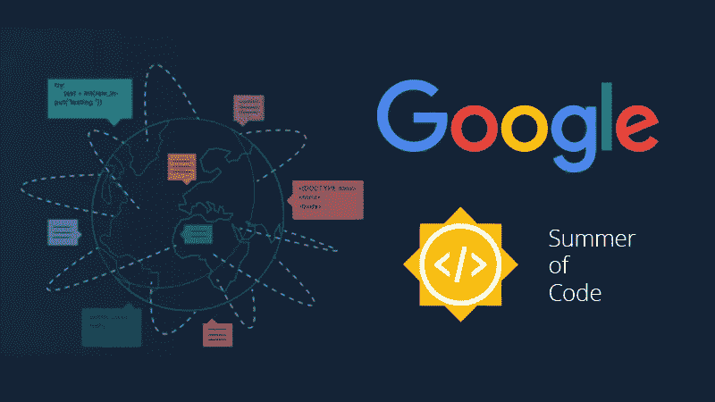

# 你在申请谷歌代码之夏？这里有一些提示

> 原文：<https://medium.com/codex/youre-applying-for-google-summer-of-code-here-s-some-tips-a897eef13a2f?source=collection_archive---------3----------------------->

## [法典](http://medium.com/codex)

所以，又到了一年中的这个时候；谷歌代码之夏(GSoC)宣布将于 2021 年举办，昨天公布了指导组织的[名单。作为一名来自](https://summerofcode.withgoogle.com/organizations/) [2011](https://www.google-melange.com/archive/gsoc/2011/orgs/sahana/projects/ramdesh88.html) 、 [2012](https://www.google-melange.com/archive/gsoc/2012/orgs/sahana/projects/ramdesh88.html) 和 [2015](https://www.google-melange.com/archive/gsoc/2015/orgs/moodle/projects/ramdesh88.html) 的前 GSoC 学生，一名来自 [2013](https://wiki.sahanafoundation.org/agasti/vesuvius/gsoc2013/portableapp) 的导师和一名来自 2014 的组织管理人员，我想我应该为这次考虑申请的学生写一些提示。虽然如今项目的管理方式发生了一些变化(咳咳，报酬，*wink wink*)，但对于想要申请并参与这个令人惊叹的项目的人来说，一些核心原则保持不变。

现在，我不打算长篇大论地谈论[什么是 GSoC](https://summerofcode.withgoogle.com/)、[如何开始为开源软件做贡献](https://stackoverflow.blog/2020/08/03/getting-started-with-contributing-to-open-source/)，或者其他我现在想不起来的第三件事。我将列出一些建议，告诉你如何努力成为 GSoC 的学生，以及如何努力完成你的项目。

# **选择一个指导组织**

转到今年的[指导组织列表。顶部有一个方便的搜索栏。你对特定的编程语言或框架感兴趣/精通吗？你喜欢像](https://summerofcode.withgoogle.com/organizations/)[生物](https://summerofcode.withgoogle.com/organizations/?sp-search=biology)或者[太空](https://summerofcode.withgoogle.com/organizations/?sp-search=space)这样的特定领域吗？搜索一下，看看出现的指导组织列表。点击一个组织，你就有机会看到他们今年提交给 GSoC 的想法列表。好吧，让我们假设你是一个航天迷，想和[aerospaceresearch.net](https://aerospaceresearch.net/?page_id=2156)一起工作(我完全是随机挑选的)。他们的想法列表是[这里](https://aerospaceresearch.net/?page_id=2156)。

# **看看他们有什么项目，选一个**

现在，即使你选择了一个很棒的组织，而且你喜欢这个主题，他们的项目想法也可能超出你的能力范围。然而，我认识一些成功的 GSoC 学生，他们申请了一个乍看之下一无所知的项目。所以，如果项目想法对你来说像是无法解决的数学问题，不要灰心丧气，它几乎总是有可能解决的。为了跟进我们在 aerospaceresearch.net 的例子，让我们看看他们的一个项目想法，*[gsoc 21-a-cal 1]calibrates dr:添加更多输入源来校准 SDR。*

什么是特别提款权？我如何校准它？这类问题会让你不知所措。然而，项目想法描述有很多有用的信息，包括一个到 Github 上的[基本 repo 的链接，您可以将代码写入其中](https://github.com/aerospaceresearch/CalibrateSDR)。点开回购，注意到是用 Python 写的。太好了！我知道 Python！现在我感觉更好的是，这个项目需要用我至少熟悉的编程语言来完成。项目想法描述包含了更多有用的信息，我可以用来理解需要什么，谁是项目的指导者，等等。

请注意，对于是否选择一个项目并坚持下去，或者是否跨不同的指导组织申请多个项目，存在不同的观点。就我个人而言，我更像是一个坚持做项目应用的人，主要是因为我从来没有能够同时做很多不同的事情。然而，有很多学生两种方式都被选中了(如果你被两个项目选中，指导组织将聚在一起决定接受你的申请)。所以对每个人来说。

# 了解你申请的组织和项目

*(注意:虽然我随机选择并使用了这个项目作为例子，但是这个步骤对于每个组织或项目来说并不相同。在进入下一步之前，您可能只需要弄清楚如何为某些组织安装特定的应用程序。要记住的重要一点是，即使在你开始接触指导组织之前，你也需要做一些工作。)*

现在，一旦您选择了一个项目(或多个项目)，您就需要安装开发环境，以便开始使用与之相关的开源软件。因此，如果我们看一下 aerospaceresearch.net 的 CalibrateSDR 项目和提供的代码，你可以看到这是一个简单的 Python 项目。您所要做的就是拥有一个合适的 Python 开发环境，使用 Git 克隆 repo，并在 repo 文件夹中运行`pip install -r requirements.txt`来安装依赖项。

作为一个额外的步骤，你可以看看[https://github . com/aerospace research/calibrates dr/blob/main/calibrates dr/DAB plus/DAB . py](https://github.com/aerospaceresearch/CalibrateSDR/blob/main/calibratesdr/dabplus/dab.py)你可以看到 DAB+校准已经实现，你可能可以使用它作为一个新的信号校准方法的实现的基础(我想他们要求 NWS +你为这个 GSoC 项目选择的另一个)。

但是我们如何运行这个应用程序呢？[https://github . com/aerospace research/calibrates dr/blob/main/Cali . py](https://github.com/aerospaceresearch/CalibrateSDR/blob/main/cali.py)是一个带有`main`函数的可运行 Python 文件。在这一点上，我们遇到了障碍。有没有一组我们可以用来运行代码的样本输入？此时，我们可以进入下一步:

# **你的第一次沟通**

aerospaceresearch.net 的 GSoC 想法列表页面将 ZulipChat 和邮件列表列为他们的主要沟通方式。你可以继续订阅邮件列表，这样你就可以开始收到讨论邮件，并且可以加入聊天，看看发生了什么。既然你已经为理解这个项目做了一些工作，是时候用一个简单的信息表明你对这个项目感兴趣了，比如:

> 大家好，我是<college>的本科生/研究生<name>，我有兴趣向 aerospaceresearch.net 申请 GSoC 的“**添加更多输入源以校准 SDR”**项目。我检查了 Github 上的报告，注意到 DAB+校准已经实现。我能以此为基础，使用新信号进行建筑校准吗？我还注意到，为了运行应用程序，我需要一些输入数据。你能给我指出什么测试数据吗？</name></college>

这里要意识到的重要的事情是，你需要表明你已经建立了开发环境，并努力理解项目需要什么，而不是没有任何线索就随意出现。指导组织喜欢看到这一点，因为这表明你致力于了解项目是什么，以及该组织做什么。

# **跟随至**

在申请期间，持续与指导组织周围的社区保持联系是非常重要的。自由/开源软件社区是关于互相帮助的，所以不要犹豫去帮助任何在聊天中寻求帮助的人。不要在最初的沟通后沉默不语，最后突然提交申请。大多数组织要求您在有资格申请之前至少提交一些问题修复，当您与该组织合作并了解其社区时，您也可以开始了解并完成您的项目的一些初步研究。这项研究将真正帮助你写一个好的应用程序。

我不打算详细解释如何写一份好的 GSoC 申请，因为不同的指导组织对书面申请有不同的指导方针，而且已经有很好的指导来写申请了。一般来说，如果你和社区保持联系，并努力理解你的项目，那么几乎可以肯定你能够写出一份好的申请，并被选为 GSoC 的学生。

# **总之……**

谷歌代码之夏的主要目标之一是让新的贡献者加入开源组织。在我的 2011 年和 2012 年 GSoC 项目之后，我留在了我的指导组织，甚至成为了他们一个产品的主要维护者。需要理解的最重要的一点是，自由/开源软件是一个很好的接触和参与社区的方式，同时学习软件开发的基本技能和行业最佳实践，而 GSoC 是一个很好的入口。这意味着指导组织总是倾向于选择一个 GSoC 的学生，看起来他们很适合这个社区，所以如果你想申请，不要想离开这个社区。

正如我前面提到的，我只是想根据我作为学生和导师的经验写下一些提示。祝今年申请的每个人好运，我希望你被选中！

请注意，我选择 aerospaceresearch.net 作为例子完全是随机的，我粗略地看了一下我选择的项目想法，得到的一些结论可能是错误的。我只是想概述一下最初迷上一个项目并理解它背后的思维过程。