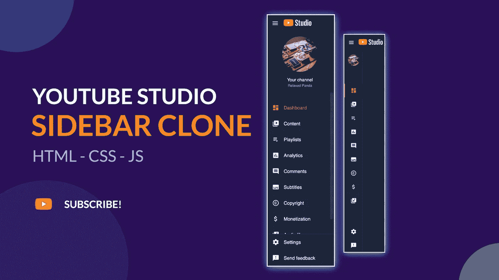

# Youtube studio 侧边栏菜单克隆 HTML、CSS 和 Javascript

> 原文：<https://medium.com/codex/youtube-studio-sidebar-clones-html-css-and-javascript-f7756280814a?source=collection_archive---------2----------------------->

朋友们好，今天我将向你们展示如何用 HTML、CSS 和 JavaScript 来构建 youtube studio 侧边栏的侧边栏菜单克隆。

按照这个教程，你需要在你的笔记本电脑上安装两个东西。

1.  网络浏览器:谷歌浏览器、火狐浏览器或任何其他网络浏览器。
2.  一个文本编辑器:最著名的开发者文本…