# Youtube 趋势视频数据分析

> 原文：<https://medium.com/codex/youtube-trending-videos-data-analysis-a340b4a039f9?source=collection_archive---------7----------------------->

## [法典](http://medium.com/codex)

我不认为这个世界上有人懂技术，也不知道 Youtube 是什么。Youtube 是最受欢迎的社交媒体之一，任何使用互联网的人都经常使用它。当我们谈论与视频相关的社交媒体时，我想每个人都会认为并猜测我们在谈论 Youtube。如果我们想以视频的形式找到基于音频和视频的信息，几乎可以肯定的是，任何人都说我们应该去 Youtube，即使它是学术学习过程的视频，试图找到关于如何制作东西或如何解决一些问题的教程，作为观看娱乐的媒介，等等。看到 Youtube 上大量的视频内容和 Youtube 上访问者的高流量，让我相信 Youtube 在未来几年将继续快速增长，尤其是如果 Youtube 能够继续增加其在 Youtube 上的知名度和功能的话。到目前为止，我认为有一个功能非常有趣，那就是 Youtube 趋势。

YouTube 在其网站上表示，Youtube 趋势是他们的功能之一，可以帮助观众了解 Youtube 和世界上正在发生的事情。趋势分析旨在挖掘广大观众会感兴趣的视频。有些趋势是可以预测的，比如流行歌手的新歌或者新电影的预告片。还有一些令人惊讶，比如一个病毒式的视频。不仅如此，我认为这个功能非常有趣，老实说，我也很好奇 Youtube 趋势是如何工作的。我假设用户互动，比如浏览、喜欢、评论，也许还有不喜欢，是决定 Youtube 趋势的因素之一。但是我不确定，我真的不确定。因此，为了回答我的好奇心，我将尝试分析我在 2021 年 3 月 17 日从 Youtube Trending 收集的数据。我搜集了几个国家的 Youtube 趋势数据，比如美国、英国、韩国、日本、印度尼西亚、印度和马来西亚。但是，今天，我将只尝试分析印度尼西亚 Youtube 趋势视频。也许在下一篇文章中，我会尝试分析其他国家的 Youtube 趋势视频，或者也许我会比较并结合几个国家的几个 Youtube 趋势视频。那么，我们开始吧。

我们要做的第一件事是得到一个数据集。为了删除 Youtube 趋势视频，我在这个 [Github](https://github.com/mitchelljy/Trending-YouTube-Scraper) 中使用了 mitchelljy 的趋势 Youtube 视频刮刀。你可以在 Github 上找到如何使用代码以及如何废弃数据。别担心，步骤解释的很清楚，很好用。如果你不想放弃，想直接分析数据，你可以使用他的 Kaggle 数据集，名为趋势 YouTube 统计[这里](https://www.kaggle.com/datasnaek/youtube-new)。向米切尔致敬。

下一步是你可以打开你的 Jupyter 笔记本(或者你可以使用 Google Collab [here](https://colab.research.google.com/) )并导入一些将用于分析数据的库。在这个简单的分析中，我只使用了两个库，即 Pandas 和 os。完成库导入后，我将打开并读取我想要使用的数据集。我还对索引进行了更改，将它转换为 index +1(这样索引值直接从 1 开始，而不是从 0 开始)。下面是我打开看完之后可以看到的代码和一些数据。

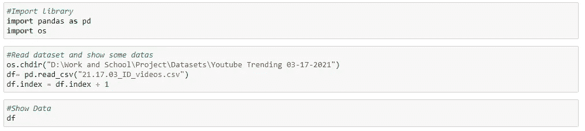

导入库并打开数据集

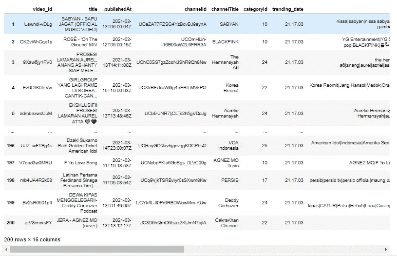

数据集已打开。

在数据集的底部，您可以看到表的组成:有 200 行 x 16 列。为了保证表格的形状或构成，可以编码 **df.shape** 就可以看到数据的形状。您还可以使用 **df.count** 来查找表格中的各种数据及其编号。 **Df.dtypes** 也可以用来找出表中各种类型的数据类型。也许这太简单了，对一些人来说，他们不需要这些东西。但我认为这真的很重要，因为在你“深入研究”并试图分析数据之前，你需要很好地了解你的数据。

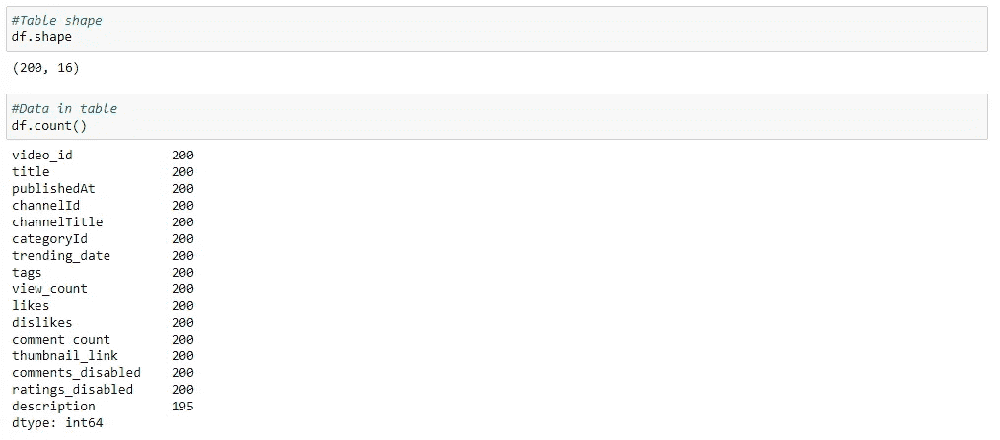

表格形状、各种数据及其编号。从这张图可知，200 个视频中，有 5 个视频没有描述。想把数据分析好，知道这一点真的很重要。幸运的是，这个分析描述并不太重要，所以我稍后将不再赘述。

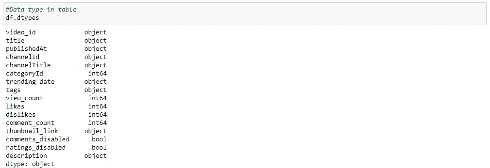

表中的数据类型。您可以看到数据类型，并找出以后如何使用或处理它们。

当我从数据集中获得足够的信息后，我会尝试准备数据。由于这是一个简单的分析，我将只关注“数字”数据，我认为这肯定是一个视频是否流行的决定性因素。因此，我将删除一些我认为不会成为影响因素的列。将被删除的列是 **video_id、channelId、categoryId。趋势日期、标签、缩略图链接、评论禁用、评级禁用、**和**描述。**删除列后，表格看起来是这样的。

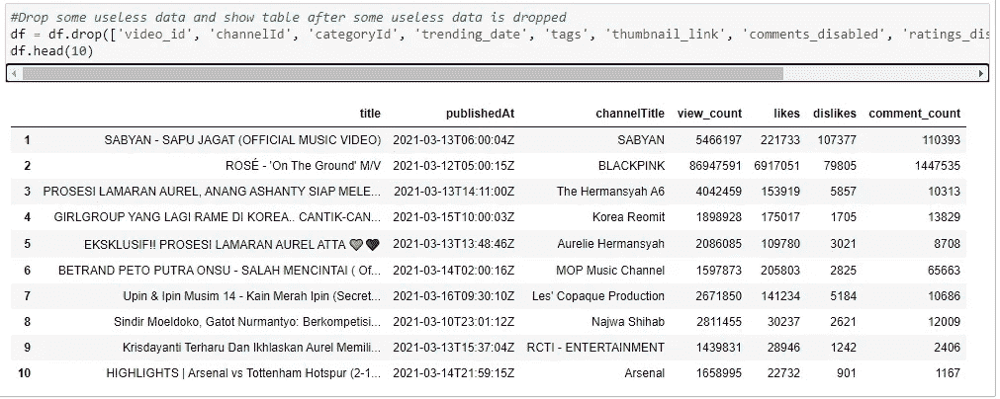

掉了几列之后，我想知道我的数据的基本统计，特别是查看次数、喜欢、不喜欢和评论的平均值。我可以使用 **df.describe()** 来找出答案。不仅是平均值，我们还可以知道标准差、最小值、中值、最大值等等。为了清楚地看到平均值，我还将使用 pandas 库的均值特性找出视图、喜欢、不喜欢和评论的均值。

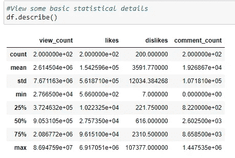

基本统计数据。

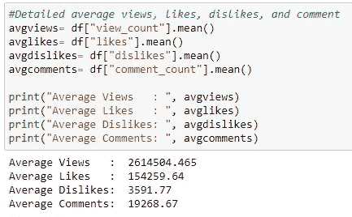

详细的平均观点、喜欢、不喜欢和评论。

在做了第一次分析后，我发现一个趋势视频的平均观看次数是 2.614.304，465。考虑到数据是在月中拍摄的，我认为这个数字相当高。从第一次分析我还发现，喜欢的平均是 154.259，64，不喜欢的平均是 3591，77，评论的平均是 19.268，67。从第一次分析中，我找不到关于算法如何工作的清晰逻辑。我只是找到了平均的观点，喜欢，不喜欢，和评论。所以，我会试着从数据中探索更多。下一步是我想检查视频的意见高于平均水平，喜欢高于平均水平，不喜欢高于平均水平，评论高于平均水平。我试图检查它的原因是我想知道是否有一些模式可以帮助我了解算法是如何工作的。

在我试图找出那些拥有高于平均水平的浏览量、高于平均水平的喜欢、高于平均水平的不喜欢和高于平均水平的评论的视频之后，我无法找到关于算法如何工作的清晰逻辑(再次)。这是因为有很多视频有各种各样的变化。观看次数高于平均值的视频有 42 个。对于具有高于平均值的喜欢的视频，有 34 个视频。厌恶度在平均水平以上的视频有 34 个。评论高于平均水平的视频有 24 个。因此，为了减少视频的数量以及我们如何看到一种模式，我将只寻找前 10 个视频:观看次数最多的前 10 个视频，最喜欢的前 10 个视频，最不喜欢的前 10 个视频，以及评论最多的前 10 个视频。

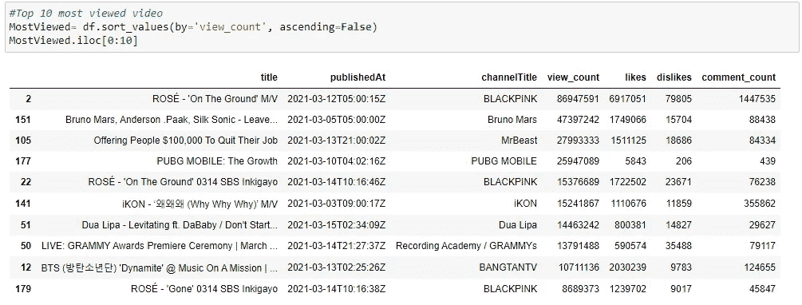

观看次数最多的 10 个视频。

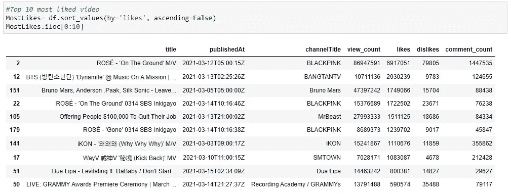

十大最受欢迎的视频。

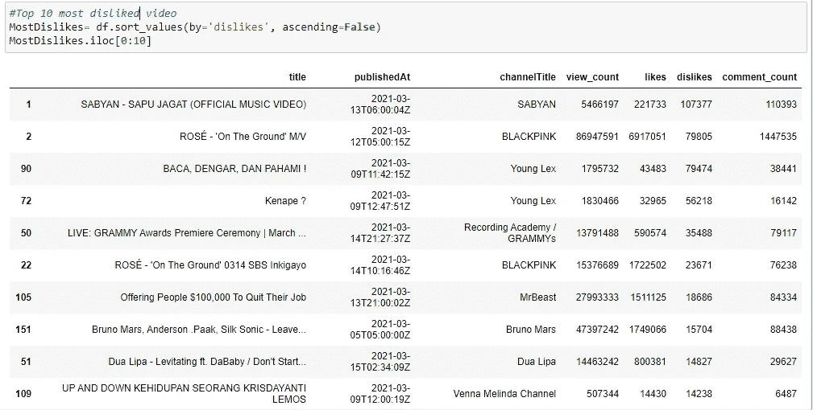

十大最不喜欢的视频。

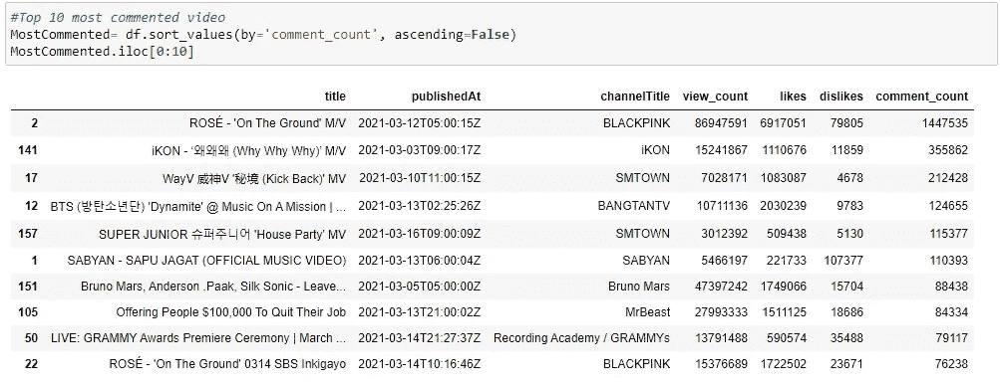

评论最多的 10 个视频。

从我找到的前 10 个视频中，可以看到有一个视频称霸所有“最”。该视频是 ROSé—“在地面上”M/V。该视频是所有趋势视频中观看次数最多的视频**，所有趋势视频中最受欢迎的视频，所有趋势视频中最不受欢迎的视频的第二名，**和**所有趋势视频中评论最多的视频**。但问题是，**为什么这个视频在印度尼西亚 Youtube 热门视频上没有排名第一？**

在我看来，这不是 Youtube 的错。否则，这是一个事实，Youtube 趋势视频算法不会“那么容易”工作。不仅仅是看的最多的视频，最喜欢的视频，最不喜欢的视频，或者评论最多的视频。还有其他因素决定了 Youtube 趋势算法的工作。幸运的是，Youtube 在他们的网站上说是什么决定了一个视频在趋势上的排名。这些因素(Youtube 称之为信号)是:

*   视图计数
*   视频生成视图的速度(即“温度”)
*   观点来自哪里，包括 YouTube 之外
*   视频的年代
*   与最近从同一频道上传的其他视频相比，该视频的表现如何

我们可以看到，有一个视图计数作为这些信号之一，但它不是唯一的。有几个信号将结合起来，产生一个视频列表，展示 YouTube 上正在发生的事情，同时与观众相关，并反映平台上的内容。你可以在这里阅读 Youtube 趋势分析的完整解释[。](https://support.google.com/youtube/answer/7239739?hl=en#:~:text=Trending%20helps%20viewers%20see%20what's,of%20viewers%20would%20find%20interesting.&text=The%20list%20of%20trending%20videos,same%20position%20in%20the%20list.)

也许这只是一个简单的分析，未来我们可以从这些数据中做很多分析。但至少我们知道这个概念:如何做一个简单的数据分析，用数据去证明一些东西。希望我们能一起学习，在下一篇文章里再相见。干杯。

**编辑:**

你可以在我的 Github [这里](https://github.com/zahidna/YoutubeTrendingAnalysis)下载或者克隆 jupyter 笔记本文件。