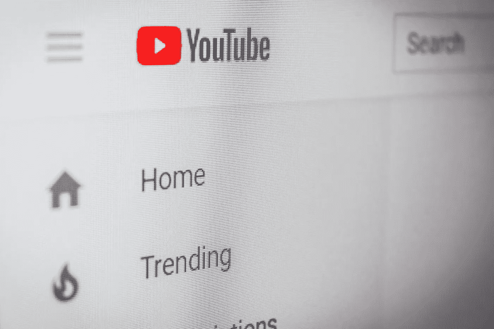
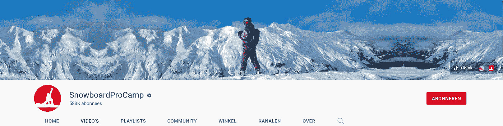
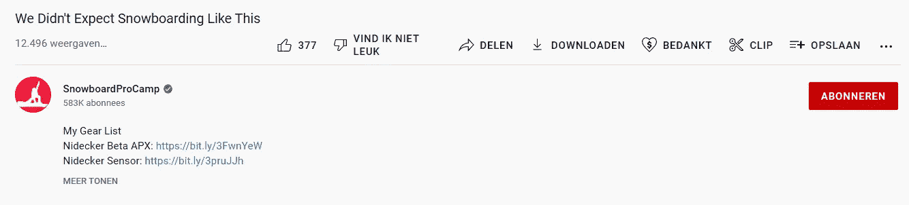
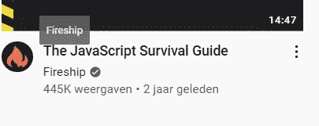
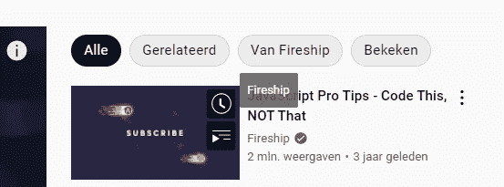

# 如果可以的话，我会改变 YouTube UX 网站

> 原文：<https://medium.com/codex/youtube-ux-changes-i-would-make-if-i-could-4f483ed8f6cb?source=collection_archive---------15----------------------->

## 我在世界上最大的网站之一遇到了一些问题。

由[克里斯蒂安·威迪格](https://unsplash.com/@christianw?utm_source=unsplash&utm_medium=referral&utm_content=creditCopyText)在 [Unsplash](https://unsplash.com/s/photos/youtube?utm_source=unsplash&utm_medium=referral&utm_content=creditCopyText) 上拍摄的照片

创造一个完美的产品很难，如果不是完全不可能的话。每当你开始构建一个产品的时候，你总会遇到一些事情，并不像你希望的那样顺利。但是，当产品来自一家最大的公司时，你会期望某些事情按照它们应该的那样工作。

这些是我个人对流行的视频分享平台 YouTube 的一些设计选择的一些问题。如果你同意或者我错过了什么，请在 Twitter 上告诉我。

# 社会联系

任何内容创作者都受益于拥有一个紧密的社区。一个空间或多个平台，他们可以在上面回答问题，与他们的观众一起闲逛，或者在某个地方发布不同风格的内容。作为一个创作者，你会希望这些链接尽可能突出。但事实并非如此。

上图为 YouTuber SnowboardProCamp 的页面。你能发现我的问题吗？

作为第一个例子，我们以一个 YouTuber 的频道页面为例。我们有一个漂亮的横幅，用户的头像，以及他们的订阅人数，但为什么社交链接这么小？但这并没有结束。

视频页面

当你看视频时，你可能想查看他们的社交网站，可能想在抖音或推特上关注他们，但没有一个按钮，用户可以添加至少一个像 linktree 页面这样的链接。

大多数用户在他们的视频描述中添加一些链接，或者作为固定评论。但是你仍然需要添加链接(可能与你的频道页面上的不同)，用户需要打开描述才能看到它们(如果它们在底部)。

## 为什么这是 YouTube 自身的问题

我在上面提到了一些问题，但这看起来很奇怪的最大原因是 YouTube 本身会受益于发布其他社交网络的创作者。它将不同平台的用户引入 YouTube 从中获取收入的视频。

# 点击频道名称时出现不一致

这个有点难用截图展示，但我会试着解释一下。

当你点击一个频道的名字时，你会期望打开该频道自己的页面，而不是链接下面的视频。但是 YouTube 在这方面有些不一致。

从主页，(youtube.com)和你的订阅页面，当你点击一个频道名称，你可以悬停在它上面，它会给出一个很好的工具提示，稍微变暗悬停的链接，当你点击它，它会带你到频道页面。这是完美的，我希望它如何工作。

但是当你打开一个视频，查看右边的其他视频，它就变了。我们来看下一张截图。

在这张截图中，你可以在左边看到视频的边缘，在右边看到其他建议的视频列表。当你将鼠标悬停在一个频道名称上时，你会得到与主页上相同的反馈。略暗的文本颜色和工具提示。**但是当你点击它的时候，它会把你带到视频，而不是频道。**

我确信这是有原因的，但这似乎有点奇怪。

# 结论

我知道这篇文章与我的其他文章有些不同，但我认为这是一篇有趣的文章。我并不反对谷歌或 YouTube，但我也很想听听大家对此的看法，以及我是否遗漏了任何其他不一致或怪异的行为。

**非常感谢你的阅读，祝你有美好的一天。**

考虑成为中级会员来支持我。它帮了我大忙，不会花你任何额外的费用，而且你可以阅读尽可能多的中等文章！

在 [Twitter](https://twitter.com/0xmbvissers) 和 [gm.xyz](https://gm.xyz/u/mbvissers.eth) 上关注我，了解我和我的项目。

检查多边形上的[像素披萨](https://www.pixel-pizzas.com/)。