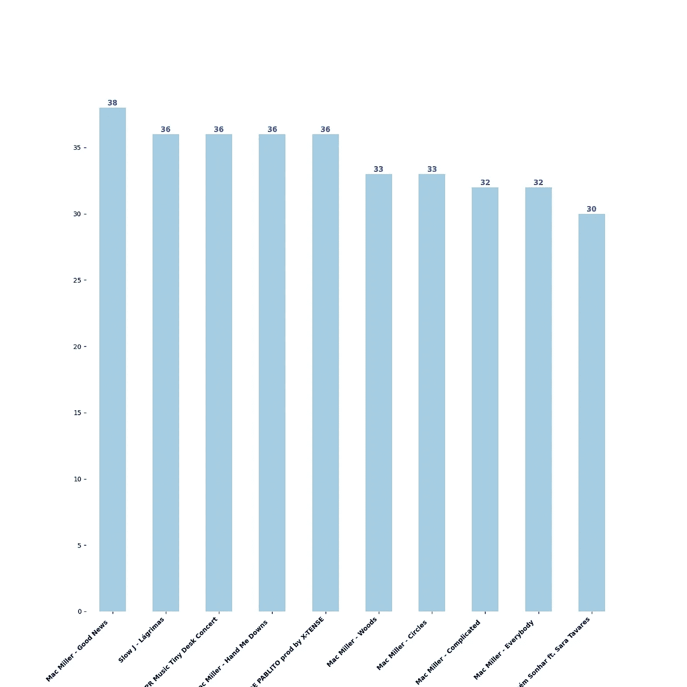
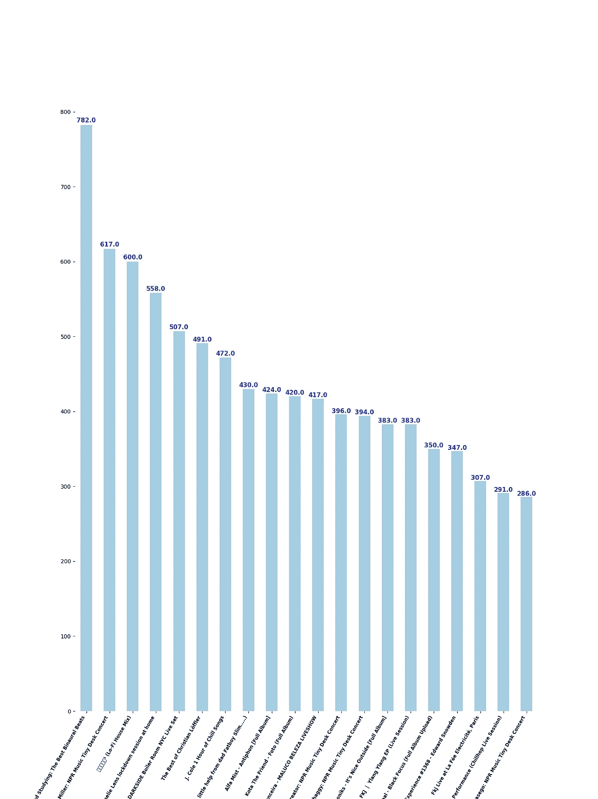

# Youtube 版本的 Spotify 年度回顾

> 原文：<https://medium.com/codex/youtube-version-of-spotify-year-in-review-ccf44a92b2ab?source=collection_archive---------12----------------------->


Szabo Viktor 在 [Unsplash](https://unsplash.com?utm_source=medium&utm_medium=referral) 上拍摄的照片

## [抄本](http://medium.com/codex)

我主要在工作时用 Youtube 听音乐，也在睡觉前看一些随意的视频🤔。将 Spotify 与 Youtube 进行比较并不是本文的目的，但我真正喜欢 Spotify 的一点是，在每年年底，它会显示哪些艺术家或歌曲是你听得最多的。我在网上搜索，试图为 Youtube 找到一个解决方案，但没有找到，*作为一名软件工程师，我决定为它编码。*

这相当容易！您所要做的就是将历史数据下载为 JSON 文件，然后使用这些数据获得您想要的东西。这就是我们在这篇文章中要做的事情。

为此，我们需要做 3 个步骤:

1.  [下载 **Youtube** 历史数据](http://6bc3)
2.  [将文件从 JSON 转换为 CSV](http://7956)
3.  [创建多个汇总数据的 XLXS 文件并绘制数据](http://eb66)

您可以下载项目并直接在您的机器上运行它，而不是经历这些步骤。更多信息请参见文章的这一部分。

# **步骤 1 —下载 Youtube 历史数据**

要下载这些数据，你可以浏览这个页面——https://www.youtube.com/feed/history。或者你可以直接去这个网站[*http://google.com/takeout*](http://google.com/takeout)直接下载文件。

我更喜欢第二个，因为它容易得多。对于第二个选项，您*必须确保只选择“Youtube 和 Youtube Music ”,并且还要选择 JSON 选项*。

# **步骤 2 —将文件从 JSON 转换为 CSV 并创建其他列**

数据是 JSON 格式的，它包含了你看过的每个视频的信息:

我更喜欢处理数据帧，所以在这一步我们将把 JSON 数据转换成 CSV 格式。下面的方法还调用了另一个*这里没有显示的方法*！该方法创建两列，这两列将包含有关视频持续时间的信息。这些列将在一些图中使用。如果你不想用它，你可以简单地在这条线上加注释。或者，你可以查看 Github repo([https://Github . com/Filipe good/Youtube-Most-Viewed/blob/main/main . py](https://github.com/FilipeGood/Youtube-Most-Viewed/blob/main/main.py))获取函数 *create_duration_col(df)*

接下来，只需保存数据帧。

# 步骤 3-创建多个 XLSX 文件和图

现在我们有了首选格式的数据，我们可以使用它了。

首先，我们将创建一些 excel 文件，用不同的列对数据进行聚合和分组。下面的函数创建 excel 文件，这些文件按标题和频道、按频道的视图和按天的视图对我们的数据*进行分组。*有了这个，*你可以从 Youtube* 上获得很多关于你消费什么以及如何消费的见解。

通过查看不同图中显示的数据来分析数据总是更好。你可以用数据做各种各样的情节，极限是你的想象力！在本文中，我将只展示 3 个图，但是我在 [Github](http://ee4d) 中有其他实现。

**观看次数最多的 10 个视频**

下面的代码将计算所有具有相同标题(相同视频)的记录，并将绘制前 10 个记录。

我真的很喜欢麦克米勒的上一张专辑。



**按星期几查看**

为了创建这个图，我们将使用在上一步中创建的列，并按一周中的某一天对数据进行分组。


**花费时间最多的前 20 个视频** 对于这个情节，我们将使用由函数 *create_duration_col(df)创建的列。*如果没有这些栏目，*就放过这个栏目。*
这个剧情给我们展示了消耗我们大部分时间的前 20 个视频。

获奖视频恰好是双耳节拍的视频。当我在写论文的时候，我喜欢听双耳的节拍:)当然，Mac 在 Tiny desk 中的 Miller 表演也在讲台上。



你可以创建许多不同的情节，或者你可以使用我在 Github repo 中的代码来为你创建情节。

如果你只想运行这个项目，你可以从这里下载:[https://github.com/FilipeGood/Youtube-Most-Viewed/](https://github.com/FilipeGood/Youtube-Most-Viewed/)

下载项目后，您有 3 个主要命令:

```
**python3 main.py -f convert -d *<file_name.json>*** - converts from json to csv (Step 2)**python3 main.py -f create -** creates the excel files and the plots**python3 main.py -f join -d *<new_file_name.csv>* -** join previous historica data with new one. If you have a new historica data file, you can join the old one with the new one
```

感谢阅读:)