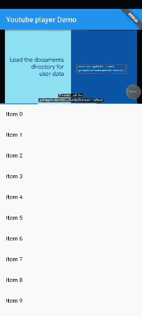

# YouTube 视频播放器颤动

> 原文：<https://medium.com/codex/youtube-videoplayer-flutter-476423cc1269?source=collection_archive---------2----------------------->

在本文中，我们将在应用程序中播放 YouTube 视频。除此之外，当视频部分不可见时，我们也暂停它。

有时或经常，我们需要在我们的移动应用程序中集成或播放视频。我们可以得到许多库或包，为我们提供实现需求的能力。

最终输出如下所示:



YouTube 视频播放器

在进入编码部分之前，首先让我们讨论一下我们将在应用程序中使用的一些主题。


照片由[思想目录](https://unsplash.com/@thoughtcatalog?utm_source=medium&utm_medium=referral)在 [Unsplash](https://unsplash.com?utm_source=medium&utm_medium=referral) 上拍摄

# 可见度检测器

Visibility Detector 是一个包装小部件的小部件，当小部件的可见性发生变化时，它就会被触发。更多详情请访问此[链接](https://pub.dev/packages/visibility_detector)。

# **现在让我们开始**


由[萨法尔·萨法罗夫](https://unsplash.com/@codestorm?utm_source=medium&utm_medium=referral)在 [Unsplash](https://unsplash.com?utm_source=medium&utm_medium=referral) 上拍摄的照片

在 **pubsec.yaml** 文件中，首先让我们添加项目的依赖项。

```
dependencies:youtube_player_flutter: ^8.1.0
visibility_detector: ^0.3.3
```

添加依赖项后，我们在 **lib** 文件夹中创建 **video_player.dart** 文件。

在其中，我们首先将 **initState videoId** 与 **url 分开。**

```
videoId=YoutubePlayer.convertUrlToId(widget.youtubeUrl)!;
```

然后我们初始化 **YoutubePlayerController。**

```
_controller = YoutubePlayerController(initialVideoId: videoId,
flags: const YoutubePlayerFlags(
mute: false,
autoPlay: false,
disableDragSeek: false,
loop: false,
isLive: false,
forceHD: false,
enableCaption: true,
),)
..addListener(listener);
```

我们还需要创建**监听器，**负责播放器是否准备好，小部件是否安装。

```
void listener() {
if (_isPlayerReady && mounted && !_controller.value.isFullScreen) {setState(() {});
}}
```

当我们导航到下一页时，视频播放器需要暂停。因此，我们将控制器暂停在已释放和停用的页面上。

```
@override
void deactivate() {
// Pauses video while navigating to next page.
_controller.pause();
super.deactivate();
}
```

当处置时也是如此。

```
@overridevoid dispose() {
_controller.dispose();
_idController.dispose();
_seekToController.dispose();
super.dispose();
}
```

然后，我们用 VisibilityDetector 为 videoplayer 构建布局。这里，当 VideoPlayer 小部件不再可见时，我们暂停我们的控制器。

```
VisibilityDetector(
key: const Key("unique key"),
onVisibilityChanged: (info) {
if (info.visibleFraction == 0) {
_controller.pause();
} else {
_controller.value.isPlaying
? _controller.play()
: _controller.pause();
}
},
child: YoutubePlayerBuilder()
),
```

最后我们的 **video_player.dart** 看起来如下:

然后我们创建 **homepage.dart.** 这里我们调用我们的 YouTubeVideo 小部件并传递 url。这里我们创建了 **ListView** 来演示视频播放器不可见时的暂停效果。

***首页.镖***

最后是我们的 main.dart 文件

**主镖**

# 让我们连接起来

我们可以成为朋友。在[上找到脸书](https://www.facebook.com/nabin.dhakal.714/)、 [Linkedin](https://www.linkedin.com/in/nabindhakal/) 、 [Github](https://github.com/nbnD) 、 [Youtube](https://www.youtube.com/channel/UCW6oYt_3QSl7J2HSHNqwXWw) 、 [BuyMeACoffee](https://www.buymeacoffee.com/nabindhakal) 、 [Instagram](https://www.instagram.com/nbn_d_/) 。

访问:[颤振连接](https://flutterjunction.com/)

**投稿:** [BuyMeACoffee](https://www.buymeacoffee.com/nabindhakal)

# 结论

希望这篇文章对你有所帮助，让你学到新的东西。我在这篇文章中使用了一些对你们中的一些人来说可能是新的东西。

如果你学到了新的东西或者想提出一些建议，请在评论中告诉我。

如果你喜欢这篇文章，请点击👏图标，它为向大家提供新事物提供了动力。

也请关注令人兴奋的文章和项目的更新。

通过分享学习在学习过程中产生巨大的影响，并使社区越来越大。

分享是吸引其他爱好者的磁石。

因此，让我们迈出一小步，让我们的学习社区变得更大。

与你的朋友分享这篇文章，或者如果你喜欢这篇文章，就在推特上发表。

# 在以下时间吃饱:

[](https://github.com/nbnD/youtubevideoplayer) [## GitHub-nbnD/YouTube 视频播放器

### 一个新的颤振项目。这个项目是颤振应用的起点。一些帮助您入门的资源…

github.com](https://github.com/nbnD/youtubevideoplayer)