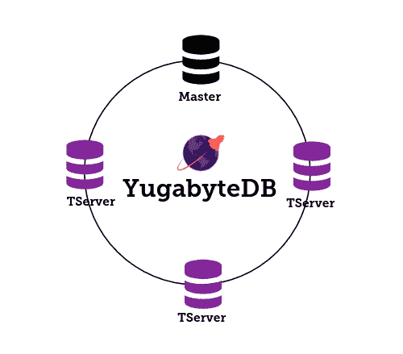
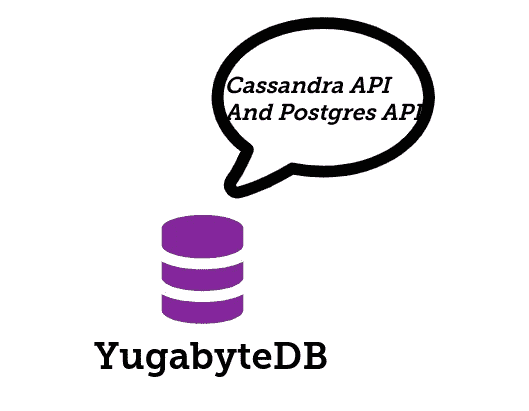
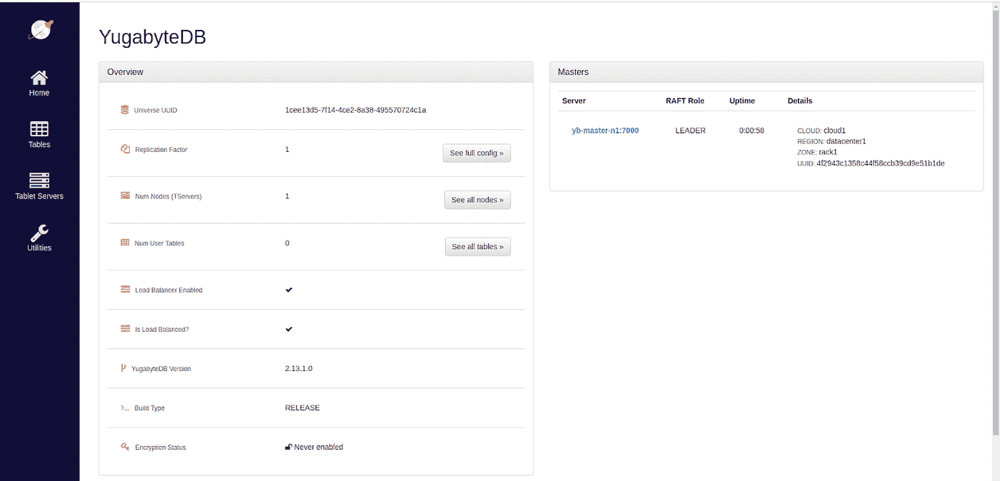
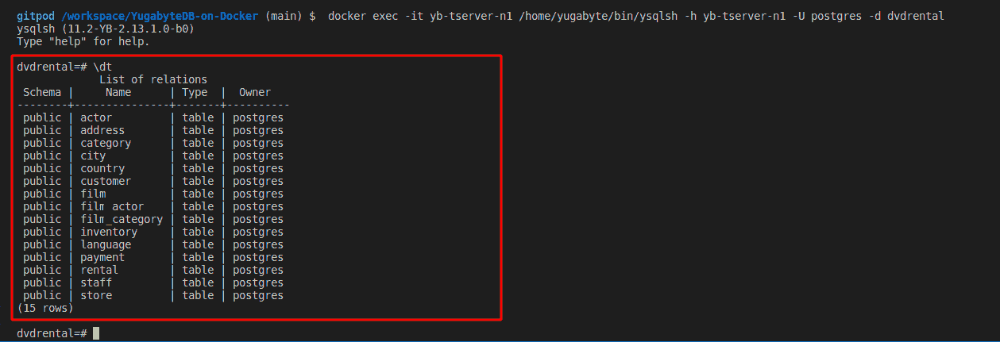
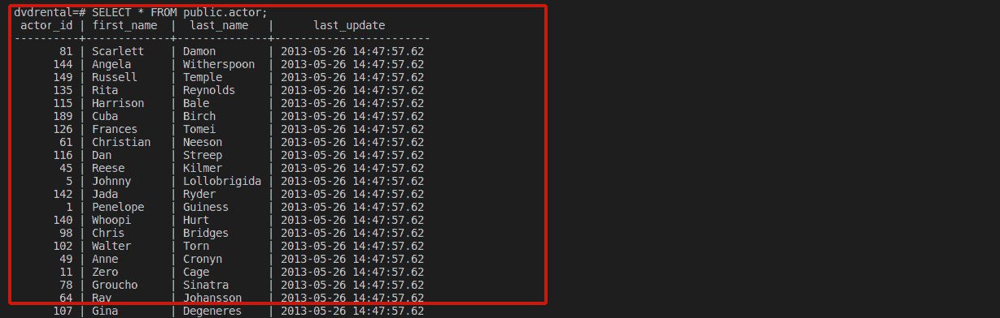
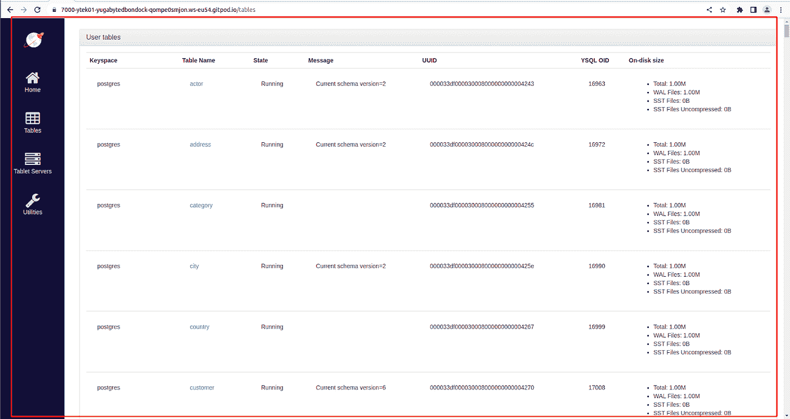

# 使用 Docker 合成文件进行 YugabyteDB 部署

> 原文：<https://medium.com/codex/yugabytedb-local-deployment-using-docker-compose-file-69965775c416?source=collection_archive---------6----------------------->

## 如何使用 Docker Compose 文件设置 YugabyteDB 本地集群


Jo Heubeck 和 Domi Pfenninger 摄影

在这篇博文中，我将向您展示如何使用 Docker Compose 文件部署 Yugabyte 本地集群。与单独提供 Docker 容器相比，使用 Docker Compose 文件进行开发速度更快，而且不会出错。在这篇博客中，我将向您展示如何加载和填充用于测试目的的样本数据。此外，您可能处于这样一种情况:您希望展示一个概念证明，而不想设置一个大型集群来构建一个简单的应用程序。如果这是您想要的，那么让我们团结起来，快速建立我们的集群。



YugabyteDB 集群(图片由作者提供)

这对你的发展过程非常重要。有趣的是，如果您正在为您的生产环境设置一个多节点集群，建议您在云平台上设置您的数据库集群，如本页【https://docs.yugabyte.com/preview/deploy/checklist/所述。请参考它，了解在任何云平台上设置集群的方法。



Yugabyte 节点(图片由作者提供)

Docker 容器帮助解决的问题之一是不同的环境问题，我们能够跨不同的平台移动我们的部署，我们的数据库将按预期工作。别浪费太多时间，让我们开始工作吧。在我们接触 Docker 命令之前，值得注意的是 YugabyteDB 是一个高性能、云原生的分布式 SQL 数据库，旨在支持所有 PostgreSQL 特性。它最适合云原生 OLTP(即实时、关键业务)应用程序，这些应用程序需要绝对的数据正确性，并且至少需要以下一项:可伸缩性、高容错性和全球分布式部署。

YugabyteDB 符合 Cassandra API 和 Postgres API，这使得它非常强大。它结合并补充了 NoSQL Cassandra 数据库和 PostgreSQL 数据库的优势。为此，我使用 PostgreSQL API 将我的数据加载到数据库中。我使用的数据是开源的 PostgreSQL DVD 租赁数据库，可从[https://www . PostgreSQL tutorial . com/PostgreSQL-getting-started/PostgreSQL-sample-database/](https://www.postgresqltutorial.com/postgresql-getting-started/postgresql-sample-database/)获得。至此，让我们使用 Docker 容器来设置 YugabyteDB。

*   用 docker-compose 文件克隆 Github repo

请注意，您可以在 YAML 文件中包含任意多的节点/容器，但是对于我们的例子，我们只包含了一个节点。

*   确保您的数据库可以与其他正在运行的 docker 容器的其他应用程序/服务网络进行通信

这一部分对于你成功连接运行在你的网络上的 YugabyteDB 非常重要，你的数据库必须向你的应用程序公开，你必须能够连接数据库。

*   启动 Docker 容器、主节点和服务器节点

使用位于 [http://localhost:7000](http://localhost:7000/) 的 yb-master 管理服务页面检查并确认 YugabyteDB 正在运行。



YugabyteDB 管理页面(图片由作者提供)

您也可以使用 Docker 命令来检查这一点。

```
docker ps
```

*   将样本数据复制并加载到 YugabyteDB 中

*   连接到 PostgreSQL API，并将数据加载到数据库中

默认情况下，YCQL API 和 YSQL API 在集群上是启用的。下面的命令将进入 Postgre 数据库 Docker 容器，创建一个新的 Postgres 数据库，创建有权限的表，设置凭证，并用必要的数据行加载表。

*   登录到您使用上一页中的脚本创建的用户帐户，并确认您的数据在新创建的 Postgres 数据库中

*   列出 dvdrental 数据库中的所有表格



dvdrental Postgres 数据库中所有表格的列表(图片由作者提供)

*   检查演员的桌子



演员表(图片由作者提供)



YugabyteDB 管理 UI 页面中的表列表(图片由作者提供)

有了这个设置，您就可以开始设计并开始将您的应用程序连接到您的 YugabyteDB。有了这些，你就可以继续你的开发过程了，在这之后进入生产阶段，一定要按照[页面](https://docs.yugabyte.com/preview/deploy/checklist/)上描述的部署清单进行。

## **结论**

对于您的部署，请确保将一个卷附加到您的容器以避免数据丢失，此外，请确保公开您的端口，以便您可以从应用程序连接到数据库集群。有了这些，你就可以开始了，这篇文章的完整代码可以在[这里](https://github.com/yTek01/YugabyteDB-on-Docker)找到。

## 参考

[1][https://www . PostgreSQL tutorial . com/PostgreSQL-getting-started/PostgreSQL-sample-database/](https://www.postgresqltutorial.com/postgresql-getting-started/postgresql-sample-database/)

[https://docs.yugabyte.com/preview/deploy/checklist/](https://docs.yugabyte.com/preview/deploy/checklist/)

[3][https://hub.docker.com/r/yugabytedb/yugabyte](https://hub.docker.com/r/yugabytedb/yugabyte)

[4][https://docs . yugabyte . com/preview/deploy/docker/docker-compose/](https://docs.yugabyte.com/preview/deploy/docker/docker-compose/)

感谢您的阅读。我很乐意回答任何问题，并听取任何意见。