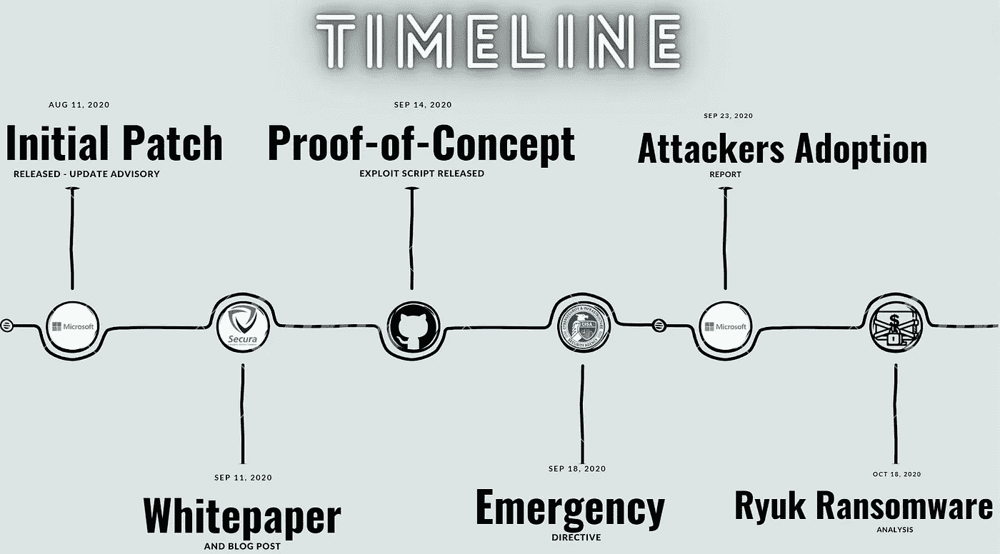

# zero logon-Netlogon 特权提升漏洞-CVE-2020-1472

> 原文：<https://medium.com/codex/zerologon-netlogon-elevation-of-privilege-vulnerability-cve-2020-1472-3c7631239478?source=collection_archive---------27----------------------->

为了一个课程项目，我一直在研究这个 CVE，它是 2020 年的**五大漏洞之一。有很多东西我不知道，但学习它们是非常愉快的。我看了大概十篇博文，了解了这次攻击的细节及其组成部分，想用简单的话分享一下我的理解。我们走吧！**

# **1。定义**

**Netlogon:** 域中的用户和其他服务通过名为 Netlogon 的 Windows Server 进程进行身份验证。这是一个本地安全机构服务。

**AES:** 用于保护电子数据的对称分组密码。美国政府选择 AES 来保护机密信息。AES 算法可用于加密(加密)和解密(解密)信息。

MS-NRPC: 微软视窗 Netlogon 远程协议

**Windows 域:**一种计算机网络，其中每个用户帐户、计算机、打印机和其他安全主体都在许多中央计算机集群(称为域控制器)上的中央数据库中注册。

**DS:** 目录(域)服务。网络资源名称及其相应网络地址的映射(DNS 就是一个例子)。

**AD:** 活动目录。windows 域网络的目录服务

**DC:** 域控制器。也称为“AD DS”，用于 Windows 域网络的 Active Directory 域服务

**Kerberos:** 基于票证的网络认证协议

# 2.时间表

# **3。漏洞描述和影响**

该漏洞是由 MS-NRPC 使用的加密认证方案中的错误引起的，通过该方案，除了别的以外，计算机密码可以被更新。通过利用此漏洞，攻击者可以伪装成任何机器，甚至是域控制器本身，并执行远程过程调用。该漏洞的核心存在于 MS-NRPC 的 ComputeNetlogonCredential 调用的不符合标准的实现中，稍后将对此进行解释。Secura 的高级安全专家 Tom Tervoort 首先发现了它。该 CVE 也称为 Zerologon，是 Windows Server 中的一个严重漏洞，已从微软获得 10.0 的 CVSS 评分。它被称为 2020 年发现的最关键的活动目录漏洞。由于连接到域控制器是成功利用漏洞的唯一先决条件，因此该漏洞尤其严重。

# 4.编程缺陷

Microsoft Windows Netlogon 远程协议(MS-NRPC)是 Active Directory 的核心身份验证组件，为用户和计算机帐户提供身份验证。ComputeNetlogonCredential 将一个 8 字节的质询作为输入，使用 AES 算法执行加密转换，并输出一个 8 字节的结果。

为了安全地使用 AES，有一个随机初始化向量(IV ),用于使用同一密钥加密的每个明文。但是，ComputeNetlogonCredential 函数将 IV 设置为 16 个零字节的固定值。这违反了安全使用 AES-CFB8 的要求:只有当 iv 是随机的时，它的安全属性才成立。这导致了一个密码缺陷，其中 8 字节零的加密可能导致零的密文，概率为 1/256。通过选择全零的 ClientCredential，攻击者有 1/256 的机会成功验证为任何加入域的计算机。通过模拟域控制器，攻击者可以采取额外的步骤来更改计算机的 Active Directory 密码，因此，它可以访问 DC 的所有数据。

# 5.剥削

有很多库可以利用这个漏洞。其中一个是[https://github.com/dirkjanm/CVE-2020-1472.](https://github.com/dirkjanm/CVE-2020-1472.)步骤非常简单直白，在很多视频中都可以看到；你只需要搜索“CVE-2020-1472 利用”！

步骤如下:

1.使用 8 个零字节的质询和密文发起暴力攻击，创建与域控制器的不安全 Netlogon 通道。平均需要 256 次尝试才能做到这一点。

2.将存储在 AD 中的 DC 帐户密码设置为空。由于存储在 DC 注册表中的密码不变，一些域控制器功能将被破坏。

3.使用空密码连接到同一个 DC 并转储额外的哈希。

4.为了避免被发现，请将域控制器密码重置为保存在本地注册表中的原始值。

5.使用从阶段 3 转储的散列来执行任何想要的攻击。

作为步骤 4 的结果，将不会有对 DC 的攻击的任何踪迹。

# 6.勒索软件关系

Ryuk 是一种勒索软件，因针对大型、面向公众的微软 Windows 网络系统而臭名昭著。这些报告强调，Ryuk 勒索软件(2020 年最多产的勒索软件变种之一)背后的攻击者正在将此漏洞纳入他们的武器库。

# 7.参考

维基百科(一个基于 wiki 技术的多语言的百科全书协作计划ˌ也是一部用不同语言写成的网络百科全书ˌ 其目标及宗旨是为全人类提供自由的百科全书)ˌ开放性的百科全书

Zerologon:通过破坏 Netlogon 加密技术来危害未经验证的域控制器(CVE-2020–1472)，Tom Tervoort，2020 年 9 月，Secura

Netlogon 特权提升漏洞，[https://msrc.microsoft.com/updateguide/](https://msrc.microsoft.com/updateguide/)漏洞/CVE-2020–1472

zero logon(CVE-2020–1472):未经认证的权限升级为全域权限，[https://www . crowd strike . com/blog/CVE-2020-1472-zero logon-security-](https://www.crowdstrike.com/blog/cve-2020-1472-zerologonsecurity-)咨询

微软 Windows Netlogon 远程协议(MS-NRPC)使用不安全的 AESCFB8 初始化向量，【https://www.kb.cert.org/vuls/id/490028】T4

关于开发零 logon(CVE-2020–1472)对环境的影响，似乎有一些问题和困惑。这里有一条线索，[https://threadreaderapp.com/thread/1306280553281449985.html](https://threadreaderapp.com/thread/1306280553281449985.html)

ZeroLogon 利用脚本，[https://github.com/risksense/zerologon](https://github.com/risksense/zerologon)